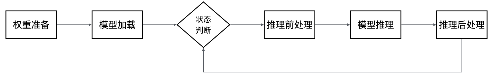

MindSpore大语言模型带框架推理
=============================

.. image:: https://mindspore-website.obs.cn-north-4.myhuaweicloud.com/website-images/feature/atomgit/resource/_static/logo_source.svg
    :target: https://atomgit.com/mindspore/docs/blob/master/tutorials/source_zh_cn/model_infer/ms_infer/ms_infer_model_infer.rst
    :alt: 查看源文件

.. toctree::
   :maxdepth: 1
   :hidden:

   ms_infer_network_develop
   ms_infer_parallel_infer
   ms_infer_quantization
   ms_infer_model_serving_infer

特性背景
--------

2022年末，OpenAI发布了ChatGPT大语言模型，为人工智能带来了一个新的研究方向，即基于Transformers结构的大语言模型，其展现了超过人们预期的AI能力，在多项测试中取得较好成绩，快速成为人工智能的研究焦点。

在大语言模型的研究中，其中一个重要的研究方向就是如何提高大语言模型在实际应用中的性价比：

- 大语言模型通常是百亿、千亿级别的参数量，因此一次模型推理的计算量巨大，需要消耗大量计算资源，导致人工智能服务提供商发现，当前大语言模型单次推理成本非常高，难以被有效应用到实际生活和生产环境中；

- 针对大语言模型推理成本高的问题，MindSpore框架提供了大语言模型推理能力，结合当前主流大语言模型的特点，深度优化大语言模型部署和推理，实现模型推理成本最优。

模型原理
--------

在了解MindSpore大语言模型推理的能力之前，让我们先了解一下当前主流大语言模型是如何实现让人惊叹的智能水平的，下面我们将以当前最常见的文本生成类大语言模型为例子，简单介绍大语言模型的推理原理，了解AI模型是如何通过计算，完成和人对话、总结文章中心思想等复杂任务的。

大语言模型构建和普通的模型相同，主要分为训练和推理两个阶段：

- **训练**：大语言模型的训练过程，可以简单地理解为是模型在海量的文本数据中，不停地阅读和学习文本中的知识。这个过程中，模型会将各个文本元素的位置关系，以及出现频率记录在模型权重中，如“中国的面积有”这句话接下来会有很高概率出现“960万平方公里”。在训练过程中，通过海量数据的输入，大语言模型记录了这两句话关联较强。

- **推理**：大语言模型的推理过程，就是在训练的数据库中，针对用户给出的具体一段文本，找到和其最强相关的文本元素返回给用户，如用户提问“中国的面积有”，大语言模型就可以根据训练时记录“960万平方公里”的信息返回给用户，让用户获取其想要的答案。

在实际文本处理场景中，语言是复杂多变的，因此很难直接找到两个句子的直接相关性。大语言模型技术通常会采用单词化的方法，即将"中国的面积有"分解为多个常见的单词组合，例如"中国"、"的"、"面积"、"有"。这种做法不仅可以更好地应对文本差异带来的影响，如"中国的面积是"和"中国的面积有"两个短语相似度可能为0，而["中国"，"的"，"面积"，"是"]和["中国"，"的"，"面积"，"有"]两个组合的相似度就可以认为有75%，可以有效帮助大语言模型识别出这类文本差异。这种技术我们通常称为tokenize，即把一段文本分解为一组token（通常是单词和标点符号之类的元素）的组合表示。大语言模型完成生成一句话的过程就是根据当前的token组合信息，每一轮推理出下一个token，并和之前的token组合到一起，形成新一轮的输入，反复迭代每次生成一个单词，逐步完成整段文本的生成。下表简单描述一下大语言模型推理的例子：

用户输入：中国的首都

.. list-table:: 推理示例
   :header-rows: 1

   * - 推理迭代
     - 推理输入
     - 输入向量
     - 推理结果
   * - 1
     - 中国的首都
     - [中国， 的， 首都]
     - 北京
   * - 2
     - 中国的首都北京
     - [中国， 的， 首都， 北京]
     - 真
   * - 3
     - 中国的首都北京真
     - [中国， 的， 首都， 北京， 真]
     - 美丽
   * - 4
     - 中国的首都北京真美丽
     - [中国， 的， 首都， 北京， 真， 美丽]
     - END

可以看到，每一轮迭代，大语言模型会根据当前语境推理出下一个token，与前面的语句拼装成下一轮迭代的输入。通过多轮迭代，当遇到生成的token是END这个特殊token时，模型认为推理结束，将结果返回给用户。

关键步骤
--------

MindSpore大语言模型推理为用户提供了“开箱即用”的大语言模型部署和推理能力，用户能够利用MindSpore提供的大语言模型相关API，快速部署自己的大语言模型，并根据模型特点进行相应优化，实现最优性价比，为实际生产生活带来大语言模型能力。下图是利用MindSpore大语言模型推理特性进行模型推理的关键步骤图：

1. **权重准备**：权重数据是大语言模型的智能核心，因此部署模型的第一步就是获取和准备好对应模型的权重文件。
2. **模型加载**：模型推理时，根据使用的不同优化技术，模型结构会有一定的差异，因此需要根据模型网络结构将模型的主干网络构建出来，方便后续进行推理。
3. **状态判断**：根据推理请求的具体语义，判断是否需要继续推理，此流程主要用于多轮推理时判断是否结束，如果推理结束（如完成问题回答），则将推理内容返回给用户，否则会继续下一轮推理。
4. **推理前处理**：根据推理请求，对推理数据进行前处理，常见的前处理包括通过tokenizer将语句转换成索引表示的一组数字向量，让大语言模型可以正确识别其任务内容，以及构建一些模型推理的特殊输入用于加速（如KVCache增量推理的Cache信息）。
5. **模型推理**：通过输入的数据进行模型推理，通常会返回语句中下一个token的概率分布。
6. **推理后处理**：根据模型推理的结果，计算出下一个token，将token转换成文本返回给用户，同时如果推理没有结束，将token拼装成下一轮推理的输入继续推理。

主要特性
--------

MindSpore大语言模型为了能够实现最优的性价比，针对大语言模型网络的特性，进行了多项深度优化，其中主要包含以下特性：

- **全量/增量推理**：大语言模型的核心网络结构是以Transformer为主的自注意力机制，每一轮迭代都要计算所有token的注意力分数，而实际上相同的token序列计算注意力分数时key和value结果是相同的，即["中国"，"的"，"面积"，"是"]的key和value可以理解为是由["中国"，"的"，"面积"]和["是"]拼接而成的，因此可以通过将前面已经计算的序列的key和value值缓存起来，从而减少下一轮迭代推理过程的计算量，这种技术通常被称为KVCache优化。结合大语言模型推理的全过程可以发现，在N和N+1轮的两次连续迭代中，其中N+1轮可以完全复用N轮的key和value值，因为前N个序列是一致的，真正需要计算key和value的只有N+1轮的第一个token，这样我们可以将模型推理分为以下两个阶段：

  - **全量推理**：用户输入的第一轮迭代，此时用户给出的长度为N的语句，N的长度和内容都无法预测，需要计算全部key和value的值，成为全量推理。

  - **增量推理**：完成第一轮迭代计算后，前一轮迭代语句的key和value值已经缓存在KVCache中，此时只需要额外计算最近一个token对应的key和value值，并与缓存的结果拼接起来计算注意力分数，成为增量推理。

- **Attention优化**：大语言模型网络结构最主要的计算是对于Attention的计算，由于当前主流模型的Attention的size比较大（通常4K或以上），模型推理的整个过程性能强依赖于Attention计算的性能，因此当前有很多研究在关注如何优化Attention计算性能，其中比较主流的包括Flash Attention和Page Attention技术。

  - **Flash Attention**：Attention计算中会存在两个大矩阵相乘（4K大小），实际计算会将大矩阵分解为多个芯片能够计算的小矩阵单元进行计算，由于芯片的最小级的缓存大小限制，需要不断地将待计算数据在缓存和主存间搬入搬出，导致计算资源实际无法充分利用，因此当前主流芯片下，Attention计算实际上是带宽bound。Flash Attention技术将原本Attention进行分块，使得每一块计算都能够在芯片上独立计算完成，避免了在计算Key和Value时多次数据的搬入和搬出，从而提升Attention计算性能，具体可以参考 `Flash Attention <https://arxiv.org/abs/2205.14135>`_。

  - **Paged Attention**：标准的Flash Attention每次会读取和保存整个输入的Key和Value数据，这种方式虽然比较简单，但是会造成较多的资源浪费，当一个batch中多个请求序列长度不一致时，Flash Attention需要key和value用最长的序列的显存，如“中国的首都是北京“和“中国的国旗是五星红旗”，假设分词按字分词，则需要10 * 2 = 20个KVCache显存单元。Paged Attention基于Linux操作系统页表原理对KVCache进行优化，按照特定大小的块来存储Key和Value的数据，如块大小为2时，可以按照块使用KVCache，只需要4 * 2 + 5 * 2 = 18个KVCache的显存单元，由于Paged Attention离散的特性，也可以结合Prefix Cache这类技术进一步节省“中国的”所占用的显存，最终只需要3 * 2 + 5 * 2 = 16个KVCache单元。在服务化的场景下，更多空闲显存可以让模型推理的batch更大，从而获得更高的吞吐量，具体可以参考 `Page Attention <https://arxiv.org/pdf/2309.06180>`_。

- **模型量化**：MindSpore大语言模型推理支持通过量化技术减小模型体积，提供了A16W8、A16W4、A8W8量化以及KVCache量化等技术，减少模型资源占用，提升推理吞吐量。

推理教程
--------

本章节将会结合当前主流的Qwen2开源大语言模型，演示如何通过MindSpore大语言模型推理提供的能力，逐步构建一个可以端到端进行文本生成的例子。

.. note::

   由于Qwen2模型也有多个版本和配置，本文主要基于Qwen2-7B-Instruct模型进行说明。

环境准备
~~~~~~~~

MindSpore大语言模型带框架推理主要依赖MindSpore开源软件，用户在使用前，需要先安装MindSpore的Python包，建议使用conda虚拟环境运行。可以执行如下命令简单安装：

.. code:: shell

   export PYTHON_ENV_NAME=mindspore-infer-py311
   conda create -n ${PYTHON_ENV_NAME} python=3.11
   conda activate ${PYTHON_ENV_NAME}
   pip install mindspore

同时，用户也可以参考官方安装文档来安装自己环境适配的Python包，具体见 `MindSpore安装 <https://www.mindspore.cn/install>`_。

由于MindSpore推理主要支持Ascend芯片环境上运行，还需要安装相应的Ascend开发环境，具体可以参考 `快速安装CANN <https://www.hiascend.com/document/detail/zh/CANNCommunityEdition/83RC1alpha001/softwareinst/instg/instg_quick.html>`_ ：

.. code:: shell

   pip install ${ASCEND_HOME}/lib64/te-*.whl
   pip install ${ASCEND_HOME}/lib64/hccl-*.whl
   pip install sympy

如果用户要复用当前主流的LLM模型的tokenizer能力，可以安装Transformers软件包：

.. code:: shell

   pip install transformers

如果用户需要使用模型量化能力提升模型推理性能，还需要安装mindspore_gs包，具体可以参考 `MindSpore GoldenStick安装 <https://www.mindspore.cn/golden_stick/docs/zh-CN/master/install.html>`_。

权重准备
~~~~~~~~

权重准备主要是获取大语言模型的权重文件。同时，通常每一个大语言模型都有自己对应的token列表，表示该模型支持的单词全集，因此，除了模型的权重外，还需要获取其对应的tokenizer映射。MindSpore当前已经支持直接加载safetensor的权重文件，用户可以直接下载Hugging Face官网上的模型权重文件。

对于Qwen2大语言模型，建议用户直接使用Hugging Face官方网站提供的预训练权重文件与tokenizer映射，用户可以简单地使用下面的命令进行权重下载：

.. code:: shell

   git lfs install
   git clone https://huggingface.co/Qwen/Qwen2-7B

下载完成后，相关目录下应该显示如下文件树结构：

.. code:: shell

   ls
   |- config.json
   |- generation_config.json
   |- LICENSE
   |- merges.txt
   |- model-00001-of-00004.safetensors
   |- model-00002-of-00004.safetensors
   |- model-00003-of-00004.safetensors
   |- model-00004-of-00004.safetensors
   |- model.safetensors.index.json
   |- README.md
   |- tokenizer_config.json
   |- tokenizer.json
   |- vocab.json

模型构建
~~~~~~~~

首先用户需要构建模型并加载权重，执行以下代码：

.. code:: python

   import os
   import mindspore as ms
   from qwen2 import Qwen2Config, Qwen2ForCausalLM, CacheManager
   from mindspore import Tensor, mint

   # set mindspore context and envs
   os.environ["MS_INTERNAL_DISABLE_CUSTOM_KERNEL_LIST"] = "PagedAttention"

   ms.set_context(infer_boost="on")
   ms.set_context(mode=ms.context.PYNATIVE_MODE)

   model_path = "/path/to/model"
   input_str = ["I love Beijing, because", "Hello, Qwen2"]
   batch_size = len(input_str)
   max_new_tokens = 64
   block_size = 128
   max_seq_lens = block_size * 10
   block_num = (max_seq_lens * batch_size) // block_size

   config = Qwen2Config.from_json(model_path + "/config.json")

   model = Qwen2ForCausalLM(config)
   # load weight
   model.load_weight(model_path)

   cache_manager = CacheManager(config, block_num, block_size, batch_size)

其中，qwen2为模型的网络脚本（qwen2.py），需要和当前脚本在同一个目录下，可以参考 `从零构建大语言模型推理网络 <./ms_infer_network_develop.md>`_。用户也可以使用其他的网络脚本，但是需要修改相应的模型接口。

脚本中第一步是设置mindspore相关环境变量，包括：

- **MS_INTERNAL_DISABLE_CUSTOM_KERNEL_LIST**：设置PagedAttention使用MindSpore支持TH拉平的算子，由于MindSpore在动态图模式下算子只支持TH格式，因此如果要在动态图下开发，需要设置此环境变量，用户也可以自行使用BSH格式输入。

- **infer_boost**：开启推理优化，此优化主要是使能MindSpore的FlashAttention、PagedAttention等融合算子。

- **mode**：设置执行模式为动态图模式，此模式更方便调试和开发，推荐用户在模型开发时使用此模式。

脚本中的第二步是使用模型脚本qwen2.py提供的类进行模型的初始化和KVCache的初始化，其中包含几个参数：

- **input_str**：需要推理的原始文本，此处一次传入batch_size=2的字符串list，表示同时推理两个语句。

- **model_path**：模型目录路径，即前面Hugging Face官网下载的模型路径。

- **max_new_tokens**：最大推理单词数量，当迭代到最大单词数量后，即停止推理，后面迭代推理中会使用。

- **block_size**：PagedAttention中管理KVCache对象的block大小，block_size越小，划分越细，不同请求可能复用概率更高，block_size越大，则网络计算时，一次读取的有效数据更多，计算性能更好。

- **max_seq_len**：模型推理支持的最大长度，此参数通常可以从config配置中获取，影响KVCache的显存占用，由于Qwen2配置默认比较大（32K），此处修改为block_size的10倍简化。

根据以上参数对模型进行初始化，获得model和cache_manager对象。

模型推理
~~~~~~~~

模型构建好之后，用户就可以使用模型对象来进行文本生成，实现如自助客服、智能问答、聊天机器人等实际应用。但是应用的输入通常是一句语言的文本，无法直接作为模型的输入进行计算。因此，我们需要增加前处理和后处理的逻辑，将文本语言转换成模型能够识别的token数据，在完成推理计算后，再将token数据转换成文本语言。我们以一句简单的问答文本生成为例子，简单描述这个过程：

- **前处理**：利用tokenizer的数据，将一句话分解为多个token id表示的list。此处，我们使用Transformers开源社区的tokenizer。

  .. code:: python

     from transformers import AutoTokenizer

     tokenizer = AutoTokenizer.from_pretrained(model_path, trust_remote_code=True)

     input_str = ["I love Beijing, because", "Hello, Qwen2"]

     input_ids = tokenizer(input_str)["input_ids"]

     print(input_ids)

  执行此Python代码，会打印如下输出：

  .. code:: shell

     [[40, 2948, 26549, 11, 1576], [9707, 11, 1207, 16948, 17]]

  其中，[40, 2948, 26549, 11, 1576]对应"I love Beijing, because"的单词序列，40表示I对应的token，2948表示love对应的token，26549表示Beijing对应的token，11表示逗号加空格对应的token，1576表示because对应的token，这个格式可以直接传给模型进行推理。同理[9707, 11, 1207, 16948, 17]对应"Hello, Qwen2"的输入序列。此处采用一次传入2个请求的batch计算进行演示。

- **整网计算**：传入当前输入token的数据和配置，让模型对象通过多轮计算迭代推理出每轮的token结果。为了代码更加简洁，可以将迭代推理封装到如下generate函数中：

  .. code:: python

     from typing import List
     from mindspore import ops, mint, Tensor, dtype
     from qwen2 import Qwen2Config, Qwen2ModelInput, Qwen2ForCausalLM, CacheManager, sample

     def generate(model: Qwen2ForCausalLM, config: Qwen2Config, cache_manager: CacheManager, input_ids: List, max_new_tokens: int, max_seq_lens: int, eos_token_id: int):
         batch_size = len(input_ids)
         assert max_seq_lens >= max(map(len, input_ids))

         cur = min(map(len, input_ids))
         is_prefill = True
         it = 0

         decode_q_seq_lens = Tensor([1 for _ in range(batch_size)], dtype=dtype.int32)
         decode_mask = ops.zeros((1, 1), dtype=config.param_dtype)
         attn_mask = None
         q_seq_lens = None

         while cur <= max_seq_lens and it < max_new_tokens:
             batch_valid_length = Tensor([cur for _ in range(batch_size)], dtype=dtype.int32)
             if is_prefill:
                 inp = Tensor([input_ids[i][:cur] for i in range(batch_size)], dtype=dtype.int32)
                 pos = mint.arange(cur).astype(dtype.int32)
                 block_tables, slot_mapping = cache_manager.step(0, cur)
                 attn_mask = ops.logical_not(ops.sequence_mask(pos + 1, cur)).astype(config.param_dtype)
                 q_seq_lens = None
             else:
                 inp = Tensor([[input_ids[i][cur - 1]] for i in range(batch_size)], dtype=dtype.int32)
                 pos = Tensor([[cur - 1] for _ in range(batch_size)], dtype=dtype.int32).view(-1)
                 block_tables, slot_mapping = cache_manager.step(cur - 1, 1)
                 attn_mask = decode_mask
                 q_seq_lens = decode_q_seq_lens

             model_input = Qwen2ModelInput(
                 input_ids=inp,
                 positions=pos,
                 batch_valid_length=batch_valid_length,
                 is_prefill=is_prefill,
                 attn_mask=attn_mask,
                 k_caches=cache_manager.k_caches,
                 v_caches=cache_manager.v_caches,
                 block_tables=block_tables,
                 slot_mapping=slot_mapping,
                 q_seq_lens=q_seq_lens
             )

             logits = model(model_input)

             next_tokens = sample(logits)

             for i in range(batch_size):
                 if cur >= len(input_ids[i]):
                     input_ids[i].append(int(next_tokens[i]))

             cur += 1
             it += 1
             if is_prefill:
                 is_prefill = False

         for i in range(batch_size):
             if eos_token_id in input_ids[i]:
                 eos_idx = input_ids[i].index(eos_token_id)
                 input_ids[i] = input_ids[i][: eos_idx + 1]

         return input_ids

  上面的generate函数模拟了大语言模型推理的迭代过程，其中核心步骤包括以下几个：

  1. **模型输入准备**：准备模型推理需要的输入数据，构造Qwen2ModelInput对象，其主要的参数包括：

     **input_ids**：输入的词表id的list，每个batch一个list表示。

     **positions**：表示输入的词表在推理语句中的位置信息，主要用于rope旋转位置编码。

     **batch_valid_length**：表示当前推理的语句长度，主要是用于获取KVCache的KV值。通常是positions的值加1，投机推理场景下可能大于positions的值加1。

     **is_prefill**：是否是全量推理。全量推理需要计算多个KV值；增量推理通常可以复用上一轮计算的KV结果，只需要计算最后一个KV值。

     **attn_mask**：用于注意力分数计算时隐藏掉不必要的信息，通常是一个上三角或者下三角的标准矩阵（有效值是1，其余是0）。

     **kv_caches**：KVCache对象，保存了所有计算的KV结果。

     **block_tables&slot_mapping**：表示当前推理词表使用的KVCache具体信息，block_tables表示每个batch当前使用的block，slot_mapping表示对应的单词在block中的具体位置。如block_tables=[2, 10]，slot_mapping=[1200]，block_size=128，表示当前推理使用了第2个和第10个block，当前单词用了第1200个block单元，即第10个block的第48个单元的KV值。

     **q_seq_lens**：表示注意力中query的长度，主要是PagedAttention算子使用。标准模型下值一般是1，投机推理场景下可能大于1。

  2. **模型计算**：调用主干模型网络启动模型计算逻辑，计算出下一个单词的概率分布。

  3. **采样结果**：通过sample采样计算获取下一个单词的id（此处使用argmax，即选择概率最大的单词）。

  4. **更新下一个迭代输入**：更新下个迭代的词表list，进入下一个迭代。

  完成以上的迭代后，可以做一些优化，由于此处模型推理实现按照推理单词个数来结束，推理结果可能会被突然打断，因此可以通过tokenizer的断句词表id，将结果圈定在最后断句（如句号）的位置，提升文本结果的可读性。封装完成后，可以通过以下代码简单的调用单词生成过程：

  .. code:: python

     output = generate(
         model=model,
         config=config,
         cache_manager=cache_manager,
         input_ids=input_ids,
         max_new_tokens=max_new_tokens,
         eos_token_id=tokenizer.eos_token_id,
         max_seq_lens=max_seq_lens
     )

- **后处理**：根据网络推理的输出，利用tokenizer的反向能力，将token id的list转换成一句可理解的语句。

  .. code:: python

     result = [tokenizer.decode(a) for a in output]
     print(result)

  执行此Python代码，会打印如下输出：

  .. code:: shell

     <s>I love Beijing, because it is a city that is constantly changing. I have been living here for 10 years and I have seen the city changes so much. ...

  可以看到，将模型推理的token id翻译后，即是一句可以被正常人理解的语句。实际验证过程中，由于do_sample的随机性，每次推理会有一定的差异，但是结果的逻辑基本都是可以被理解的。

  完整端到端样例可以参考 `infer.py <https://atomgit.com/mindspore/docs/blob/master/docs/sample_code/infer_code/qwen2/infer.py>`_ 。

模型并行
~~~~~~~~

对于模型参数比较多的大语言模型，如Llama2-70B、Qwen2-72B，由于其参数规模通常会超过一张GPU或者NPU的内存容量，因此需要采用多卡并行推理。MindSpore大语言模型推理支持将原始大语言模型切分成N份可并行的子模型，使其能够分别在多卡上并行执行，在实现超大模型推理的同时，也利用多卡中更多的资源提升性能。MindSpore Transformers模型套件提供的模型脚本天然支持将模型切分成多卡模型执行。

当前，主流的模型并行方法包含以下几类：

- **数据并行（data parallel）**：将要计算的数据切分成可并行的多份，分别在多卡上并行计算。在推理场景下通常可以通过batch实现多语句并行计算。数据并行可以理解为多个模型实例，因此不需要额外的模型适配。

- **模型并行（tensor parallel）**：将模型要计算的算子按照网络脚本定义的方式切分，在推理场景下切分数量通常和卡数相等。由于网络中的算子计算输入输出都会根据并行度变化，因此需要对模型进行并行适配。

- **流水并行（pipeline parallel）**：将模型按照层数切分成多个实例，多次请求间可以实现流水计算。由于网络整体被切成多个子网，因此需要对模型进行并行适配。

- **专家并行（expert parallel）**：MoE类大语言模型特有的并行策略，将不同的专家计算并行分发到不同的计算实体，通过并发专家控制提升计算性能。

为了更加清晰的描述模型并行计算的流程，本章基于最基础和最普遍的模型并行策略进行说明，用户可以通过以下几步来实现模型的并行适配：

1. **模型适配**：MindSpore大语言模型多卡运行时，通常使用模型并行，因此原始模型需要根据卡数进行切分，如[1024, 4096]和[4096,
   2048]矩阵乘法，可以切分成2个[1024, 4096]和[4096,
   1024]的矩阵乘法。而不同的切分可能带来不同的并行计算性能。对于Qwen、LLAMA这类大语言模型而言，其切分主要包含在Attention中query、key、value这些数据的linear操作上。

2. **权重适配**：除了模型结构的并行化改造外，由于模型计算中的权重也被切分了，因此在模型加载的时候，相关的权重也要进行切分，以尽量减少不必要权重加载占用显存。对于大语言模型而言，主要的权重都集中在embedding和linear两个网络层中，因此权重加载的适配主要涉及这两个模块改造。

3. **模型推理**：和单卡推理不同，多卡推理需要同时启动多个进程来并行进行推理，因此在启动模型推理时，相比于直接运行脚本，多卡推理需要一次运行多组相关进程。MindSpore框架为用户提供了msrun的并行运行工具，具体使用方法可以参考 `构建可并行的大语言模型网络 <./ms_infer_parallel_infer.md>`_。

模型量化
~~~~~~~~

MindSpore大语言模型支持以下量化技术，来提升模型推理性能：

- **A16W8/A16W4量化**：对大语言模型权重进行量化，将float16的权重用8-bits的int8或者4-bits的int4数据进行保存，在计算前反量化为float16进行计算，降低显存占用，提升模型并发度，提高推理吞吐量。

- **A8W8量化**：对大语言模型整网进行量化，将float16的计算转换成8-bits的int8数据进行计算，让GPU或NPU计算单元的计算效率翻倍（如原来16\*16的计算单元变为32\*16的计算单元），需要特定的量化算子支持，不仅能够减少显存占用，还能有效提升计算性能。

- **KVCache量化**：在大语言模型推理场景下，除了模型权重以外，KVCache也占用了大量显存，因此对KVCache进行量化，降低其显存消耗，也能够有效提升整体的吞吐量。MindSpore大语言模型支持对KVCache做float16到int8的量化，通过Flash Attention和Paged Attention适配，将量化和反量化融合到算子内部，降低量化带来的开销，实现整体吞吐量提升。

使用Golden Stick进行模型量化主要分为以下两步：

1. **模型量化**：利用量化算法，将模型的数据类型从高bit类型（如float16）转化成低bit类型（如int8或int4）。

2. **模型推理**：加载标准模型，将模型网络进行量化改造（插入相应量化算子），加载量化后的权重，调用模型推理。

具体模型量化的详细资料可以参考 `模型量化 <./ms_infer_quantization>`_。

高级用法
--------

- **使用自定义算子优化模型推理**

  MindSpore大语言模型推理支持用户自定义算子接入，以实现用户特定场景的算子优化，或者实现网络中的算子融合，用户可以通过简单的修改网络脚本的算子API来实现自定义算子的使能与关闭，具体可以参考 `自定义算子 <../../custom_program/operation/op_custom_ascendc.md>`_。

- **大语言模型离线推理**

  由于大语言模型体积巨大，因此MindSpore大语言模型推理推荐用户使用更灵活的在线推理（权重CKPT+网络脚本），但是在一些特定场景，如端侧或者边缘侧大模型，由于运行环境受限，不一定有Python或者MindSpore包的环境下，用户可以使用MindSpore
  Lite离线推理方案。此时，用户需要将模型导出成MindSpore的统一模型表达MindIR文件，并将其传给MindSpore
  Lite运行时，具体教程可以参考 `Lite推理概述 <../lite_infer/overview.md>`_。
