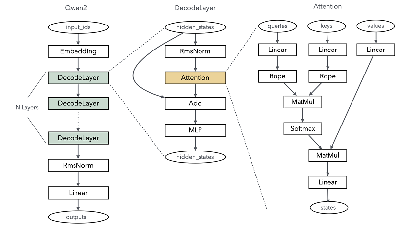

# 从零构建大语言模型推理网络

[](https://gitee.com/mindspore/docs/blob/master/tutorials/source_zh_cn/model_infer/ms_infer/ms_infer_network_develop.md)

## 模型开发模式

MindSpore提供两种模式运行模型：

- **静态图模式**：将模型网络编译成一整张网络图，对图进行融合优化，提升模型执行性能。但由于一些语法支持问题，对模型开发有一定限制，易用性相对较低。

- **动态图模式**：根据网络脚本的Python语句逐条执行，可以随时使用打印、pdb等进行调试，易用性较高。但相对性能不如静态图模式。

MindSpore推荐用户先用动态图模式进行模型开发，然后根据需要进行动转静的改造，以获取最大的模型性能。

## 动态图开发主干网络

当前主流的大语言模型大多采用基于Transformer架构的主干网络，其中Self-Attention机制是核心计算部分。以Qwen2大语言模型为例，下图简要展示了其主干网络结构：



由此可见，Qwen2的核心层主要分为以下几部分：

- **Embedding**：将每个token对应的索引转换成一个向量，实现特征分散效果。类似one-hot向量化，Embedding的权重会参与训练过程，可以更好地适配语言模型中的上下文语义。这个过程通过Embedding算子来实现。

- **DecodeLayer**：即Transformer结构，是大语言模型的关键计算模块。通常根据配置不同，会重复多层计算，每一层实际就是一个Transformer结构。

- **RmsNorm & Linear**：输出线性归一层，在Transformer结构计算完后，将结果归一成和模型词表一样的维度，最终输出每个token的概率分布。

使用MindSpore大语言模型推理构建网络，可以根据MindSpore提供的算子自己拼装。下面以Qwen2模型为例，简单描述构建模型的过程，完整端到端样例可以参考[qwen2.py](https://gitee.com/mindspore/docs/blob/master/docs/sample_code/infer_code/qwen2/qwen2.py)。

### 基础公共网络层

由于Qwen2大语言模型的配置和参数都比较多，为了能够更方便地管理这些参数，需要先定义模型使用的Config和Input类。同时，注意到Linear和RmsNorm算子在网络中的各个功能层中会频繁出现，可以预先将这些公共层构建好。

#### Config & Input

```python
import json
from dataclasses import dataclass
from typing import Optional, Type, List, Tuple, Union

from mindspore import Tensor, dtype

@dataclass
class Qwen2Config:
    """Qwen2 Config, the key-value is almost the same with config.json in Hugging Face"""
    architectures: Optional[List[str]] = None
    attention_dropout: float = 0.0
    bos_token_id: int = 151643
    eos_token_id: int = 151645
    hidden_act: str = "silu"
    hidden_size: int = 3584
    initializer_range: float = 0.02
    intermediate_size: int = 18944
    max_position_embeddings: int = 32768
    max_window_layers: int = 28
    model_type: str = "qwen2"
    num_attention_heads: int = 28
    num_hidden_layers: int = 28
    num_key_value_heads: int = 4
    rms_norm_eps: float = 1e-06
    rope_theta: float = 1000000.0
    sliding_window: Optional[int] = 131072
    tie_word_embeddings: bool = False
    torch_dtype: str = "bfloat16"
    transformers_version: str = "4.41.2"
    use_cache: bool = True
    use_sliding_window: bool = False
    vocab_size: int = 152064
    param_dtype: Optional[Type] = dtype.bfloat16   # this is mindspore datatype as hugging face use str as dtype

    @classmethod
    def from_json(cls, json_path: str) -> 'Qwen2Config':
        with open(json_path) as f:
            data = json.load(f)
        config = cls(**data)
        return config


@dataclass
class Qwen2ModelInput:
    input_ids: Tensor
    positions: Tensor
    batch_valid_length: Tensor
    is_prefill: bool
    attn_mask: Tensor
    k_caches: List[Tensor]
    v_caches: List[Tensor]
    slot_mapping: Tensor = None
    block_tables: Tensor = None
    hidden_state: Optional[Tensor] = None
    residual: Optional[Tensor] = None
    q_seq_lens: Optional[Tensor] = None
```

其中，Qwen2Config配置和Hugging Face的配置基本一致，具体请参考Qwen2的官方文档。需要注意的是，Qwen2Config用param_dtype替换了torch_dtype，原因是MindSpore的datatype类型与PyTorch的不一致。Qwen2ModelInput定义了模型的输入，主要包括单词id、KVCache和Attention融合算子等MindSpore推理优化特性所需要的数据。

#### RmsNorm

RmsNorm是当前大语言模型中常用的归一算法，在MindSpore中有直接可以使用的算子，只需要对应实现权重创建即可。同时，由于RmsNorm经常会有残差计算，RmsNorm类在网络层中实现了残差融合计算，代码可以参考：

```python
from typing import Optional, Type, Union, Tuple

from mindspore import nn, ops, mint, Parameter, Tensor

class RmsNorm(nn.Cell):
    def __init__(self, config: Qwen2Config) -> None:
        super().__init__()

        self.rms_norm = ops.RmsNorm(config.rms_norm_eps)

        self.weight = Parameter(
            mint.ones(
                config.hidden_size,
                dtype=config.param_dtype
            ),
            requires_grad=False
        )

    def construct(self, x: Tensor, residual: Optional[Tensor] = None) -> Union[Tensor, Tuple[Tensor, Tensor]]:
        if residual is not None:
            x = x + residual
            residual = x
        output = self.rms_norm(x, self.weight)[0]
        if residual is None:
            return output
        return output, residual
```

#### Linear

Linear层实际就是一个线性变换，其主要的计算逻辑就是矩阵乘法MatMul。不过会根据具体使用场景来判断是否要进行bias加法的偏差纠正（query、key、value转换时需要bias），我们将这些计算融入到一个网络结构中，代码如下：

```python
from typing import Optional, Type

from mindspore import nn, ops, mint, Parameter, Tensor

class Qwen2Linear(nn.Cell):
    def __init__(self, input_size: int, output_size: int, param_dtype: Optional[Type], enable_bias: bool) -> None:
        super().__init__()

        self.param_dtype = param_dtype
        self.input_size = input_size
        self.output_size = output_size
        self.enable_bias = enable_bias

        self.matmul = ops.MatMul(transpose_b=True)
        self.weight = Parameter(
            mint.zeros(
                (self.output_size, self.input_size),
                dtype=self.param_dtype
            ),
            requires_grad=False
        )

        if self.enable_bias:
            self.bias_add = ops.Add()
            self.bias = Parameter(
                mint.zeros(self.output_size, dtype=self.param_dtype)
            )

    def construct(self, input: Tensor):
        origin_shape = input.shape
        x = self.matmul(input.view(-1, origin_shape[-1]), self.weight)
        if self.enable_bias:
            x = self.bias_add(x, self.bias)
        return x.view(*origin_shape[:-1], -1)
```

其中，由于我们需要支持多batch计算，因此传入的input的shape可能是input_size的n倍。为了保证计算正确，我们保存了原始输入shape，并在计算完成后，重新通过view还原shape。

### Qwen2ForCausalLM

Qwen2模型通常会针对特定业务对模型结构进行封装。例如，Qwen2ForCausalLM就是Qwen2面向语言处理和对话类业务的封装。

通过Qwen2ForCausalLM类，将模型的主要接口定义清楚，下面是具体实现：

```python
from glob import glob
from typing import Optional, Type

from mindspore import nn, Tensor, load_checkpoint, load_param_into_net

class Qwen2ForCausalLM(nn.Cell):
    def __init__(self, config: Qwen2Config) -> None:
        super().__init__()

        self.model = Qwen2Model(config=config)
        self.lm_head = Qwen2Linear(
            input_size=config.hidden_size,
            output_size=config.vocab_size,
            param_dtype=config.param_dtype,
            enable_bias=False
        )

    def load_weight(self, weight_path: str) -> None:
        weight_dict = {}
        for path in glob(weight_path + "/*.safetensors"):
            weight_dict.update(load_checkpoint(path, format="safetensors"))

        load_param_into_net(self, weight_dict, strict_load=False)

    def construct(self, model_input: Qwen2ModelInput) -> Tensor:
        if model_input.is_prefill:
            self.model.phase = "prefill"
        else:
            self.model.phase = "increment"

        hidden_state = self.model(model_input.input_ids, model_input.positions,
                                  model_input.batch_valid_length, model_input.is_prefill,
                                  model_input.k_caches, model_input.v_caches, model_input.slot_mapping,
                                  model_input.block_tables, model_input.attn_mask, model_input.q_seq_lens)
        logits = self.lm_head(hidden_state)[:, -1]
        return logits
```

由代码可见，Qwen2ForCausalLM主要有2个核心接口：

- **load_weight**：从Hugging Face官网模型加载权重，并且按照网络脚本注入到模型中。

- **construct**：主要推理计算，会调用子模块逐层完成计算。
    由construct可以看出，模型核心分为主干网络计算和最后一个lm_head的linear计算，将hidden_size的特征转换成vocab_size的词表概率分布。除此之外，MindSpore会对设置了phase的模型做一些优化，因此还需要对全量和增量推理网络进行设置。

### Qwen2Model

Qwen2Model是Qwen2模型的主要网络，其组成主要分为两部分：一是将输入转换成特征的Embedding层，另一个是n层Transformer的Decoder结构。

#### Embedding

Embedding层逻辑比较简单，就是根据输入单词id，获取对应的hidden_size的特征数据（此数据也是训练权重的一部分），通过一个gather算子就可以实现，代码如下：

```python
from typing import Optional, Type

from mindspore import nn, ops, mint, Parameter, Tensor

class VocabEmbedding(nn.Cell):
    def __init__(self, config: Qwen2Config) -> None:
        super().__init__()

        self.num_embeddings = config.vocab_size
        self.embedding_dim = config.hidden_size

        self.gather = ops.Gather()

        self.weight = Parameter(
            mint.zeros(
                (self.num_embeddings, self.embedding_dim),
                dtype=config.param_dtype
            ),
            requires_grad=False
        )

    def construct(self, input_ids: Tensor):
        return self.gather(self.weight, input_ids, 0)
```

#### DecoderLayer

DecoderLayer是Transformer网络的核心计算单元，其主要计算都包含在这一层中。从Qwen2的网络结构图可以看出，主要包含Rope、Attention、MLP等网络层，为了方便开发，我们先完成这些网络层的构建。

- **Rope**

    Rope（旋转位置编码）算子用于增强Attention机制对单词间距离的感知能力，通过在query和key的特征上添加位置编码信息来实现。由于Rope的特性，可以预先计算好结果，并在使用时通过查表的方式直接获取，从而实现高效的计算。这可以通过gather操作和Rope算子来完成。具体计算方法可参考旋转位置编码的相关资料。

    ```python
    import numpy as np
    from typing import Optional, Type

    from mindspore import nn, ops, mint, Parameter, Tensor

    class Qwen2RotaryEmbedding(nn.Cell):
        def __init__(self, head_size: int, rotary_dim: int, max_position_embeddings: int, base: int, dtype: Optional[Type]) -> None:
            super().__init__()

            self.head_size = head_size
            self.rotary_dim = rotary_dim
            self.max_position_embeddings = max_position_embeddings
            self.base = base
            self.dtype = dtype

            # format 2 is neox style
            self.rotary_embedding_op = ops.ApplyRotaryPosEmb(2)
            self.gather = ops.Gather()

            self.freqs_cos, self.freqs_sin = self._compute_cos_sin_cache()

        def _compute_inv_freq(self) -> Tensor:
            freqs_base = mint.arange(0, self.rotary_dim, 2).astype(np.float32)
            freqs = 1.0 / (self.base ** (freqs_base / self.rotary_dim))
            return freqs

        def _compute_cos_sin_cache(self) -> Tuple[Tensor, Tensor]:
            freqs = self._compute_inv_freq()
            t = np.arange(0, self.max_position_embeddings, 1).astype(np.float32)
            freqs = np.outer(t, freqs)
            emb = np.concatenate((freqs, freqs), axis=1)
            freqs_cos = np.cos(emb)
            freqs_sin = np.sin(emb)

            freqs_cos = Tensor(freqs_cos, dtype=self.dtype)
            freqs_sin = Tensor(freqs_sin, dtype=self.dtype)
            return freqs_cos, freqs_sin

        def construct(self, positions: Tensor, query: Tensor, key: Tensor, batch_valid_length: Tensor, is_prefill: bool):
            query = query.contiguous()
            key = key.contiguous()

            if is_prefill:
                freqs_cos = self.freqs_cos
                freqs_sin = self.freqs_sin
            else:
                freqs_cos = self.gather(self.freqs_cos, positions.view(-1), 0)
                freqs_sin = self.gather(self.freqs_sin, positions.view(-1), 0)

            return self.rotary_embedding_op(query, key, freqs_cos, freqs_sin, batch_valid_length)
    ```

- **Attention**

    Attention层是由多个Linear、Rope和Attention分数计算等组成的。其中，MindSpore提供了FlashAttention和PagedAttention两个融合算子，用于提升Attention分数计算的推理性能。

    然而，由于原生算子面向多种场景，输入比较复杂，此处通过封装简化使用场景。具体代码可以参考：

    ```python
    import numpy as np
    from typing import Optional, Type

    from mindspore import nn, ops, mint, Parameter, Tensor

    class FlashAttention(nn.Cell):
        def __init__(self, scale: float, num_heads: int) -> None:
            super().__init__()

            input_layout = "TH"
            scale = scale
            pre_tokens = 2147483647
            next_tokens = 2147483647
            self.flash_attention = ops.operations.nn_ops.FlashAttentionScore(head_num=num_heads,
                                                                            scale_value=scale,
                                                                            pre_tokens=pre_tokens,
                                                                            next_tokens=next_tokens,
                                                                            input_layout=input_layout)

        def construct(self, q: Tensor, k: Tensor, v: Tensor, attn_mask: Tensor, batch_valid_length: Tensor) -> Tensor:
            _, _, _, output = self.flash_attention(
                q,
                k,
                v,
                None,
                None,
                None,
                attn_mask,
                None,
                batch_valid_length,
                batch_valid_length
            )
            return output


    class PagedAttention(nn.Cell):
        def __init__(self, head_num: int, scale: float, num_kv_heads: int) -> None:
            super().__init__()

            self.head_num = head_num
            self.num_kv_heads = num_kv_heads

            self.paged_attention = ops.auto_generate.PagedAttention(
                head_num=head_num,
                scale_value=scale,
                kv_head_num=num_kv_heads
            )

        def construct(self, q: Tensor, k_cache: Tensor, v_cache: Tensor,
                            block_tables: Tensor, batch_valid_length: Tensor,
                            attn_mask: Tensor, q_seq_lens: Tensor) -> Tensor:
            output = self.paged_attention(q, k_cache, v_cache, block_tables, batch_valid_length, None, None, attn_mask, q_seq_lens)
            return output
    ```

    Attention层的代码可以通过上述构建的网络层实现，代码可以参考：

    ```python
    import numpy as np
    from typing import Optional, Type

    from mindspore import nn, ops, mint, Parameter, Tensor


    class Qwen2Attention(nn.Cell):
        def __init__(self, config: Qwen2Config) -> None:
            super().__init__()

            self.hidden_size = config.hidden_size
            self.num_heads = config.num_attention_heads
            self.num_kv_heads = config.num_key_value_heads
            self.head_dim =config.hidden_size // self.num_heads
            self.q_size = self.head_dim * self.num_heads
            self.kv_size = self.head_dim * self.num_kv_heads
            self.scaling = float(self.head_dim ** -0.5)
            self.rope_theta = int(config.rope_theta)
            self.param_dtype = config.param_dtype
            self.max_position = config.max_position_embeddings

            self.flash_attn = FlashAttention(self.scaling, self.num_heads)
            self.paged_attn = PagedAttention(self.num_heads, self.scaling, self.num_kv_heads)
            self.reshape_and_cache = ops.auto_generate.ReshapeAndCache()

            self.q_proj = Qwen2Linear(
                input_size=self.hidden_size,
                output_size=self.q_size,
                param_dtype=self.param_dtype,
                enable_bias=True
            )
            self.k_proj = Qwen2Linear(
                input_size=self.hidden_size,
                output_size=self.kv_size,
                param_dtype=self.param_dtype,
                enable_bias=True
            )
            self.v_proj = Qwen2Linear(
                input_size=self.hidden_size,
                output_size=self.kv_size,
                param_dtype=self.param_dtype,
                enable_bias=True
            )
            self.o_proj = Qwen2Linear(
                input_size=self.q_size,
                output_size=self.hidden_size,
                param_dtype=self.param_dtype,
                enable_bias=False
            )

            self.rotary_emb = Qwen2RotaryEmbedding(
                head_size=self.head_dim,
                rotary_dim=self.head_dim,
                max_position_embeddings=self.max_position,
                base=self.rope_theta,
                dtype=self.param_dtype
            )

        def construct(self, hidden_state: Tensor, positions: Tensor, batch_valid_length: Tensor,
                            is_prefill: bool, layer_idx: int, k_cache: Tensor, v_cache: Tensor,
                            slot_mapping: Tensor, block_tables: Tensor, attn_mask: Tensor,
                            q_seq_lens: Tensor) -> Tensor:
            bs, seq_len, hidden_dim = hidden_state.shape

            q = self.q_proj(hidden_state).view(-1, self.q_size)
            k = self.k_proj(hidden_state).view(-1, self.kv_size)
            v = self.v_proj(hidden_state).view(-1, self.kv_size)

            q, k = self.rotary_emb(
                positions,
                q,
                k,
                batch_valid_length,
                is_prefill
            )

            k = k.contiguous()
            v = v.contiguous()

            cache_out = self.reshape_and_cache(
                k,
                v,
                k_cache,
                v_cache,
                slot_mapping
            )
            q = ops.depend(q, cache_out)

            if is_prefill:
                attn_output = self.flash_attn(
                    q,
                    k,
                    v,
                    attn_mask,
                    batch_valid_length
                )
            else:
                attn_output = self.paged_attn(
                    q,
                    k_cache,
                    v_cache,
                    block_tables,
                    batch_valid_length,
                    attn_mask,
                    q_seq_lens
                )

            output = self.o_proj(attn_output).view(bs, seq_len, -1)
            return output
    ```

- **MLP**

    MLP层由多个Linear和一个激活函数（通常是silu）组成，负责实现网络的非线性计算。MLP层可以将问题投影到多个非线性空间，从而增强网络能力。具体实现可以参考下面代码：

    ```python
    import numpy as np
    from typing import Optional, Type

    from mindspore import nn, ops, mint, Parameter, Tensor

    class Qwen2MLP(nn.Cell):
        def __init__(self, config: Qwen2Config) -> None:
            super().__init__()

            self.up_proj = Qwen2Linear(
                input_size=config.hidden_size,
                output_size=config.intermediate_size,
                param_dtype=config.param_dtype,
                enable_bias=False
            )
            self.gate_proj = Qwen2Linear(
                input_size=config.hidden_size,
                output_size=config.intermediate_size,
                param_dtype=config.param_dtype,
                enable_bias=False
            )
            self.down_proj = Qwen2Linear(
                input_size=config.intermediate_size,
                output_size=config.hidden_size,
                param_dtype=config.param_dtype,
                enable_bias=False
            )
            self.act_fn = ops.silu

        def construct(self, x: Tensor) -> Tensor:
            output = self.down_proj(self.act_fn(self.gate_proj(x)) * self.up_proj(x))
            return output
    ```

DecoderLayer层可以用上述的网络层参考以下方式构建：

```python
from typing import Tuple
from mindspore import nn, Tensor

class Qwen2DecoderLayer(nn.Cell):
    def __init__(self, config: Qwen2Config) -> None:
        super().__init__()

        self.hidden_size = config.hidden_size

        self.self_attn = Qwen2Attention(config=config)
        self.mlp = Qwen2MLP(config=config)
        self.input_layernorm = RmsNorm(config=config)
        self.post_attention_layernorm = RmsNorm(config=config)

    def construct(self, hidden_state: Tensor, residual: Tensor, positions: Tensor,
                        batch_valid_length: Tensor, is_prefill: bool, layer_idx: int,
                        k_cache: Tensor, v_cache: Tensor, slot_mapping: Tensor,
                        block_tables: Tensor, attn_mask: Tensor, q_seq_lens: Tensor) -> Tuple[Tensor, Tensor]:
        if residual is None:
            residual = hidden_state
            hidden_state = self.input_layernorm(hidden_state)
        else:
            hidden_state, residual = self.input_layernorm(hidden_state, residual)

        hidden_state = self.self_attn(hidden_state, positions, batch_valid_length, is_prefill,
                                        layer_idx, k_cache, v_cache, slot_mapping, block_tables,
                                        attn_mask, q_seq_lens)
        hidden_state, residual = self.post_attention_layernorm(hidden_state, residual)
        hidden_state = self.mlp(hidden_state)

        return hidden_state, residual
```

#### Model

完成Embedding和Decoder层构建后，可以参考如下代码构建Model类：

```python
from mindspore import nn, ops, mint, Parameter, Tensor

class Qwen2Model(nn.Cell):
    def __init__(self, config: Qwen2Config) -> None:
        super().__init__()

        self.vocab_size = config.vocab_size
        self.hidden_size = config.hidden_size
        self.num_hidden_layers = config.num_hidden_layers

        self.embed_tokens = VocabEmbedding(config=config)
        self.layers = nn.CellList()
        for i in range(config.num_hidden_layers):
            layer = Qwen2DecoderLayer(config=config)
            self.layers.append(layer)
        self.norm = RmsNorm(config=config)

    def construct(self, input_ids: Tensor, positions: Tensor, batch_valid_length: Tensor,
                        is_prefill: bool, k_caches: List[Tensor], v_caches: List[Tensor],
                        slot_mapping: Tensor, block_tables: Tensor, attn_mask: Tensor,
                        q_seq_lens: Tensor) -> Tensor:
        hidden_state = self.embed_tokens(input_ids)
        residual = None

        for i in range(self.num_hidden_layers):
            layer = self.layers[i]
            hidden_state, residual = layer(hidden_state, residual, positions, batch_valid_length,
                                           is_prefill, i, k_caches[i], v_caches[i], slot_mapping,
                                           block_tables, attn_mask, q_seq_lens)

        hidden_state, _ = self.norm(hidden_state, residual)

        return hidden_state
```

### KVCacheManager

由于大语言模型通常会使用KVCache优化，MindSpore提供的FlashAttention和PagedAttention需要和KVCache配合使用，需要额外传入一些参数，其中主要包括：

- **k_cache & v_cache**：kv_cache对象可以理解为是一个缓存表，用于保存上一次迭代中的key和value值。在下一次迭代时，可以直接读取这些值，从而避免重复计算前n个词的key和value，以提升性能。

- **block_tables & slot_mapping**：PagedAttention通过类似分页的机制，将KVCache按block储存，以便相同词能够集中在同一块block，从而提升显存利用率。

根据上述描述，这些参数可以用一个管理类进行封装，代码可以参考：

```python
import math
from collections import deque
from mindspore import nn, ops, mint, Parameter, Tensor, mutable

class CacheManager:
    def __init__(self, config: Qwen2Config, block_num: int, block_size: int, batch_size: int) -> None:
        self.block_num = block_num
        self.block_size = block_size
        self.batch_size = batch_size

        head_dim = config.hidden_size // config.num_attention_heads

        self.k_caches = mutable([ops.zeros((block_num, block_size, config.num_key_value_heads, head_dim), dtype=config.param_dtype) for _ in range(config.num_hidden_layers)])
        self.v_caches = mutable([ops.zeros((block_num, block_size, config.num_key_value_heads, head_dim), dtype=config.param_dtype) for _ in range(config.num_hidden_layers)])
        self.block_tables = [[] for _ in range(batch_size)]
        self.acc_slot_mapping = [[] for _ in range(batch_size)]
        self.free_block_ids = deque(range(block_num))

    def step(self, start_pos_idx: int, token_num_per_batch: int) -> Tuple[Tensor, Tensor]:
        for i in range(self.batch_size):
            block_table = self.block_tables[i]
            total_block_num = math.ceil((start_pos_idx + token_num_per_batch) / self.block_size)
            now_block_num = len(block_table)
            for _ in range(total_block_num - now_block_num):
                block_id = self.free_block_ids.popleft()
                block_table.append(block_id)
                start_slot_id = block_id * self.block_size
                self.acc_slot_mapping[i].extend(list(range(start_slot_id, start_slot_id + self.block_size)))


        now_block_tables = Tensor(self.block_tables, dtype=dtype.int32)
        now_slot_mapping = Tensor([self.acc_slot_mapping[i][start_pos_idx: start_pos_idx + token_num_per_batch]
                                for i in range(self.batch_size)], dtype=dtype.int32).view(-1)

        return now_block_tables, now_slot_mapping
```

### Sampler

当主干网络计算完毕后，此时网络的输出是一个shape为[batch_size， vocab_size]的词表，表示batch中多个推理请求的下一个单词的概率分布，需要从中选择一个词作为最终的结果返回，此处为了简单和消除随机性，每次都选择概率最大的单词作为输出，即通过一次argmax计算，代码可以参考如下：

```python
from mindspore import Tensor

def sample(logits: Tensor) -> Tensor:
    next_token = logits.argmax(axis=-1, keepdims=True)
    return next_token
```

## 动态图转静态图

MindSpore可以通过jit将动态图转换成静态图，以此提升推理性能。从代码实现上，用户可以通过如下简单的装饰器进行转换：

```python
from mindspore import nn, ops, mint, Parameter, Tensor, jit


class Qwen2Model(nn.Cell):
    def __init__(self, config: Qwen2Config) -> None:
        super().__init__()

        self.vocab_size = config.vocab_size
        self.hidden_size = config.hidden_size
        self.num_hidden_layers = config.num_hidden_layers

        self.embed_tokens = VocabEmbedding(config=config)
        self.layers = nn.CellList()
        for i in range(config.num_hidden_layers):
            layer = Qwen2DecoderLayer(config=config)
            self.layers.append(layer)
        self.norm = RmsNorm(config=config)

    @jit(jit_level="O0", infer_boost="on")
    def construct(self, input_ids: Tensor, positions: Tensor, batch_valid_length: Tensor,
                        is_prefill: bool, k_caches: List[Tensor], v_caches: List[Tensor],
                        slot_mapping: Tensor, block_tables: Tensor, attn_mask: Tensor,
                        q_seq_lens: Tensor) -> Tensor:
        hidden_state = self.embed_tokens(input_ids)
        residual = None

        for i in range(self.num_hidden_layers):
            layer = self.layers[i]
            hidden_state, residual = layer(hidden_state, residual, positions, batch_valid_length,
                                           is_prefill, i, k_caches[i], v_caches[i], slot_mapping,
                                           block_tables, attn_mask, q_seq_lens)

        hidden_state, _ = self.norm(hidden_state, residual)

        return hidden_state
```

通过在nn.Cell的construct方法加上mindspore.jit装饰器，这个Cell的计算就会转化为静态图执行，其中参数意义如下：

- **jit_level**：编译级别，当前MindSpore推理主要支持O0级别、O1级别（会有一些算子融合优化）。

- **infer_boost**：开启推理加速优化，开启后，运行时会做一些调度优化和流优化，提升推理性能。

除此之外，由于MindSpore的静态图模式实现的限制，部分场景可能会导致动转静失败，此处列出一些常见的原因：

- **使用setattrs**：由于MindSpore图捕获时不支持Python的setattrs语法，因此不能使用封装类封装参数，如上例中的Qwen2ModelInput不能直接传给要转静态的Qwen2Model，否则会导致静态图执行失败。

- **List取值**：转静态的时候，如果有List参数，需要通过mutable进行wrap，保证MindSpore能够正确处理，如上例中的k_caches和v_caches。否则会触发fallback到Python的操作，会影响推理性能，部分场景会导致计算失败。

- **图输入名称**：如果使用了MindSpore的PagedAttention算子，两个图输入必须命名为batch_valid_length和q_seq_lens，否则会导致PagedAttention算子初始化失败。

用户在使用MindSpore开发模型脚本时，如果计划后续使用静态图推理，建议在动态图开发调试时就遵循以上限制，避免后续迁移和调试的额外成本。
