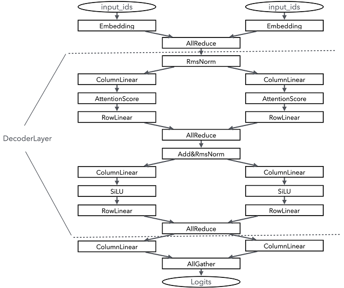
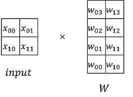
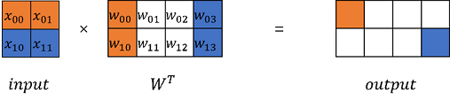
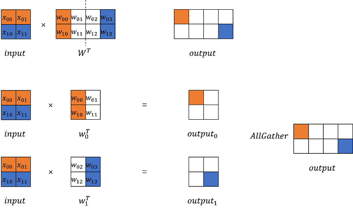
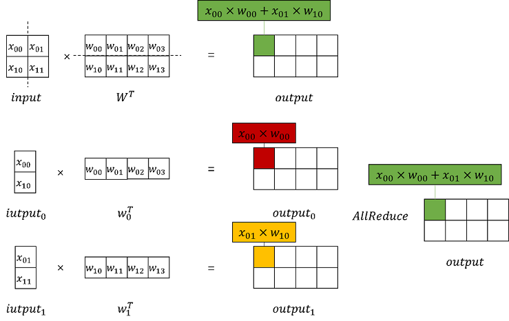
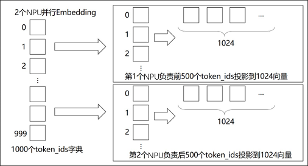
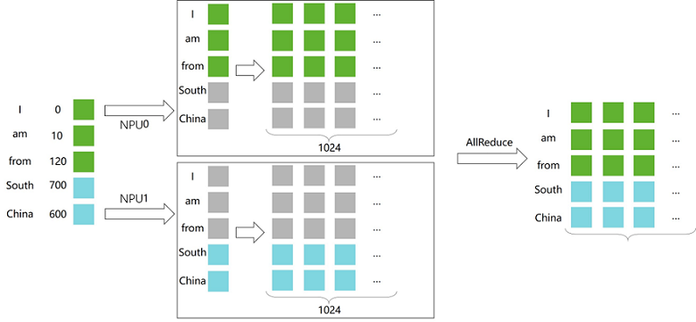
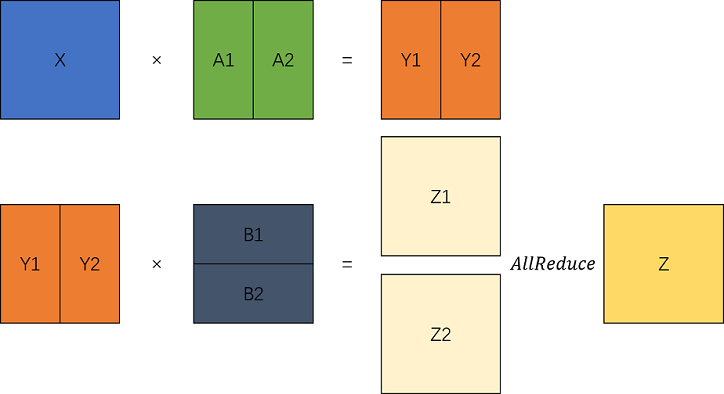
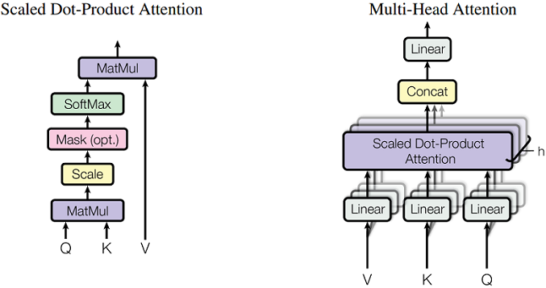

# 构建可并行的大语言模型网络

[](https://gitee.com/mindspore/docs/blob/br_base/tutorials/source_zh_cn/model_infer/ms_infer/ms_infer_parallel_infer.md)

随着模型规模的不断扩展，大语言模型所需的计算资源，特别是显存需求，呈指数级增长。以Qwen2-72B为例，在半精度（FP16）下，这些参数本身就需要约144GB的显存。

同时大模型日益膨胀的序列长度也给显存带来极大的压力。显存不仅影响了模型的加载，还限制了批处理（batch size）大小。较小的批处理可能会降低推理效率，进而影响整个系统的吞吐量。

显存的压力使得单一设备很难在合理时间内完成推理任务，并行计算成为应对这一挑战的关键。本章将以常见大语言模型网络结构为例，分析模型并行的方案。

## 模型并行需求分析

在对模型进行并行切分前，需要先根据模型的结构特征来进行并行分析，确认网络中哪些层可以并行，以及如何切分能够获得比较好的性能加速。为了要能够获得好的加速效果，并行切分的部分就需要尽可能的独立计算互不影响。以Qwen2模型结构为例，我们对其主要的网络结构进行并行分析：

- **Embedding**：Embedding层实际上是一个gather操作，不管是按hidden_dim还是num_embeddings维度切分，都可以比较好地进行并行计算。由于按照num_embedding可以更好地进行all_reduce（减少数据排布的开销），此处我们按照num_embeddings维度进行切分。

- **Attention**：Qwen2模型使用了GQA的Attention计算方法，即有多个独立的Attention计算，因此我们可以按照列维度将query、key、value切分开来单独计算，但是需要保证切分能够被Attention的head数整除。

- **MLP**：MLP层实际上是两个Linear的矩阵乘法，可以按块切分。

- **RmsNorm&Add**：由于RmsNorm需要对一行数据进行归一操作，需要有全局信息，因此无法有效并行计算，此处需要先通过all_reduce将数据汇总，然后计算，同时Add和RmsNorm通常在一起出现，因此都不进行切分。

- **LMHead**：LMHead层实际就是一层Linear层，输入shape通常是（batch_size， hidden_size）*（hidden_size， vocab_size），我们可以对vocab_size维度进行切分，并在最后通过all_gather合并以此提速。

下图是在并行度为2的1层Qwen2的切分执行示意图：



从图中可以看出，由于RmsNorm无法切分，因此每次RmsNorm计算前，需要在网络中加入一个AllReduce的算子同步各个子进程的计算结果。而RmsNorm之后的结果，一般都是hidden_states，因此可以通过一个列切的Linear进行切分计算分配到各个子进程上，在需要归一的时候，可以通过行切的RowLinear进行归一。

## 模型模块并行方案

Linear层作为切分主要的网络层，其核心是MatMul矩阵计算，因此矩阵切分计算也是模型并行最重要的一部分。

### 基础矩阵乘模块





在大模型计算中，矩阵乘（MatMul）不管是在权重还是计算量上都占了相当大的比例。观察矩阵乘，其拥有列可切分性（Column-wise Parallelism）和行可切分性（Row-wise Parallelism）。





以MindSpore原始实现的`nn.Dense`为起点，分别构建列切和行切的矩阵乘实现。

1. 通信域的创建和管理，大模型配置的管理

    构建`CommunicationHelper`类管理模型并行的域。

    ```python
    from mindspore.communication import create_group, get_group_size, get_rank
    ```

    ```python
    class CommunicationHelper:
        def __init__(self, group_name, size):
            self.group_name = group_name
            self.size = size
            self.rank_list = [i for i in range(size)]

        def create_tensor_model_parallel_group(self):
            create_group(group=self.group_name, rank_ids=self.rank_list)

        def get_tensor_model_parallel_group_size(self):
            return get_group_size(group=self.group_name)

        def get_tensor_model_parallel_group_rank(self):
            return get_rank(group=self.group_name)

        def get_tensor_model_parallel_group(self):
            return self.group_name
    ```

    构建`ConfigHelper`管理并配置大模型参数。

    ```python
    class ConfigHelper:
        def __init__(self,
                     vocab_size,
                     hidden_size,
                     ffn_hidden_size,
                     num_layers,
                     batch_size,
                     seq_length, dtype,
                     num_heads,
                     has_bias=False):
            self.vocab_size = vocab_size
            self.hidden_size = hidden_size
            self.ffn_hidden_size = ffn_hidden_size
            self.num_layers = num_layers
            self.batch_size = batch_size
            self.seq_length = seq_length
            self.dtype = dtype
            self.num_heads = num_heads
            self.has_bias = has_bias
    ```

2. 列切矩阵乘

    `ColumnParallelLinear`类，根据模型并行的设备数，计算切分后的权重shape并初始化。列切是切分`out_channels`，在模型前向，调用矩阵乘计算出并行的结果。最后可以选择对并行的结果进行`AllGather`，以得到完整的输出。

    MindSpore训推一体框架支持开启infer_boost，该参数会使MS框架开启高性能自研算子库。启动该模式需要：

    1. 设置变量：

        ```python
        from mindspore import set_context
        set_context(jit_config={"jit_level": 'O0', "infer_boost": 'on'})
        ```

    2. 设置系统环境变量：

        ```bash
        export ASCEND_HOME_PATH={$ascend_custom_path}
        ```

    以模型并行device数是2为例，设置环境变量以及初始化通信组，并配置大模型参数config。

    ```python
    from mindspore import nn, Parameter, ops, Tensor
    from mindspore.common import dtype as mstype
    from mindspore.communication import init
    from mindspore.common.initializer import initializer
    import numpy as np

    from mindspore import set_context
    set_context(jit_config={"jit_level": 'O0', "infer_boost": 'on'})

    TP_GROUP_NAME='tp'
    TP_SIZE = 2
    COMMUN_HELPER = CommunicationHelper(group_name=TP_GROUP_NAME, size=TP_SIZE)

    init()
    COMMUN_HELPER.create_tensor_model_parallel_group()

    config = ConfigHelper(batch_size=64,
                          vocab_size=32000,
                          num_layers=4,
                          seq_length=2048,
                          hidden_size=1024,
                          ffn_hidden_size=4096,
                          dtype=mstype.float16,
                          num_heads=8,
                          has_bias=False)
    ```

    列切矩阵乘模块实现如下：

    ```python
    class ColumnParallelLinear(nn.Cell):
        def __init__(self,
                     in_channels,
                     out_channels,
                     weight_init=None,
                     bias_init=None,
                     has_bias=True,
                     dtype=mstype.float32):
            super().__init__()
            self.in_channels = in_channels
            self.out_channels = out_channels
            self.has_bias = has_bias
            self.tensor_parallel_group_size = COMMUN_HELPER.get_tensor_model_parallel_group_size()
            self.out_channels_per_partition = out_channels // self.tensor_parallel_group_size
            self.dtype = dtype
            weight_shape = (self.out_channels_per_partition, self.in_channels)
            self.weight = Parameter(initializer(weight_init, weight_shape, self.dtype), name="weight")
            if self.has_bias:
                self.bias = Parameter(initializer(bias_init, (self.out_channels_per_partition), self.dtype), name="bias")
                self.bias_add = ops.Add()
            self.matmul = ops.BatchMatMul(transpose_b=True)
            self.cast = ops.Cast()

        def construct(self, x):
            origin_dtype = x.dtype
            x = self.cast(x, self.dtype)
            out = self.matmul(x, self.weight)
            if self.has_bias:
                out = self.bias_add(
                    out, self.cast(self.bias, self.dtype)
                )
            out = self.cast(out, origin_dtype)
            return out
    ```

    列切矩阵乘法的输出是并行的，若需要得到完整的输出，可通过`GatherLastDim`得到。

    ```python
    class GatherLastDim(nn.Cell):
        def __init__(self):
            super().__init__()
            self.all_gather = ops.AllGather(group=COMMUN_HELPER.get_tensor_model_parallel_group())
            self.world_size = COMMUN_HELPER.get_tensor_model_parallel_group_size()
            self.split = ops.Split(axis=0, output_num=self.world_size)

        def construct(self, input_):
            output = self.all_gather(input_)
            tensor_list = self.split(output)
            output = ops.cat(tensor_list, axis=-1)
            return output
    ```

    列切矩阵乘法的推理：

    ```python
    column_parallel_linear = ColumnParallelLinear(in_channels=config.hidden_size,
                                                  out_channels=config.hidden_size,
                                                  weight_init='normal',
                                                  dtype=config.dtype,
                                                  has_bias=False)
    input_x = Tensor(np.random.randn(config.batch_size, config.seq_length, config.hidden_size).astype(np.float32))
    out_parallel = column_parallel_linear(input_x)
    print(out_parallel.shape)

    gather_last_dim = GatherLastDim()
    out = gather_last_dim(out_parallel)
    print(out.shape)
    ```

3. 行切矩阵乘

    与列切相同，`RowParallelLinear`根据模型并行域的大小切分权重。在初始化时，切分方向是行，因此切分`in_channels`维度后初始化。在模型前向，输入与权重进行矩阵乘后，需要对所有`device`上的结果进行`AllReduce`。

    行切矩阵乘模块实现如下：

    ```python
    class RowParallelLinear(nn.Cell):
        def __init__(self,
                     in_channels,
                     out_channels,
                     weight_init='normal',
                     bias_init=None,
                     has_bias=True,
                     dtype=mstype.float32):
            super().__init__()
            self.in_channels = in_channels
            self.out_channels = out_channels
            self.has_bias = has_bias
            self.tensor_parallel_group_size = COMMUN_HELPER.get_tensor_model_parallel_group_size()
            self.in_channels_per_partition = in_channels // self.tensor_parallel_group_size
            self.dtype = dtype
            weight_shape = (self.out_channels, self.in_channels_per_partition)
            self.weight = Parameter(initializer(weight_init, weight_shape, self.dtype), name="weight")
            if self.has_bias:
                self.bias = Parameter(initializer(bias_init, (self.in_channels_per_partition), self.dtype), name="bias")
                self.bias_add = ops.Add()
            self.bmm = ops.BatchMatMul(transpose_b=True)
            self.all_reduce = ops.AllReduce(group=COMMUN_HELPER.get_tensor_model_parallel_group())
            self.cast = ops.Cast()

        def construct(self, x):
            origin_dtype = x.dtype
            x = self.cast(x, self.dtype)
            output_parallel = self.bmm(x, self.weight)
            if self.has_bias:
                output_parallel = self.bias_add(output_parallel, self.cast(self.bias, self.dtype))
            out = self.all_reduce(output_parallel)
            out = self.cast(out, origin_dtype)
            return out
    ```

    行切矩阵乘法的推理：

    ```python
    row_parallel_linear = RowParallelLinear(in_channels=config.hidden_size,
                                            out_channels=config.hidden_size,
                                            weight_init='normal',
                                            dtype=config.dtype,
                                            has_bias=False)
    out = row_parallel_linear(out_parallel)
    print(out.shape)
    ```

4. Embedding

   除了矩阵乘之外，Embedding层也可以进行并行计算。将Embedding权重切分至若干个device上，每个device负责映射不同范围token_ids。

   

   

   以nn.Embedding为基础，构建模型并行的Embedding层：

   ```python
    class VocabParallelEmbedding(nn.Cell):
        def __init__(self,
                     num_embeddings,
                     embedding_dim,
                     init_method="normal",
                     init_type=mstype.float32):
            super().__init__()
            self.num_embeddings = num_embeddings
            self.embedding_dim = embedding_dim
            self.tensor_model_parallel_size = COMMUN_HELPER.get_tensor_model_parallel_group_size()
            per_partition_vocab_size = self.num_embeddings // self.tensor_model_parallel_size
            self.vocab_start_index = COMMUN_HELPER.get_tensor_model_parallel_group_rank() * per_partition_vocab_size
            self.vocab_end_index = self.vocab_start_index + per_partition_vocab_size
            self.num_embeddings_per_partition = (
                self.vocab_end_index - self.vocab_start_index
            )
            self.embedding_weight = Parameter(
                initializer(
                    init=init_method,
                    shape=(self.num_embeddings_per_partition, self.embedding_dim),
                    dtype=init_type,
                ),
                name="embedding_weight",
            )
            self.all_reduce = ops.AllReduce(group=COMMUN_HELPER.get_tensor_model_parallel_group())
            self.max_index_per_partition = Tensor(self.num_embeddings_per_partition - 1, dtype=mstype.int32)
            self.expand_dims = ops.ExpandDims()
            self.gather = ops.Gather()
            self.sub = ops.Sub()
            self.relu = ops.ReLU()
            self.minimum = ops.Minimum()
            self.eq = ops.Equal()
            self.mul = ops.Mul()

        def construct(self, x):
            displaced_x = self.sub(x, self.vocab_start_index)
            down_truncated_x = self.relu(displaced_x)
            truncated_x = self.minimum(down_truncated_x, self.max_index_per_partition)
            input_mask = self.eq(displaced_x, truncated_x)
            input_mask = self.expand_dims(input_mask, -1)
            output_parallel = self.gather(self.embedding_weight, truncated_x, 0)
            output_parallel = self.mul(output_parallel, input_mask)
            output = self.all_reduce(output_parallel)
            return output
    ```

    并行Embedding推理：

    ```python
    input_ids = np.random.randint(0, config.vocab_size, size=(config.batch_size, config.seq_length), dtype=np.int32)
    input_ids = Tensor(input_ids)

    vocab_parallel_embedding = VocabParallelEmbedding(num_embeddings=config.vocab_size,
                                                   embedding_dim=config.hidden_size)
    embedding_output = vocab_parallel_embedding(input_ids)
    print(embedding_output.shape)
    ```

### TransformerModel并行适配

可以看出张量按顺序，先经过`ColumnParallelLinear`列切矩阵乘得到并行的结果，然后输入`RowParallelLinear`行切矩阵乘，就能得到完整的两次矩阵乘结果。



根据以上分析，可以对TransformerModel模型修改为支持并行切分的模型结构。

1. Attention

    以MHA（Multi Head Attention）为例，Transformer中典型的Attention模块是多头的，每个注意力头相互独立。因此在保证单个注意力头完整的情况下，激活值在`hidden_size`的维度是可切的。例如，假设一个MHA的头数（`num_heads`）是16，每个头的维度（`head_dim`）是256，那么`hidden_size`就是4096，计算Q/K/V的Linear的in/out都是4096。当模型并行设置为`tensor_model_parallel=4`时，这些Linear被切分到4个device，每个device的shape为(4096,1024)，意味着每个device计算4个头。

    

    Attention模块编码示例：

    ```python
    class ParallelAttention(nn.Cell):
        def __init__(self, config):
            super().__init__()
            self.tensor_model_parallel_size = COMMUN_HELPER.get_tensor_model_parallel_group_size()
            self.num_heads_per_partition = config.num_heads // self.tensor_model_parallel_size
            self.head_dim = config.hidden_size // config.num_heads
            self.norm_factor = math.sqrt(self.head_dim)
            self.q = ColumnParallelLinear(in_channels=config.hidden_size,
                                          out_channels=config.hidden_size,
                                          weight_init='normal',
                                          has_bias=config.has_bias)
            self.k = ColumnParallelLinear(in_channels=config.hidden_size,
                                          out_channels=config.hidden_size,
                                          weight_init='normal',
                                          dtype=config.dtype,
                                          has_bias=config.has_bias)
            self.v = ColumnParallelLinear(in_channels=config.hidden_size,
                                          out_channels=config.hidden_size,
                                          weight_init='normal',
                                          dtype=config.dtype,
                                          has_bias=config.has_bias)
            self.flash_attention = ops.operations.nn_ops.FlashAttentionScore(head_num=self.num_heads_per_partition,
                                                                            scale_value=1.0/self.norm_factor,
                                                                            next_tokens=0)
            self.out = RowParallelLinear(in_channels=config.hidden_size,
                                         out_channels=config.hidden_size,
                                         weight_init='normal',
                                         dtype=config.dtype,
                                         has_bias=config.has_bias)

        def construct(self, x, mask):
            query = self.q(x)
            key = self.k(x)
            value = self.v(x)
            _, _, _, context_layer = self.flash_attention(query, key, value, attn_mask=mask)
            output = self.out(context_layer)
            return output
    ```

2. MLP

   MLP模块为2个全连接层，也可以使用矩阵乘的并行切分来处理，具体代码如下：

    ```python
    class ParallelMLP(nn.Cell):
        def __init__(self, config):
            super().__init__()
            self.w1 = ColumnParallelLinear(in_channels=config.hidden_size,
                                           out_channels=config.ffn_hidden_size,
                                           weight_init='normal',
                                           dtype=config.dtype,
                                           has_bias=config.has_bias)
            self.w2 = RowParallelLinear(in_channels=config.ffn_hidden_size,
                                        out_channels=config.hidden_size,
                                        weight_init='normal',
                                        dtype=config.dtype,
                                        has_bias=config.has_bias)
            self.act_func = nn.SiLU()
            self.mul = ops.Mul()

        def construct(self, x):
            x = self.w1(x)
            x = self.act_func(x)
            output = self.w2(x)
            return output
    ```

3. TransformerLayer

    TransformerLayer层由Attention和MLP构成，由于没有可并行的单算子，只需要将并行参数透传给Attention和MLP即可。

    ```python
    class ParallelTransformerLayer(nn.Cell):
        def __init__(self, config):
            super().__init__()
            self.attention = ParallelAttention(config=config)
            self.feed_forward = ParallelMLP(config=config)
            self.attention_norm = RMSNorm(dim=config.hidden_size, dtype=config.dtype)
            self.ffn_norm = RMSNorm(dim=config.hidden_size, dtype=config.dtype)
            self.add = ops.Add()

        def construct(self, x, mask):
            norm_output = self.attention_norm(x)
            attention_output = self.attention(norm_output, mask)
            norm_input = self.add(x, attention_output)
            norm_output = self.ffn_norm(norm_input)
            mlp_output = self.feed_forward(norm_output)
            output = self.add(norm_input, mlp_output)
            return output
    ```

4. TransformerModel

    ```python
    class ParallelTransformer(nn.Cell):
        def __init__(self, config):
            super().__init__()
            self.embedding = VocabParallelEmbedding(num_embeddings=config.vocab_size,
                                                    embedding_dim=config.hidden_size,
                                                    init_method='normal',
                                                    init_type=config.dtype)
            self.layers = nn.CellList()
            self.num_layers = config.num_layers
            for _ in range(config.num_layers):
                layer = ParallelTransformerLayer(config=config)
                self.layers.append(layer)
            self.norm_out = RMSNorm(dim=config.hidden_size, dtype=config.dtype)

        def construct(self, x, mask):
            hidden_state = self.embedding(x)
            for i in range(self.num_layers):
                hidden_state = self.layers[i](hidden_state, mask)
            hidden_state = self.norm_out(hidden_state)
            return hidden_state
    ```

具体端到端的大语言模型代码工程可以参考[model_dev.py](https://gitee.com/mindspore/docs/blob/br_base/docs/sample_code/infer_code/model_dev.py)脚本，通过运行如下命令进行验证：

```shell
msrun --worker_num 2 --local_worker_num 2 --master_port 8124 --log_dir msrun_log --join True --cluster_time_out 300 model_dev.py
```

## 实践：Qwen2模型并行改造

本章将对[从零构建大语言模型推理网络](./ms_infer_network_develop.md)中开发的Qwen2大语言模型进行并行适配，根据上述分析，可以将并行适配分为以下三个主要步骤：

1. **模型网络适配**：根据上述的并行方案，对模型中的网络层进行并行切分，将计算分割到多个卡上执行。

2. **模型权重适配**：由于Linear中权重在并行切分后，shape也变化了，因此在加载模型权重时，需要对应修改。

3. **KVCache适配**：由于Attention分数计算时的数量计算也根据并行度切分了，因此在KVCache管理中也要对应更新shape。

为了能够简化场景，本章只对Qwen2模型中的Linear进行并行度为2的切分，Embedding层的切分暂时不涉及。建议，将示例中原本单卡的infer.py和qwen2.py文件，重命名为infer_parallel.py和qwen2_parallel.py，防止代码的冲突。

### 通信组建立

在对模型进行改造前，需要先通过mindspore的通信模块建立通信组，以实现后续通信操作，这部分功能可以直接复用上述描述的CommunicationHelper类完成，通过以下代码可以完成此功能：

```python
from mindspore.communication import create_group, get_group_size, get_rank, init

class CommunicationHelper:
    def __init__(self, group_name: str, size: int) -> None:
        self.group_name = group_name
        self.size = size
        self.rank_list = [i for i in range(size)]

    def create_tensor_model_parallel_group(self):
        create_group(group=self.group_name, rank_ids=self.rank_list)

    def get_tensor_model_parallel_group_size(self):
        return get_group_size(group=self.group_name)

    def get_tensor_model_parallel_group_rank(self):
        return get_rank(group=self.group_name)

    def get_tensor_model_parallel_group(self):
        return self.group_name

COMMON_HELPER = None

def init_communication():
    TP_GROUP_NAME = "tp"
    TP_SIZE = 2

    global COMMON_HELPER
    COMMON_HELPER = CommunicationHelper(group_name=TP_GROUP_NAME, size=TP_SIZE)
    init()
    COMMON_HELPER.create_tensor_model_parallel_group()
```

### 模型并行切分

本方案主要对Linear层进行并行切分，因此主要的修改是对其进行修改，实现上，需要将Qwen2Linear修改为Qwen2ColParallelLinear和Qwen2RowParallelLinear两个类，分别对应列切和行切的Linear，具体代码可以参考如下：

```python
from typing import Optional, Type, Tuple

from mindspore import nn, ops, mint, Parameter, Tensor


class Qwen2ColParallelLinear(nn.Cell):
    def __init__(self, input_size: int, output_size: int, param_dtype: Optional[Type], enable_bias: bool) -> None:
        super().__init__()

        self.tp_size = COMMON_HELPER.get_tensor_model_parallel_group_size()
        self.param_dtype = param_dtype
        self.input_size = input_size
        self.output_size = output_size // self.tp_size
        self.enable_bias = enable_bias

        self.matmul = ops.MatMul(transpose_b=True)
        self.weight = Parameter(
            mint.zeros(
                (self.output_size, self.input_size),
                dtype=self.param_dtype
            ), requires_grad=False
        )

        if self.enable_bias:
            self.bias_add = ops.Add()
            self.bias = Parameter(
                mint.zeros(self.output_size, dtype=self.param_dtype)
            )

    def construct(self, input: Tensor) -> Tuple[Tensor, bool]:
        origin_shape = input.shape
        x = self.matmul(input.view(-1, origin_shape[-1]), self.weight)
        if self.enable_bias:
            x = self.bias_add(x, self.bias)
        return x.view(*origin_shape[:-1], -1)


class Qwen2RowParallelLinear(nn.Cell):
    def __init__(self, input_size: int, output_size: int, param_dtype: Optional[Type], enable_bias: bool) -> None:
        super().__init__()

        self.tp_size = COMMON_HELPER.get_tensor_model_parallel_group_size()
        self.param_dtype = param_dtype
        self.input_size = input_size // self.tp_size
        self.output_size = output_size
        self.enable_bias = enable_bias

        self.matmul = ops.MatMul(transpose_b=True)
        self.weight = Parameter(
            mint.zeros(
                (self.output_size, self.input_size),
                dtype=self.param_dtype
            ),
            requires_grad=False
        )

        if self.enable_bias:
            self.bias_add = ops.Add()
            self.bias = Parameter(
                mint.zeros(self.output_size, dtype=self.param_dtype)
            )
        self.all_reduce = ops.AllReduce(group=COMMON_HELPER.get_tensor_model_parallel_group())

    def construct(self, input: Tensor):
        origin_shape = input.shape
        x = self.matmul(input.view(-1, origin_shape[-1]), self.weight)
        if self.enable_bias:
            x = self.bias_add(x, self.bias)
        x = self.all_reduce(x)
        return x.view(*origin_shape[:-1], -1)
```

由上面代码可以看出，Linear改造其实很简单，Qwen2ColParallelLinear只需要在output维度按并行度切分即可，Qwen2RowParallelLinear则只需要在input维度按并行度切分即可，由于行切后通常会要all_reduce计算，因此在Qwen2RowParallelLinear中加入了一个all_reduce操作。

除此之外，我们需要将原来使用Qwen2Linear的地方根据算法修改成新的Linear层，我们主要关注以下三部分：

- **Attention**：主要包括query、key、value、output共4个Linear，其中query、key、value需要替换成Qwen2ColParallelLinear，output需要替换成Qwen2RowParallelLinear。

- **MLP**：主要包括gate、up、down共3个Linear，其中，gate、up需要替换成Qwen2ColParallelLinear，down需要替换成Qwen2RowParallelLinear。

- **LMHead**：包含一个Linear，由于没有行切Linear与其对应，需要通过all_gather操作获取多卡结果。

用户可以简单的进行类对象替换完成下面的修改和适配，此处列出修改后的网络层实现：

```diff
import numpy as np
from typing import Optional, Type

from mindspore import nn, ops, mint, Parameter, Tensor


class Qwen2Attention(nn.Cell):
    def __init__(self, config: Qwen2Config) -> None:
        super().__init__()

+        self.tp_size = COMMON_HELPER.get_tensor_model_parallel_group_size()
        self.hidden_size = config.hidden_size
        self.num_heads = config.num_attention_heads
        self.num_kv_heads = config.num_key_value_heads
        self.head_dim =config.hidden_size // self.num_heads
        self.q_size = self.head_dim * self.num_heads
        self.kv_size = self.head_dim * self.num_kv_heads
        self.scaling = float(self.head_dim ** -0.5)
        self.rope_theta = int(config.rope_theta)
        self.param_dtype = config.param_dtype
        self.max_position = config.max_position_embeddings

-        self.flash_attn = FlashAttention(self.scaling, self.num_heads)
-        self.paged_attn = PagedAttention(self.num_heads, self.scaling, self.num_kv_heads)
+        self.flash_attn = FlashAttention(self.scaling, self.num_heads // self.tp_size)
+        self.paged_attn = PagedAttention(self.num_heads // self.tp_size, self.scaling, self.num_kv_heads // self.tp_size)
        self.reshape_and_cache = ops.auto_generate.ReshapeAndCache()

-        self.q_proj = Qwen2Linear(
+        self.q_proj = Qwen2ColParallelLinear(
            input_size=self.hidden_size,
            output_size=self.q_size,
            param_dtype=self.param_dtype
            bias=True
        )
-        self.q_proj = Qwen2Linear(
+        self.q_proj = Qwen2ColParallelLinear(
            input_size=self.hidden_size,
            output_size=self.kv_size,
            param_dtype=self.param_dtype,
            bias=True
        )
-        self.q_proj = Qwen2Linear(
+        self.q_proj = Qwen2ColParallelLinear(
            input_size=self.hidden_size,
            output_size=self.kv_size,
            param_dtype=self.param_dtype,
            bias=True
        )
-        self.q_proj = Qwen2Linear(
+        self.q_proj = Qwen2RowParallelLinear(
            input_size=self.q_size,
            output_size=self.hidden_size,
            param_dtype=self.param_dtype,
            bias=False
        )

        self.rotary_emb = Qwen2RotaryEmbedding(
            head_size=self.head_dim,
            rotary_dim=self.head_dim,
            max_position_embeddings=self.max_position,
            base=self.rope_theta,
            dtype=self.param_dtype
        )

    def construct(self, hidden_state: Tensor, positions: Tensor, batch_valid_length: Tensor,
                        is_prefill, bool, layer_idx: int, k_cache: Tensor, v_cache: Tensor,
                        slot_mapping: Tensor, block_tables: Tensor, attn_mask: Tensor,
                        q_seq_lens: Tensor) -> Tensor:
        bs, seq_len, hidden_dim = hidden_state.shape

-        q = self.q_proj(hidden_state).view(-1, self.q_size)
-        k = self.k_proj(hidden_state).view(-1, self.kv_size)
-        v = self.v_proj(hidden_state).view(-1, self.kv_size)
+        q = self.q_proj(hidden_state).view(-1, self.q_size // self.tp_size)
+        k = self.k_proj(hidden_state).view(-1, self.kv_size // self.tp_size)
+        v = self.v_proj(hidden_state).view(-1, self.kv_size // self.tp_size)

        q, k = self.rotary_emb(
            positions,
            q,
            k,
            batch_valid_length,
            is_prefill
        )

        k = k.contiguous()
        v = v.contiguous()

        cache_out = self.reshape_and_cache(
            k,
            v,
            k_cache,
            v_cache,
            slot_mapping
        )
        q = ops.depend(q, cache_out)

        if is_prefill:
            attn_output = self.flash_attn(
                q,
                k,
                v,
                attn_mask,
                batch_valid_length
            )
        else:
            attn_output = self.paged_attn(
                q,
                k_cache,
                v_cache,
                block_tables,
                batch_valid_length,
                attn_mask,
                q_seq_lens
            )

        output = self.o_proj(attn_output).view(bs, seq_len, -1)
        return output

class Qwen2MLP(nn.Cell):
    def __init__(self, config: Qwen2Config) -> None:
        super().__init__()

-        self.q_proj = Qwen2Linear(
+        self.up_proj = Qwen2ColParallelLinear(
            input_size=config.hidden_size,
            output_size=config.intermediate_size,
            param_dtype=config.param_dtype,
            bias=False
        )
-        self.q_proj = Qwen2Linear(
+        self.gate_proj = Qwen2ColParallelLinear(
            input_size=config.hidden_size,
            output_size=config.intermediate_size,
            param_dtype=config.param_dtype,
            bias=False
        )
-        self.q_proj = Qwen2Linear(
+        self.down_proj = Qwen2RowParallelLinear(
            input_size=config.intermediate_size,
            output_size=config.hidden_size,
            param_dtype=config.param_dtype,
            bias=False
        )
        self.act_fn = ops.silu

    def construct(self, x: Tensor) -> Tensor:
        output = self.down_proj(self.act_fn(self.gate_proj(x)) * self.up_proj(x))
        return output

+class GatherLastDim(nn.Cell):
+    def __init__(self):
+        super().__init__()
+
+        self.all_gather = ops.AllGather(group=COMMON_HELPER.get_tensor_model_parallel_group())
+        self.world_size = COMMON_HELPER.get_tensor_model_parallel_group_size()
+        self.split = ops.Split(axis=0, output_num=self.world_size)
+
+    def construct(self, input: Tensor) -> Tensor:
+        output = self.all_gather(input)
+        tensor_list = self.split(output)
+        output = ops.cat(tensor_list, axis=-1)
+        return output

class Qwen2ForCausalLM(nn.Cell):
    def __init__(self, config: Qwen2Config) -> None:
        super().__init__()

        self.model = Qwen2Model(config=config)
-        self.q_proj = Qwen2Linear(
+        self.lm_head = Qwen2ColParallelLinear(
            input_size=config.hidden_size,
            output_size=config.vocab_size,
            param_dtype=config.param_dtype,
            bias=False
        )
+        self.all_gather = GatherLastDim()

    def load_weight(self, weight_path: str) -> None:
        weight_dict = {}
        for path in glob(weight_path + "/*.safetensors"):
            weight_dict.update(ms.load_checkpoint(path, format="safetensors"))

        ms.load_param_into_net(self, weight_dict, strict_load=False)

    def construct(self, model_input: Qwen2ModelInput) -> Tensor:
        hidden_state = self.model(model_input.input_ids, model_input.positions,
                                  model_input.batch_valid_length, model_input.is_prefill,
                                  model_input.k_caches, model_input.v_caches, model_input.slot_mapping,
                                  model_input.block_tables, model_input.attn_mask, model_input.q_seq_len)
        logits = self.lm_head(hidden_state)[:, -1]
+        logits = self.all_gather(logits)
        return logits
```

可以看到，代码实现变化很小，主要需要注意的是Attention中query、key、value实际是按照Attention的Head进行切分，因此对于FlashAttention和PagedAttention的输入输出维度需要同样适配的除以并行度，以缩小计算范围，同时需要保证并行度可以被query和key、value的head数整除。

### 模型权重切分

原始的Qwen2ForCausalLM使用了MindSpore提供的load_param_into_net函数将权重注入到模型中，其逻辑是按照原始权重进行加载的，当模型被切分后，需要加载的模型也要进行适配，大小要变化，非0卡的进程需要按偏移读取数据，因此需要修改load_weight函数，实现并行下的权重加载。

此处建议使用通过在权重参数注册加载函数方式实现，可以参考以下代码：

```diff
from typing import Optional, Type, Tuple

from mindspore import nn, ops, mint, Parameter, Tensor

class Qwen2ColParallelLinear(nn.Cell):
    def __init__(self, input_size: int, output_size: int, param_dtype: Optional[Type], enable_bias: bool) -> None:
        super().__init__()

        self.tp_size = COMMON_HELPER.get_tensor_model_parallel_group_size()
        self.param_dtype = param_dtype
        self.input_size = input_size
        self.output_size = output_size // self.tp_size
        self.enable_bias = enable_bias

        self.matmul = ops.MatMul(transpose_b=True)
        self.weight = Parameter(
            mint.zeros(
                (self.output_size, self.input_size),
                dtype=self.param_dtype
            ), requires_grad=False
        )
+        setattr(self.weight, "weight_load", self.weight_load)

        if self.enable_bias:
            self.bias_add = ops.Add()
            self.bias = Parameter(
                mint.zeros(self.output_size, dtype=self.param_dtype)
            )
+            setattr(self.bias, "weight_load", self.weight_load)

    def construct(self, input: Tensor) -> Tuple[Tensor, bool]:
        origin_shape = input.shape
        x = self.matmul(input.view(-1, origin_shape[-1]), self.weight)
        if self.enable_bias:
            x = self.bias_add(x, self.bias)
        return x.view(*origin_shape[:-1], -1)

+    def weight_load(self, param: Tensor, weight: Tensor) -> None:
+        tp_rank = COMMON_HELPER.get_tensor_model_parallel_group_rank()
+        copy_dim = 0
+        shard_size = param.shape[copy_dim]
+        start_idx = tp_rank * shard_size
+        weight = weight.narrow(copy_dim, start_idx, shard_size).contiguous()
+
+        param.set_data(weight)
+        return None


class Qwen2RowParallelLinear(nn.Cell):
    def __init__(self, input_size: int, output_size: int, param_dtype: Optional[Type], enable_bias: bool) -> None:
        super().__init__()

        self.tp_size = COMMON_HELPER.get_tensor_model_parallel_group_size()
        self.param_dtype = param_dtype
        self.input_size = input_size // self.tp_size
        self.output_size = output_size
        self.enable_bias = enable_bias

        self.matmul = ops.MatMul(transpose_b=True)
        self.weight = Parameter(
            mint.zeros(
                (self.output_size, self.input_size),
                dtype=self.param_dtype
            ), requires_grad=False
        )
+        setattr(self.weight, "weight_load", self.weight_load)

        if self.enable_bias:
            self.bias_add = ops.Add()
            self.bias = Parameter(
                mint.zeros(self.output_size, dtype=self.param_dtype)
            )
+            setattr(self.bias, "weight_load", self.weight_load)
        self.all_reduce = ops.AllReduce(group=COMMON_HELPER.get_tensor_model_parallel_group())

    def construct(self, input: Tensor) -> Tuple[Tensor, bool]:
        origin_shape = input.shape
        x = self.matmul(input.view(-1, origin_shape[-1]), self.weight)
        if self.enable_bias:
            x = self.bias_add(x, self.bias)
        x = self.all_reduce(x)
        return x.view(*origin_shape[:-1], -1)

+    def weight_load(self, param: Tensor, weight: Tensor) -> None:
+        tp_rank = COMMON_HELPER.get_tensor_model_parallel_group_rank()
+        copy_dim = 1
+        shard_size = param.shape[copy_dim]
+        start_idx = tp_rank * shard_size
+        weight = weight.narrow(copy_dim, start_idx, shard_size).contiguous()
+
+        param.set_data(weight)
+        return None

class Qwen2ForCausalLM(nn.Cell):
    def __init__(self, config: Qwen2Config) -> None:
        super().__init__()

        self.model = Qwen2Model(config=config)
        self.lm_head = Qwen2ColParallelLinear(
            input_size=config.hidden_size,
            output_size=config.vocab_size,
            param_dtype=config.param_dtype,
            bias=False
        )
        self.all_gather = GatherLastDim()

    def load_weight(self, weight_path: str) -> None:
        weight_dict = {}
        for path in glob(weight_path + "/*.safetensors"):
            weight_dict.update(ms.load_checkpoint(path, format="safetensors"))

-        ms.load_param_into_net(self, weight_dict, strict_load=False)
+        param_dict = self.parameters_dict()
+
+        for (name, weight) in weight_dict.items():
+            if name in param_dict:
+                param = param_dict[name]
+                if hasattr(param, "weight_load"):
+                    weight_load = getattr(param, "weight_load")
+                    weight_load(param, weight)
+                else:
+                    param.set_data(weight)
```

上面代码对需要自定义加载权重的网络层增加了weight_load方法，并且对其权重对象通过setattr方法设置了自定义权重加载方法，在模型权重加载时，通过读取权重的映射表，找到对应的参数对象，更新其权重。对于列切和行切的Linear，使用了Tensor的narrow获取对应偏移的数据，唯一不同是两者切分维度不同。

### KVCache切分

KVCache的切分在并行度可以被num_key_value_heads整除场景下比较简单，直接将对应的shape修改即可，具体可以参考以下代码：

```diff
class CacheManager:
    def __init__(self, config: Qwen2Config, block_num: int, block_size: int, batch_size: int) -> None:
        self.block_num = block_num
        self.block_size = block_size
        self.batch_size = batch_size

        head_dim = config.hidden_size // config.num_attention_heads

+        self.tp_size = COMMON_HELPER.get_tensor_model_parallel_group_size()
-        self.k_caches = mutable([ops.zeros((block_num, block_size, config.num_key_value_heads, head_dim), dtype=config.param_dtype) for _ in range(config.num_hidden_layers)])
-        self.v_caches = mutable([ops.zeros((block_num, block_size, config.num_key_value_heads, head_dim), dtype=config.param_dtype) for _ in range(config.num_hidden_layers)])
+        self.k_caches = mutable([ops.zeros((block_num, block_size, config.num_key_value_heads // self.tp_size, head_dim), dtype=config.param_dtype) for _ in range(config.num_hidden_layers)])
+        self.v_caches = mutable([ops.zeros((block_num, block_size, config.num_key_value_heads // self.tp_size, head_dim), dtype=config.param_dtype) for _ in range(config.num_hidden_layers)])
        self.block_tables = [[] for _ in range(batch_size)]
        self.acc_slot_mapping = [[] for _ in range(batch_size)]
        self.free_block_ids = deque(range(block_num))

    def step(self, start_pos_idx: int, token_num_per_batch: int) -> Tuple[Tensor, Tensor]:
```

由代码可以看出，只需要将KVCache初始化的shape稍作调整，即可以完成KVCache的并行适配。

### 并行执行

由于并行执行需要初始化通信域，还需要在infer_paralle.py的初始化阶段调用init_communication函数，具体建议在set_context后面执行，可以参考如下代码：

```diff

   import os
   import mindspore as ms
-   from qwen2_parallel import Qwen2Config, Qwen2ForCausalLM, CacheManager
+   from qwen2_parallel import Qwen2Config, Qwen2ForCausalLM, CacheManager, init_communication
   from mindspore import Tensor, mint

   # set mindspore context and envs
   os.environ["MS_INTERNAL_DISABLE_CUSTOM_KERNEL_LIST"] = "PagedAttention"

   ms.set_context(infer_boost="on")
   ms.set_context(mode=ms.context.PYNATIVE_MODE)

+   init_communication()

   model_path = "/path/to/model"
```

完成模型适配和权重适配后，可以通过以下命令启动多卡执行：

```shell
msrun --worker_num 2 --local_worker_num 2 --master_port 8124 --log_dir msrun_log --join True --cluster_time_out 300 infer_parallel.py
```

其中，infer_parallel.py是推理的脚本。
