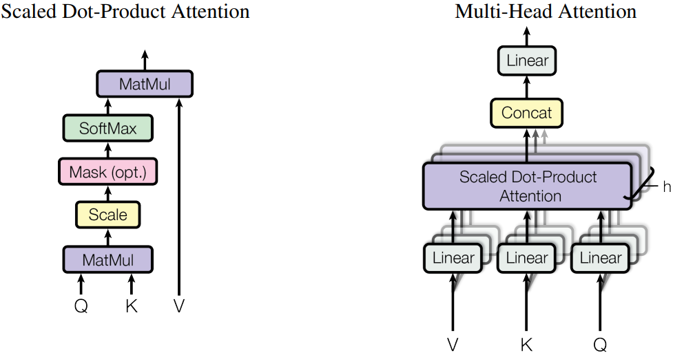

# 构建可并行的大语言模型网络

[](https://gitee.com/mindspore/docs/blob/r2.6.0rc1/tutorials/source_zh_cn/model_infer/ms_infer/parallel.md)

在过去几年中，随着深度学习技术的迅速发展，尤其是大规模预训练模型（如GPT、LLaMA以及盘古等）的出现，人工智能领域取得了巨大的进步。然而，随着模型规模的不断扩展，这些大模型所需的计算资源，特别是显存需求，呈指数级增长。以盘古71B为例，在半精度（FP16）下，这些参数本身就需要约142GB的显存。同时大模型日益膨胀的序列长度也给显存带了极大的压力。
显存不仅影响了模型的加载，还限制了批处理（batch size）较小的批处理可能会降低推理效率的下降，进而影响整个系统的吞吐量。

显存的压力使得单一设备很难在合理时间内完成推理任务，并行计算成为应对这一挑战的关键。

## 模型并行

当模型参数量过大，超出单个设备的显存容量时，模型并行能够将模型的不同部分分配到多个设备上运行。这种方法有效降低了单一设备的显存需求，并允许更大规模的模型推理。

### 基础矩阵乘模块


在大模型计算中，矩阵乘（MatMul）不管是在权重还是计算量上都占了相当大的比例。观察矩阵乘，其拥有列可切分性（Column-wise Parallelism）和行可切分性（Row-wise Parallelism）。


以MindSpore原始实现的`nn.Dense`为起点，分别构建列切和行切的矩阵乘实现。

1. 通信域的创建和管理，大模型配置的管理

    构建`CommunicationHelper`类管理模型并行的域。

    ```python
    from mindspore.communication import create_group, get_group_size, get_rank
    ```

    ```python
    class CommunicationHelper:
        def __init__(self, group_name, size):
            self.group_name = group_name
            self.size = size
            self.rank_list = [i for i in range(size)]

        def create_tensor_model_parallel_group(self):
            create_group(group=self.group_name, rank_ids=self.rank_list)

        def get_tensor_model_parallel_group_size(self):
            return get_group_size(group=self.group_name)

        def get_tensor_model_parallel_group_rank(self):
            return get_rank(group=self.group_name)

        def get_tensor_model_parallel_group(self):
            return self.group_name
    ```

    构建`ConfigHelper`管理并配置大模型参数。

    ```python
    class ConfigHelper:
        def __init__(self,
                     vocab_size,
                     hidden_size,
                     ffn_hidden_size,
                     num_layers,
                     batch_size,
                     seq_length, dtype,
                     num_heads,
                     has_bias=False):
            self.vocab_size = vocab_size
            self.hidden_size = hidden_size
            self.ffn_hidden_size = ffn_hidden_size
            self.num_layers = num_layers
            self.batch_size = batch_size
            self.seq_length = seq_length
            self.dtype = dtype
            self.num_heads = num_heads
            self.has_bias = has_bias
    ```

2. 列切矩阵乘

    `ColumnParallelLinear`类，根据模型并行的设备数，计算切分后的权重shape并初始化。列切是切分`out_channels`，在模型前向，调用矩阵乘计算出并行的结果。最后可以选择对并行的结果进行`AllGather`，以得到完整的输出。

    MindSpore训推一体框架支持开启infer_boost，该参数会使MS框架开启高性能自研算子库。启动该模式需要：
    - 设置变量：

    ```python
    from mindspore import set_context
    set_context(jit_config={"jit_level": 'O0', "infer_boost": 'on'})
    ```

    - 设置系统环境变量：

    ```bash
    export ASCEND_HOME_PATH={$ascend_custom_path}
    ```

    以模型并行device数是2为例，设置环境变量以及初始化通信组，并配置大模型参数config。

    ```python
    from mindspore import nn, Parameter, ops, Tensor
    from mindspore.common import dtype as mstype
    from mindspore.communication import init
    from mindspore.common.initializer import initializer
    import numpy as np

    from mindspore import set_context
    set_context(jit_config={"jit_level": 'O0', "infer_boost": 'on'})

    TP_GROUP_NAME='tp'
    TP_SIZE = 2
    COMMUN_HELPER = CommunicationHelper(group_name=TP_GROUP_NAME, size=TP_SIZE)

    init()
    COMMUN_HELPER.create_tensor_model_parallel_group()

    config = ConfigHelper(batch_size=64,
                          vocab_size=32000,
                          num_layers=4,
                          seq_length=2048,
                          hidden_size=1024,
                          ffn_hidden_size=4096,
                          dtype=mstype.float16,
                          num_heads=8,
                          has_bias=False)
    ```

    列切矩阵乘模块

    ```python
    class ColumnParallelLinear(nn.Cell):
        def __init__(self,
                     in_channels,
                     out_channels,
                     weight_init=None,
                     bias_init=None,
                     has_bias=True,
                     dtype=mstype.float32):
            super().__init__()
            self.in_channels = in_channels
            self.out_channels = out_channels
            self.has_bias = has_bias
            self.tensor_parallel_group_size = COMMUN_HELPER.get_tensor_model_parallel_group_size()
            self.out_channels_per_partition = out_channels // self.tensor_parallel_group_size
            self.dtype = dtype
            weight_shape = (self.out_channels_per_partition, self.in_channels)
            self.weight = Parameter(initializer(weight_init, weight_shape, self.dtype), name="weight")
            if self.has_bias:
                self.bias = Parameter(initializer(bias_init, (self.out_channels_per_partition), self.dtype), name="bias")
                self.bias_add = ops.Add()
            self.matmul = ops.BatchMatMul(transpose_b=True)
            self.cast = ops.Cast()

        def construct(self, x):
            origin_dtype = x.dtype
            x = self.cast(x, self.dtype)
            out = self.matmul(x, self.weight)
            if self.has_bias:
                out = self.bias_add(
                    out, self.cast(self.bias, self.dtype)
                )
            out = self.cast(out, origin_dtype)
            return out
    ```

    列切矩阵乘法的输出是并行的，若需要得到完整的输出，可通过`GatherLastDim`得到。

    ```python
    class GatherLastDim(nn.Cell):
        def __init__(self):
            super().__init__()
            self.all_gather = ops.AllGather(group=COMMUN_HELPER.get_tensor_model_parallel_group())
            self.world_size = COMMUN_HELPER.get_tensor_model_parallel_group_size()
            self.split = ops.Split(axis=0, output_num=self.world_size)

        def construct(self, input_):
            output = self.all_gather(input_)
            tensor_list = self.split(output)
            output = ops.cat(tensor_list, axis=-1)
            return output
    ```

    列切矩阵乘法的推理：

    ```python
    column_parallel_linear = ColumnParallelLinear(in_channels=config.hidden_size,
                                                  out_channels=config.hidden_size,
                                                  weight_init='normal',
                                                  dtype=config.dtype,
                                                  has_bias=False)
    input_x = Tensor(np.random.randn(config.batch_size, config.seq_length, config.hidden_size).astype(np.float32))
    out_parallel = column_parallel_linear(input_x)
    print(out_parallel.shape)

    gather_last_dim = GatherLastDim()
    out = gather_last_dim(out_parallel)
    print(out.shape)
    ```

3. 行切矩阵乘

    与列切相同，`RowParallelLinear`根据模型并行域的大小切分权重。在初始化时，切分方向是行，因此切分`in_channels`维度后初始化。在模型前向，输入与权重进行矩阵乘后，需要对所有`device`上的结果进行`AllReduce`。

    行切矩阵乘模块实现如下：

    ```python
    class RowParallelLinear(nn.Cell):
        def __init__(self,
                     in_channels,
                     out_channels,
                     weight_init='normal',
                     bias_init=None,
                     has_bias=True,
                     dtype=mstype.float32):
            super().__init__()
            self.in_channels = in_channels
            self.out_channels = out_channels
            self.has_bias = has_bias
            self.tensor_parallel_group_size = COMMUN_HELPER.get_tensor_model_parallel_group_size()
            self.in_channels_per_partition = in_channels // self.tensor_parallel_group_size
            self.dtype = dtype
            weight_shape = (self.out_channels, self.in_channels_per_partition)
            self.weight = Parameter(initializer(weight_init, weight_shape, self.dtype), name="weight")
            if self.has_bias:
                self.bias = Parameter(initializer(bias_init, (self.in_channels_per_partition), self.dtype), name="bias")
                self.bias_add = ops.Add()
            self.bmm = ops.BatchMatMul(transpose_b=True)
            self.all_reduce = ops.AllReduce(group=COMMUN_HELPER.get_tensor_model_parallel_group())
            self.cast = ops.Cast()

        def construct(self, x):
            origin_dtype = x.dtype
            x = self.cast(x, self.dtype)
            output_parallel = self.bmm(x, self.weight)
            if self.has_bias:
                output_parallel = self.bias_add(output_parallel, self.cast(self.bias, self.dtype))
            out = self.all_reduce(output_parallel)
            out = self.cast(out, origin_dtype)
            return out
    ```

    行切矩阵乘法的推理：

    ```python
    row_parallel_linear = RowParallelLinear(in_channels=config.hidden_size,
                                            out_channels=config.hidden_size,
                                            weight_init='normal',
                                            dtype=config.dtype,
                                            has_bias=False)
    out = row_parallel_linear(out_parallel)
    print(out.shape)
    ```

4. Embedding

    除了矩阵乘之外，Embedding层也可以进行并行计算。将Embedding权重切分至若干个device上，每个device负责映射不同范围token_ids。

    
    具体而言
    

    以nn.Embedding为基础，构建模型并行的Embedding层：

    ```python
    class VocabParallelEmbedding(nn.Cell):
        def __init__(self,
                    num_embeddings,
                    embedding_dim,
                    init_method="normal",
                    init_type=mstype.float32):
            super().__init__()
            self.num_embeddings = num_embeddings
            self.embedding_dim = embedding_dim
            self.tensor_model_parallel_size = COMMUN_HELPER.get_tensor_model_parallel_group_size()
            per_partition_vocab_size = self.num_embeddings // self.tensor_model_parallel_size
            self.vocab_start_index = COMMUN_HELPER.get_tensor_model_parallel_group_rank() * per_partition_vocab_size
            self.vocab_end_index = self.vocab_start_index + per_partition_vocab_size
            self.num_embeddings_per_partition = (
              self.vocab_end_index - self.vocab_start_index
            )
            self.embedding_weight = Parameter(
              initializer(
                  init=init_method,
                  shape=(self.num_embeddings_per_partition, self.embedding_dim),
                  dtype=init_type,
              ),
              name="embedding_weight",
            )
            self.all_reduce = ops.AllReduce(group=COMMUN_HELPER.get_tensor_model_parallel_group())
            self.max_index_per_partition = Tensor(self.num_embeddings_per_partition - 1, dtype=mstype.int32)
            self.expand_dims = ops.ExpandDims()
            self.gather = ops.Gather()
            self.sub = ops.Sub()
            self.relu = ops.ReLU()
            self.minimum = ops.Minimum()
            self.eq = ops.Equal()
            self.mul = ops.Mul()

        def construct(self, x):
            displaced_x = self.sub(x, self.vocab_start_index)
            down_truncated_x = self.relu(displaced_x)
            truncated_x = self.minimum(down_truncated_x, self.max_index_per_partition)
            input_mask = self.eq(displaced_x, truncated_x)
            input_mask = self.expand_dims(input_mask, -1)
            output_parallel = self.gather(self.embedding_weight, truncated_x, 0)
            output_parallel = self.mul(output_parallel, input_mask)
            output = self.all_reduce(output_parallel)
            return output
    ```

    并行Embedding推理：

    ```python
    input_ids = np.random.randint(0, config.vocab_size, size=(config.batch_size, config.seq_length), dtype=np.int32)
    input_ids = Tensor(input_ids)

    vocab_parallel_embedding = VocabParallelEmbedding(num_embeddings=config.vocab_size,
                                                   embedding_dim=config.hidden_size)
    embedding_output = vocab_parallel_embedding(input_ids)
    print(embedding_output.shape)
    ```

### TransformerModel并行适配

可以看出张量按顺序，先经过`ColumnParallelLinear`列切矩阵乘得到并行的结果，然后输入`RowParallelLinear`行切矩阵乘，就能得到完整的两次矩阵乘结果。


根据以上分析，可以将[模型构建](./model_dev.md)中构建的TransformerModel模型修改为支持并行切分的模型结构。

1. Attention

    以MHA(Multi Head Attention)为例，Transformer中典型的Attention模块是多头的，每个注意力头相互独立。因此在保证单个注意力头完整的情况下，激活值在`hidden_size`的维度是可切的。例如，假设一个MHA的头数（`num_heads`）是16，每个头的维度（`head_dim`）是256，那么`hidden_size`就是4096，计算Q/K/V的Linear的in/out都是4096。当模型并行设置为`tensor_model_parallel=4`时，这些Linear被切分到4个device，每个device的shape为(4096,1024)，意味着每个device计算4个头。

    

    Attention模块编码示例：

    ```python
    class ParallelAttention(nn.Cell):
        def __init__(self, config):
            super().__init__()
            self.tensor_model_parallel_size = COMMUN_HELPER.get_tensor_model_parallel_group_size()
            self.num_heads_per_partition = config.num_heads // self.tensor_model_parallel_size
            self.head_dim = config.hidden_size // config.num_heads
            self.norm_factor = math.sqrt(self.head_dim)
            self.q = ColumnParallelLinear(in_channels=config.hidden_size,
                                          out_channels=config.hidden_size,
                                          weight_init='normal',
                                          has_bias=config.has_bias)
            self.k = ColumnParallelLinear(in_channels=config.hidden_size,
                                          out_channels=config.hidden_size,
                                          weight_init='normal',
                                          dtype=config.dtype,
                                          has_bias=config.has_bias)
            self.v = ColumnParallelLinear(in_channels=config.hidden_size,
                                          out_channels=config.hidden_size,
                                          weight_init='normal',
                                          dtype=config.dtype,
                                          has_bias=config.has_bias)
            self.flash_attention = ops.operations.nn_ops.FlashAttentionScore(head_num=self.num_heads_per_partition,
                                                                            scale_value=1.0/self.norm_factor,
                                                                            next_tokens=0)
            self.out = RowParallelLinear(in_channels=config.hidden_size,
                                         out_channels=config.hidden_size,
                                         weight_init='normal',
                                         dtype=config.dtype,
                                         has_bias=config.has_bias)

        def construct(self, x, mask):
            query = self.q(x)
            key = self.k(x)
            value = self.v(x)
            _, _, _, context_layer = self.flash_attention(query, key, value, attn_mask=mask)
            output = self.out(context_layer)
            return output
    ```

2. MLP

   MLP模块为2个全连接层，也可以使用矩阵乘的并行切分来处理，具体代码如下：

    ```python
    class ParallelMLP(nn.Cell):
        def __init__(self, config):
            super().__init__()
            self.w1 = ColumnParallelLinear(in_channels=config.hidden_size,
                                           out_channels=config.ffn_hidden_size,
                                           weight_init='normal',
                                           dtype=config.dtype,
                                           has_bias=config.has_bias)
            self.w2 = RowParallelLinear(in_channels=config.ffn_hidden_size,
                                        out_channels=config.hidden_size,
                                        weight_init='normal',
                                        dtype=config.dtype,
                                        has_bias=config.has_bias)
            self.act_func = nn.SiLU()
            self.mul = ops.Mul()

        def construct(self, x):
            x = self.w1(x)
            x = self.act_func(x)
            output = self.w2(x)
            return output
    ```

3. TransformerLayer

    TransformerLayer层由Attention和MLP构成，由于没有可并行的单算子，只需要将并行参数透传给Attention和MLP即可。

    ```python
    class ParallelTransformerLayer(nn.Cell):
        def __init__(self, config):
            super().__init__()
            self.attention = ParallelAttention(config=config)
            self.feed_forward = ParallelMLP(config=config)
            self.attention_norm = RMSNorm(dim=config.hidden_size, dtype=config.dtype)
            self.ffn_norm = RMSNorm(dim=config.hidden_size, dtype=config.dtype)
            self.add = ops.Add()

        def construct(self, x, mask):
            norm_output = self.attention_norm(x)
            attention_output = self.attention(norm_output, mask)
            norm_input = self.add(x, attention_output)
            norm_output = self.ffn_norm(norm_input)
            mlp_output = self.feed_forward(norm_output)
            output = self.add(norm_input, mlp_output)
            return output
    ```

4. TransformerModel

    ```python
    class ParallelTransformer(nn.Cell):
        def __init__(self, config):
            super().__init__()
            self.embedding = VocabParallelEmbedding(num_embeddings=config.vocab_size,
                                                    embedding_dim=config.hidden_size,
                                                    init_method='normal',
                                                    init_type=config.dtype)
            self.layers = nn.CellList()
            self.num_layers = config.num_layers
            for _ in range(config.num_layers):
                layer = ParallelTransformerLayer(config=config)
                self.layers.append(layer)
            self.norm_out = RMSNorm(dim=config.hidden_size, dtype=config.dtype)

        def construct(self, x, mask):
            hidden_state = self.embedding(x)
            for i in range(self.num_layers):
                hidden_state = self.layers[i](hidden_state, mask)
            hidden_state = self.norm_out(hidden_state)
            return hidden_state
    ```

具体端到端的大语言模型代码工程可以参考[model_dev.py](https://gitee.com/mindspore/docs/blob/r2.6.0rc1/docs/sample_code/infer_code/model_dev.py)脚本，通过运行如下命令进行验证：

```shell
msrun --worker_num 2 --local_worker_num 2 --master_port 8124 --log_dir msrun_log --join True --cluster_time_out 300 model_dev.py
```
