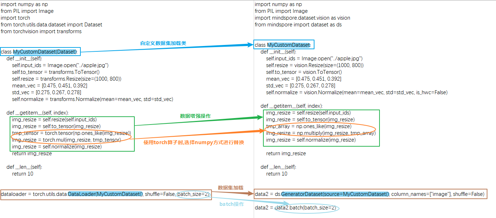

# 模型迁移

[](https://gitee.com/mindspore/docs/blob/master/tutorials/source_zh_cn/model_migration/model_migration.md)

本章节主要对模型迁移场景所必须的数据集、模型和训练、推理流程等在MindSpore上构建方法做简单的介绍。同时展示了MindSpore和PyTorch在数据集包装、模型构建、训练流程代码上的差别。

## 模型分析

在进行正式的代码迁移前，需要对即将进行迁移的代码做一些简单的分析，判断哪些代码可以直接复用，哪些代码必须迁移到MindSpore。

一般的，只有与硬件相关的代码部分，才必须要迁移到MindSpore，比如：

- 模型输入相关，包含模型参数加载，数据集包装等；
- 模型构建和执行的代码；
- 模型输出相关，包含模型参数保存等。

像Numpy、OpenCV等CPU上计算的三方库，以及Configuration、Tokenizer等不需要昇腾、GPU处理的Python操作，可以直接复用原始代码。

## 数据集包装

MindSpore提供了多种典型开源数据集的解析读取，如MNIST、CIFAR-10、CLUE、LJSpeech等，详情可参考[mindspore.dataset](https://www.mindspore.cn/docs/zh-CN/master/api_python/mindspore.dataset.html)。

### 自定义数据加载 GeneratorDataset

在迁移场景，最常用的数据加载方式是[GeneratorDataset](https://www.mindspore.cn/docs/zh-CN/master/api_python/dataset/mindspore.dataset.GeneratorDataset.html#mindspore.dataset.GeneratorDataset)，只需对Python迭代器做简单包装，就可以直接对接MindSpore模型进行训练、推理。

```python
import numpy as np
from mindspore import dataset as ds

num_parallel_workers = 2  # 多线程/进程数
world_size = 1            # 并行场景使用，通信group_size
rank = 0                  # 并行场景使用，通信rank_id

class MyDataset:
    def __init__(self):
        self.data = np.random.sample((5, 2))
        self.label = np.random.sample((5, 1))

    def __getitem__(self, index):
        return self.data[index], self.label[index]

    def __len__(self):
        return len(self.data)

dataset = ds.GeneratorDataset(source=MyDataset(), column_names=["data", "label"],
                              num_parallel_workers=num_parallel_workers, shuffle=True,
                              num_shards=1, shard_id=0)
train_dataset = dataset.batch(batch_size=2, drop_remainder=True, num_parallel_workers=num_parallel_workers)
```

一个典型的数据集构造如上：构造一个Python类，必须有\_\_getitem\_\_和\_\_len\_\_方法，分别表示每一步迭代取的数据和整个数据集遍历一次的大小，其中index表示每次取数据的索引，当shuffle=False时按顺序递增，当shuffle=True时随机打乱。

GeneratorDataset至少需要包含：

- source：一个Python迭代器；
- column_names：迭代器\_\_getitem\_\_方法每个输出的名字。

更多使用方法参考[GeneratorDataset](https://www.mindspore.cn/docs/zh-CN/master/api_python/dataset/mindspore.dataset.GeneratorDataset.html#mindspore.dataset.GeneratorDataset)。

dataset.batch将数据集中连续batch_size条数据，组合为一个批数据，至少需要包含：

- batch_size：指定每个批处理数据包含的数据条目。

更多使用方法参考[Dataset.batch](https://www.mindspore.cn/docs/zh-CN/master/api_python/dataset/dataset_method/batch/mindspore.dataset.Dataset.batch.html)。

### 与PyTorch数据集构建差别



MindSpore的GeneratorDataset与PyTorch的DataLoader的主要差别有：

- MindSpore的GeneratorDataset必须传入column_names；
- PyTorch的数据增强输入的对象是Tensor类型，MindSpore的数据增强输入的对象是numpy类型，且数据处理不能用MindSpore的mint、ops和nn算子；
- PyTorch的batch操作是DataLoader的属性，MindSpore的batch操作是独立的方法。

详细可参考[与torch.utils.data.DataLoader的差异](https://www.mindspore.cn/docs/zh-CN/master/note/api_mapping/pytorch_diff/DataLoader.html)。

## 模型构建

### 网络基本构成单元 Cell

MindSpore的网络搭建主要使用Cell进行图的构造，用户需要定义一个类继承Cell这个基类，在init里声明需要使用的API及子模块，在construct里进行计算：

<table class="colwidths-auto docutils align-default">
<tr>
<td style="text-align:center"> PyTorch </td> <td style="text-align:center"> MindSpore </td>
</tr>
<tr>
<td style="vertical-align:top"><pre>

```python
import torch

class Network(torch.nn.Module):
    def __init__(self, forward_net):
        super(Network, self).__init__()
        self.net = forward_net

    def forward(self, x):
        y = self.net(x)
        return torch.nn.functional.relu(y)

inner_net = torch.nn.Conv2d(120, 240, kernel_size=4, bias=False)
net = Network(inner_net)
for i in net.parameters():
    print(i)
```

</pre>
</td>
<td style="vertical-align:top"><pre>

```python
from mindspore import mint, nn

class Network(nn.Cell):
    def __init__(self, forward_net):
        super(Network, self).__init__()
        self.net = forward_net

    def construct(self, x):
        y = self.net(x)
        return mint.nn.functional.relu(y)

inner_net = mint.nn.Conv2d(120, 240, kernel_size=4, bias=False)
net = Network(inner_net)
for i in net.get_parameters():
    print(i)
```

</pre>
</td>
</tr>
</table>

MindSpore和PyTorch构建模型的方法差不多，使用算子的差别可以参考[API差异文档](https://www.mindspore.cn/docs/zh-CN/master/note/api_mapping/pytorch_api_mapping.html)。

#### 模型保存和加载

PyTorch提供了 `state_dict()` 用于参数状态的查看及保存，`load_state_dict` 用于模型参数的加载。

MindSpore可以使用 `save_checkpoint` 与`load_checkpoint` 。

<table class="colwidths-auto docutils align-default">
<tr>
<td style="text-align:center"> PyTorch </td> <td style="text-align:center"> MindSpore </td>
</tr>
<tr>
<td style="vertical-align:top"><pre>

```python
# 使用torch.save()把获取到的state_dict保存到pkl文件中
torch.save(pt_model.state_dict(), save_path)

# 使用torch.load()加载保存的state_dict，
# 然后使用load_state_dict将获取到的state_dict加载到模型中
state_dict = torch.load(save_path)
pt_model.load_state_dict(state_dict)
```

</pre>
</td>
<td style="vertical-align:top"><pre>

```python
# 模型权重保存：
ms.save_checkpoint(ms_model, save_path)

# 使用ms.load_checkpoint()加载保存的ckpt文件，
# 然后使用load_state_dict将获取到的param_dict加载到模型中
param_dict = ms.load_checkpoint(save_path)
ms_model.load_state_dict(param_dict)
```

</pre>
</td>
</tr>
</table>

### 优化器

PyTorch和MindSpore同时支持的优化器异同比较，详见[API映射表](https://mindspore.cn/docs/zh-CN/master/note/api_mapping/pytorch_api_mapping.html#torch-optim)。

#### 优化器的执行和使用差异

PyTorch单步执行优化器时，一般需要手动执行 `zero_grad()` 方法将历史梯度设置为 ``0``，然后使用 `loss.backward()` 计算当前训练step的梯度，最后调用优化器的 `step()` 方法实现网络权重的更新；

使用MindSpore中的优化器时，只需要直接对梯度进行计算，然后使用 `optimizer(grads)` 执行网络权重的更新。

如果在训练过程中需要动态调整学习率，PyTorch提供了 `LRScheduler` 类用于对学习率管理。使用动态学习率时，将 `optimizer` 实例传入 `LRScheduler` 子类中，通过循环调用 `scheduler.step()` 执行学习率修改，并将修改同步至优化器中。

MindSpore提供了`Cell`和`list`两种动态修改学习率的方法。使用时对应动态学习率对象直接传入优化器，学习率的更新在优化器中自动执行，具体请参考[动态学习率](https://mindspore.cn/docs/zh-CN/master/api_python/mindspore.nn.html#%E5%8A%A8%E6%80%81%E5%AD%A6%E4%B9%A0%E7%8E%87)。

<table class="colwidths-auto docutils align-default">
<tr>
<td style="text-align:center"> PyTorch </td> <td style="text-align:center"> MindSpore </td>
</tr>
<tr>
<td style="vertical-align:top"><pre>

```python
optimizer = optim.SGD(model.parameters(), lr=0.01, momentum=0.9)
scheduler = ExponentialLR(optimizer, gamma=0.9)

optimizer.zero_grad()
output = model(input)
loss = loss_fn(output, target)
loss.backward()
optimizer.step()
scheduler.step()
```

</pre>
</td>
<td style="vertical-align:top"><pre>

```python
import mindspore
from mindspore import nn

lr = nn.exponential_decay_lr(0.01, decay_rate, total_step, step_per_epoch, decay_epoch)

optimizer = nn.SGD(model.trainable_params(), learning_rate=lr, momentum=0.9)
grad_fn = mindspore.value_and_grad(forward_fn, None, optimizer.parameters, has_aux=True)
(loss, _), grads = grad_fn(data, label)
# 在优化器里自动做学习率更新
optimizer(grads)
```

</pre>
</td>
</tr>
</table>

### 自动微分

MindSpore 和 PyTorch 都提供了自动微分功能，让我们在定义了正向网络后，可以通过简单的接口调用实现自动反向传播以及梯度更新。但需要注意的是，MindSpore 和 PyTorch 构建反向图的逻辑是不同的，这个差异也会带来 API 设计上的不同。

<table class="colwidths-auto docutils align-default">
<tr>
<td style="text-align:center"> PyTorch的自动微分 </td> <td style="text-align:center"> MindSpore的自动微分 </td>
</tr>
<tr>
<td style="vertical-align:top"><pre>

```python
# torch.autograd:
# backward是累计的，更新完之后需清空optimizer

import torch.nn as nn
import torch.optim as optim

# 实例化模型和优化器
model = PT_Model()
optimizer = optim.SGD(model.parameters(), lr=0.01)

# 定义损失函数：均方误差（MSE）
loss_fn = nn.MSELoss()

# 前向传播：计算模型输出
y_pred = model(x)

# 计算损失：将预测值与真实标签计算损失
loss = loss_fn(y_pred, y_true)

# 反向传播：计算梯度
loss.backward()
# 优化器更新
optimizer.step()
```

</pre>
</td>
<td style="vertical-align:top"><pre>

```python
# ms.grad:
# 使用grad接口，输入正向图，输出反向图
import mindspore as ms
from mindspore import nn

# 实例化模型和优化器
model = MS_Model()
optimizer = nn.SGD(model.trainable_params(), learning_rate=0.01)

# 定义损失函数：均方误差（MSE）
loss_fn = nn.MSELoss()

def forward_fn(x, y_true):
    # 前向传播：计算模型输出
    y_pred = model(x)
    # 计算损失：将预测值与真实标签计算损失
    loss = loss_fn(y_pred, y_true)
    return loss, y_pred

# 计算loss和梯度
grad_fn = ms.value_and_grad(forward_fn, None, optimizer.parameters, has_aux=True)
(loss, _), grads = grad_fn(x, y_true)
# 优化器更新
optimizer(grads)
```

</pre>
</td>
</tr>
</table>

## 模型训练和推理

下面是一个在MindSpore的Trainer的例子，包含了训练和训练时推理。训练部分主要包含了将数据集、模型、优化器等模块组合训练；推理部分主要包含了评估指标获取、保存最优模型参数等。

```python
import mindspore as ms
from mindspore import nn
from mindspore.amp import StaticLossScaler, all_finite
from mindspore.communication import init, get_group_size

class Trainer:
    """一个有两个loss的训练示例"""
    def __init__(self, net, loss1, loss2, optimizer, train_dataset, loss_scale=1.0, eval_dataset=None, metric=None):
        self.net = net
        self.loss1 = loss1
        self.loss2 = loss2
        self.opt = optimizer
        self.train_dataset = train_dataset
        self.train_data_size = self.train_dataset.get_dataset_size()    # 获取训练集batch数
        self.weights = self.opt.parameters
        # 注意value_and_grad的第一个参数需要是需要做梯度求导的图，一般包含网络和loss。这里可以是一个函数，也可以是Cell
        self.value_and_grad = ms.value_and_grad(self.forward_fn, None, weights=self.weights, has_aux=True)

        # 分布式场景使用
        self.grad_reducer = self.get_grad_reducer()
        self.loss_scale = StaticLossScaler(loss_scale)
        self.run_eval = eval_dataset is not None
        if self.run_eval:
            self.eval_dataset = eval_dataset
            self.metric = metric
            self.best_acc = 0

    def get_grad_reducer(self):
        grad_reducer = nn.Identity()
        # 判断是否是分布式场景，分布式场景的设置参考上面通用运行环境设置
        group_size = get_group_size()
        reducer_flag = (group_size != 1)
        if reducer_flag:
            grad_reducer = nn.DistributedGradReducer(self.weights)
        return grad_reducer

    def forward_fn(self, inputs, labels):
        """正向网络构建，注意第一个输出必须是最后需要求梯度的那个输出"""
        logits = self.net(inputs)
        loss1 = self.loss1(logits, labels)
        loss2 = self.loss2(logits, labels)
        loss = loss1 + loss2
        loss = self.loss_scale.scale(loss)
        return loss, loss1, loss2

    @ms.jit    # jit加速，需要满足图模式构建的要求，否则会报错
    def train_single(self, inputs, labels):
        (loss, loss1, loss2), grads = self.value_and_grad(inputs, labels)
        loss = self.loss_scale.unscale(loss)
        grads = self.loss_scale.unscale(grads)
        grads = self.grad_reducer(grads)
        self.opt(grads)
        return loss, loss1, loss2

    def train(self, epochs):
        train_dataset = self.train_dataset.create_dict_iterator(num_epochs=epochs)
        self.net.set_train(True)
        for epoch in range(epochs):
            # 训练一个epoch
            for batch, data in enumerate(train_dataset):
                loss, loss1, loss2 = self.train_single(data["image"], data["label"])
                if batch % 100 == 0:
                    print(f"step: [{batch} /{self.train_data_size}] "
                          f"loss: {loss}, loss1: {loss1}, loss2: {loss2}", flush=True)
            # 保存当前epoch的模型和优化器权重
            ms.save_checkpoint(self.net, f"epoch_{epoch}.ckpt")
            ms.save_checkpoint(self.opt, f"opt_{epoch}.ckpt")
            # 推理并保存最好的那个checkpoint
            if self.run_eval:
                eval_dataset = self.eval_dataset.create_dict_iterator(num_epochs=1)
                self.net.set_train(False)
                self.eval(eval_dataset, epoch)
                self.net.set_train(True)

    def eval(self, eval_dataset, epoch):
        self.metric.clear()
        for batch, data in enumerate(eval_dataset):
            output = self.net(data["image"])
            self.metric.update(output, data["label"])
        accuracy = self.metric.eval()
        print(f"epoch {epoch}, accuracy: {accuracy}", flush=True)
        if accuracy >= self.best_acc:
            # 保存最好的那个checkpoint
            self.best_acc = accuracy
            ms.save_checkpoint(self.net, "best.ckpt")
            print(f"Updata best acc: {accuracy}")
```
