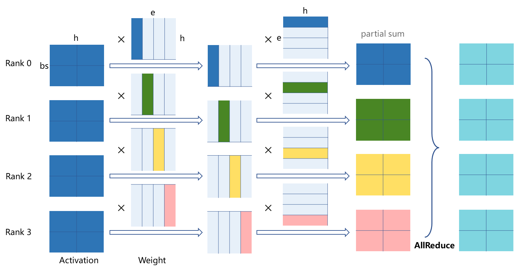
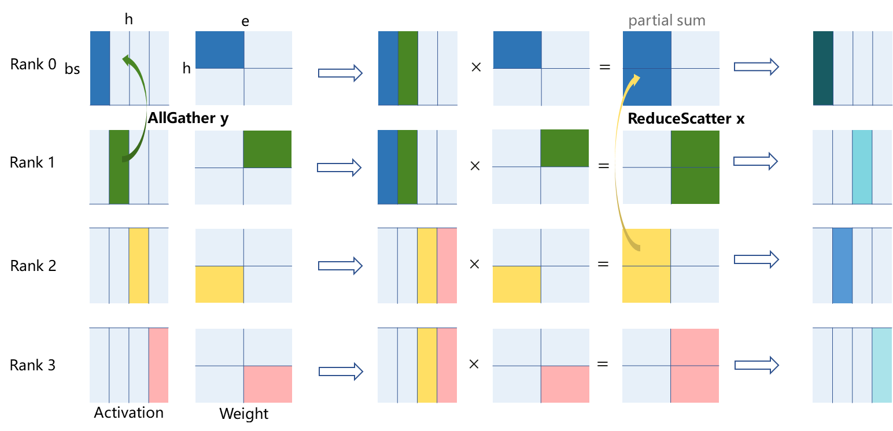
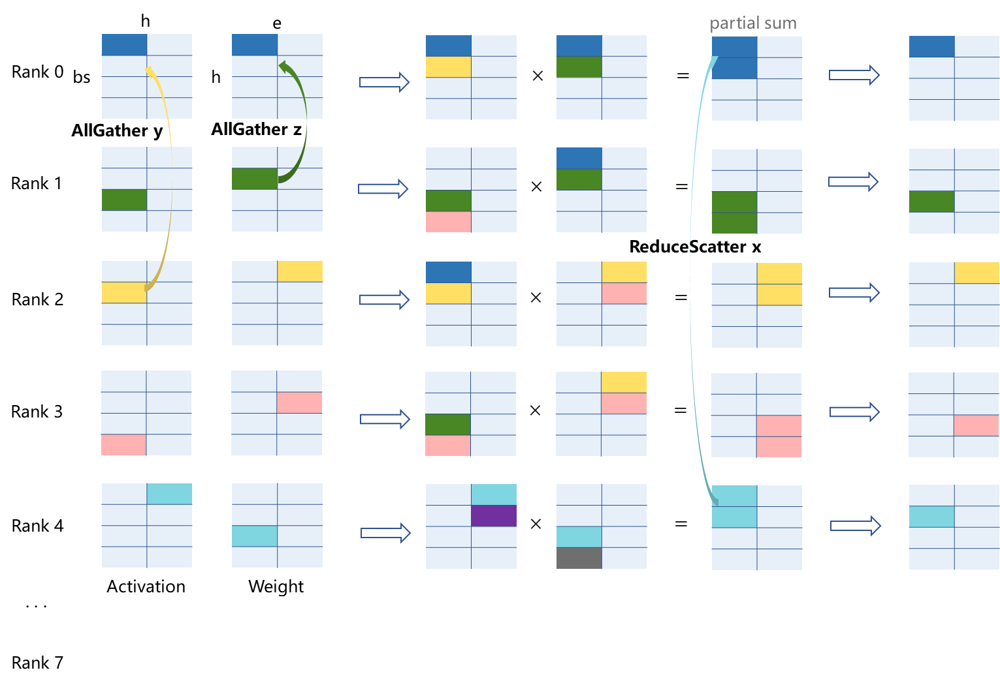

# 高维张量并行

[](https://gitee.com/mindspore/docs/blob/r2.6.0rc1/tutorials/source_zh_cn/parallel/high_dimension_tensor_parallel.md)

## 简介

大模型训练中，模型并行能够有效减少内存负荷，但其引入的通信是一个显著的性能瓶颈。因此需要优化整网模型切分策略以期引入最小的通信量。

张量并行（Tensor Parallel，简称TP）训练是将一个张量沿特定维度分成 `N` 块，每个设备只持有整个张量的 `1/N`，进行MatMul/BatchMatMul等算子计算，并引入额外通信保证最终结果正确。而高维张量并行则允许灵活控制对张量的切分次数和切分轴，支持1D、2D、3D切分。2D/3D切分相对与1D切分，在合适的切分策略下，通信量随着TP设备数增长更慢，在TP设备数较大时有着更低的额外通信量，达到提高训练速度的目的。

> 本特性支持的硬件平台为Ascend，需要在Graph模式、半自动并行下运行。

使用场景：在半自动模式下，网络中存在张量并行，且训练卡数较多时(一般不少于8卡)时，对MatMul/BatchMatMul进行2D/3D张量并行策略配置，并适配上下游算子的切分策略，可获得训练性能提升。

### 原理

#### 1D张量并行计算通信行为

1D张量并行中，每张卡上存着激活bsh的全部数据，仅在权重he和eh的一个维度上进行切分。激活和列切的权重进行第一次矩阵乘积后，与第二个行切的权重进行第二次矩阵乘积，得到的 `部分和` 经过一次全部卡间的AllReduce通信，计算出最终正确的结果。



*图：1D张量计算通信行为（4卡并行）*

#### 2D张量并行计算通信行为

2D张量并行将激活bsh与权重he均按x、y两个通信组切分，权重在两个维度上均会被切分。以下图为例，Rank0-Rank2为 `通信组x`，Rank0-Rank1为 `通信组y`。激活经过一次通信组y的AllGather后与权重进行矩阵乘积，得到的部分和经过一次通信组x间的ReduceScatter，计算出第一次MatMul的正确结果。第二次MatMul通信计算通信行为与第一次类似，下图不做展示。



*图：2D张量并行计算通信行为（以4卡并行下，一个MatMul计算为例）*

#### 3D张量并行计算通信行为

3D张量并行进一步将总卡数拆分为x、y、z三个通信组，进行了更细粒度的切分。相对于2D张量并行来说，3D张量并行将一部分的AllGather通信转移到了权重he上，这种操作在激活bsh的shape相对权重很大的情况下能减少引入的总通信量。如下图8卡并行情况所示，整体流程为：激活在通信组y进行AllGather，权重在通信组z进行AllGather -> 矩阵乘积，得到的部分和 -> 在通信组x进行ReduceScatter得到最终结果。后4卡通信计算与前4卡类似，第二次MatMul通信计算通信与第一次MatMul类似，下图均不做展示。



*图：3D张量并行计算通信行为（以8卡并行下，前5卡中的一个MatMul计算为例）*

综合对比1D/2D/3D的理论计算、存储、通信开销如下：

| TP Type | Compution | Memory(parameters) | Memory(activation) | Communication Volume(Single Device) |
| ----------- | ----------- | ----------- | ----------- | ----------- |
| 1D张量并行 | O(1/P) | O(1/P) | O(1) | 2(P-1)bsh/P |
| 2D张量并行 | O(1/xy) | O(1/xy) | O(1/xy) | 2bs[e(x-1)+h (y-1)]/xy |
| 3D张量并行 | O(1/xyz) | O(1/xyz) | O(1/xyz) | 2[bse(x-1)+bsh (y-1)+he(z-1)]/xyz |

- 处理器数量依次为P、P = xy、P = xyz
- 进行两次matmul运算的张量shape为: activation: (bs, h), weight1: (h, e), weight2: (e, h)

### 相关接口

1. `mindspore.ops.MatMul().add_prim_attr("enable_nd_tp", True)`：开启采用AllGather、MatMul和ReduceScatter的2D/3D通信/计算模式，必须使用Layout配置MatMul的shard切分。
2. `mindspore.ops.BatchMatMul().add_prim_attr("enable_nd_tp", True)`: 开启采用AllGather、MatMul和ReduceScatter的2D/3D通信/计算模式，必须使用Layout配置MatMul的shard切分。

开启上述开关后，shard切分根据不同的in_strategy决定采用2D或3D并行模式：

1. 2D张量并行in_strategy配置，主要限定激活张量的reduce维和权重张量的最后两维的切分规则: `mindspore.ops.MatMul().shard(in_strategy = (layout("None",("x","y") ), layout("x", "y")))`

2. 3D张量并行in_strategy配置，主要限定激活张量和权重张量的最后两维的切分: `mindspore.ops.MatMul().shard(in_strategy = (layout(("z","y"),"x" ), layout(("x","z"), "y")))`

> 1. 上述切分规则中的x、y、z即高维TP在不同维度上的切分设备数，需用户根据参与计算的张量的shape自行确定，原则将权重张量均匀切分的配置有更好的性能收益
> 2. 如果MatMul / BatchMatMul开启了transpose_a或trainspose_b，则高维TP所涉及的切分layout也要调换到对应位置

## 操作实践

下面在Ascend单机8卡环境下，以大模型中常见的 `MatMul -> 其他计算算子 -> MatMul` 算子结构为例，进行2D张量并行操作说明：

### 样例代码说明

> 下载完整的样例代码：[high_dimension_tensor_parallel](https://gitee.com/mindspore/docs/tree/r2.6.0rc1/docs/sample_code/high_dimension_tensor_parallel)。

目录结构如下：

```text
└─ sample_code
    ├─ high_dimension_tensor_parallel
       ├── high_dimension_tensor_parallel.py
       └── run.sh
    ...
```

其中，`high_dimension_tensor_parallel.py`是定义网络结构和运行过程的脚本。`run.sh`是执行脚本。

### 配置分布式环境

通过init初始化HCCL通信。

```python
import mindspore as ms
from mindspore.communication import init

ms.set_context(mode=ms.GRAPH_MODE)
init()
```

### 构造网络并计算

算子定义中需调用add_prim_attr方法指定MatMul算子打开高维TP，并通过Layout指定Matmul算子切分方式。由 `no_init_parameters` 接口延后初始化网络参数，并通过`AutoParallel` 包裹 `net` 设置并行模式为半自动并行模式。代码如下：

```python
# 示例代码
import numpy as np
import mindspore as ms
from mindspore import nn, ops, Tensor
from mindspore.parallel import Layout
from mindspore.common.initializer import initializer
from mindspore.nn.utils import no_init_parameters

class Network(nn.Cell):
    def __init__(self):
        super().__init__()
        self.fc1_weight = ms.Parameter(initializer("normal", [256, 512], ms.float32))
        self.fc2_weight = ms.Parameter(initializer("normal", [512, 256], ms.float32))
        self.matmul1 = ops.MatMul()
        self.relu = ops.ReLU()
        self.matmul2 = ops.MatMul()

    def construct(self, x):
        x = self.matmul1(x, self.fc1_weight)
        x = self.relu(x)
        output = self.matmul2(x, self.fc2_weight)
        return output

with no_init_parameters():
    net = Network()

in_layout = Layout((2, 4), ("x", "y"))
net.matmul1.add_prim_attr("enable_nd_tp", True)
net.matmul1.shard(in_strategy = (in_layout("None",("x","y")), in_layout("x", "y")))
net.relu.shard(in_strategy = (in_layout("None", ("y","x")),))
net.matmul2.add_prim_attr("enable_nd_tp", True)
net.matmul2.shard(in_strategy = (in_layout("None", ("y","x")), in_layout("y","x")))

input_data = Tensor(np.ones((1024, 256)), dtype=ms.float32)
net = AutoParallel(net, parallel_mode="semi_auto")
output=net(input_data)
print("The output is:", output)
```

### 运行单机8卡脚本

接下来通过命令调用对应的脚本，以 `msrun`启动方式，8卡的分布式训练脚本为例，进行分布式训练：

```bash
bash run.sh
```

运行完后，日志结果保存在 `./log_output/worker_*.log`中，示例如下：

```text
...
The output is: [[-0.02838172 0.00305654 ... 0.02173008]
 ...
 [-0.02838172 0.00305654 ... 0.02173008]]
...
```