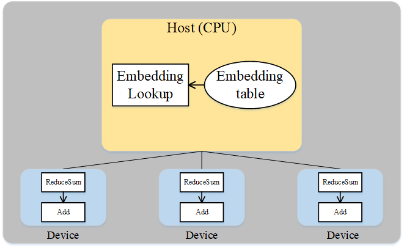

# Host&Device异构

[](https://gitee.com/mindspore/docs/blob/r2.6.0rc1/tutorials/source_zh_cn/parallel/host_device_training.md)

## 概述

在深度学习中，工作人员时常会遇到超大模型的训练问题，即模型参数所占内存超过了设备内存上限。为高效地训练超大模型，一种方案便是分布式并行训练，也就是将工作交由同构的多个加速器（如Atlas训练系列产品）共同完成。但是这种方式在面对几百GB甚至几TB级别的模型时，所需的加速器过多。而当从业者实际难以获取大规模集群时，这种方式难以应用。另一种可行的方案是使用主机端（Host）和加速器（Device）的混合训练模式。此方案同时发挥了主机端内存大和加速器端计算快的优势，是一种解决超大模型训练较有效的方式。

在MindSpore中，用户可以将待训练的参数放在主机，同时将必要算子的执行位置配置为主机，其余算子的执行位置配置为加速器，从而方便地实现混合训练。

### 基本原理

流水线并行和算子级并行适用于模型的算子数量较大，同时参数较均匀的分布在各个算子中。如果模型中的算子数量较少，同时参数只集中在几个算子中呢？Wide&Deep就是这样的例子，如下图所示。Wide&Deep中的Embedding table作为需训练的参数可达几百GB甚至几TB，若放在加速器（device）上执行，那么所需的加速器数量巨大，训练费用昂贵。另一方面，若使用加速器计算，其获得的训练加速有限，同时会引发跨服务器的通信量，端到端的训练效率不会很高。


*图：Wide&Deep模型的部分结构*

仔细分析Wide&Deep模型的特殊结构后可得：Embedding table虽然参数量巨大，但其参与的计算量很少，可以将Embedding table和其对应的算子EmbeddingLookup算子放置在Host端计算，其余算子放置在加速器端。这样做能够同时发挥Host端内存量大、加速器端计算快的特性，同时利用了同一台服务器的Host到加速器高带宽的特性。下图展示了Wide&Deep异构切分的方式：



*图：Wide&Deep异构方式*

### 相关接口

1. `mindspore.ops.Primitive.set_device()`：设置Primitive执行后端。

2. `mindspore.nn.Optimizer.target`：该属性用于指定在主机（host）上还是设备（device）上更新参数。输入类型为str，只能是"CPU"，"Ascend"。

## 操作实践

下面以Ascend单机8卡为例，进行Host&Device异构操作说明：

### 样例代码说明

> 下载完整的样例代码：[host_device](https://gitee.com/mindspore/docs/tree/r2.6.0rc1/docs/sample_code/host_device)。

目录结构如下：

```text
└─ sample_code
    ├─ host_device
       ├── train.py
       └── run.sh
    ...
```

其中，`train.py`是定义网络结构和训练过程的脚本。`run.sh`是执行脚本。

### 配置分布式环境

首先通过context接口指定并行模式为[数据并行](https://www.mindspore.cn/docs/zh-CN/r2.6.0rc1/features/parallel/data_parallel.html)模式，并通过init初始化通信。

```python
import mindspore as ms
from mindspore.communication import init

ms.set_context(mode=ms.GRAPH_MODE)
ms.set_auto_parallel_context(parallel_mode=ms.ParallelMode.DATA_PARALLEL, gradients_mean=True)
init()
```

### 数据集加载

数据集加载和数据并行一致，数据是以并行的方式导入，代码如下：

```python
import os
import mindspore as ms
import mindspore.dataset as ds

ms.set_seed(1)

def create_dataset(batch_size):
    dataset_path = os.getenv("DATA_PATH")
    rank_id = get_rank()
    rank_size = get_group_size()
    dataset = ds.MnistDataset(dataset_path, num_shards=rank_size, shard_id=rank_id)
    image_transforms = [
        ds.vision.Rescale(1.0 / 255.0, 0),
        ds.vision.Normalize(mean=(0.1307,), std=(0.3081,)),
        ds.vision.HWC2CHW()
    ]
    label_transform = ds.transforms.TypeCast(ms.int32)
    dataset = dataset.map(image_transforms, 'image')
    dataset = dataset.map(label_transform, 'label')
    dataset = dataset.batch(batch_size)
    return dataset

data_set = create_dataset(32)
```

### 网络定义

网络定义与单卡网络区别在于，配置`ops.Add()`算子在主机端运行，代码如下：

```python
import mindspore as ms
from mindspore import nn, ops
from mindspore.common.initializer import initializer

class Dense(nn.Cell):
    def __init__(self, in_channels, out_channels):
        super().__init__()
        self.weight = ms.Parameter(initializer("normal", [in_channels, out_channels], ms.float32))
        self.bias = ms.Parameter(initializer("normal", [out_channels], ms.float32))
        self.matmul = ops.MatMul()
        self.add = ops.Add()

    def construct(self, x):
        x = self.matmul(x, self.weight)
        x = self.add(x, self.bias)
        return x

class Network(nn.Cell):
    def __init__(self):
        super().__init__()
        self.flatten = nn.Flatten()
        self.layer1 = Dense(28*28, 512)
        self.relu1 = nn.ReLU()
        self.layer2 = Dense(512, 512)
        self.relu2 = nn.ReLU()
        self.layer3 = Dense(512, 10)

    def construct(self, x):
        x = self.flatten(x)
        x = self.layer1(x)
        x = self.relu1(x)
        x = self.layer2(x)
        x = self.relu2(x)
        logits = self.layer3(x)
        return logits

net = Network()
# 配置matmul和add算子在CPU端运行
net.layer1.matmul.set_device("CPU")
net.layer1.add.set_device("CPU")
net.layer2.matmul.set_device("CPU")
net.layer2.add.set_device("CPU")
net.layer3.matmul.set_device("CPU")
net.layer3.add.set_device("CPU")
```

### 训练网络

损失函数、优化器以及训练过程与数据并行一致，用`mindspore.nn.DistributedGradReducer()`接口来对所有卡的梯度进行聚合，代码如下：

```python
from mindspore import nn
import mindspore as ms

optimizer = nn.SGD(net.trainable_params(), 1e-2)
loss_fn = nn.CrossEntropyLoss()

def forward_fn(data, target):
    logits = net(data)
    loss = loss_fn(logits, target)
    return loss, logits

grad_fn = ms.value_and_grad(forward_fn, None, net.trainable_params(), has_aux=True)
grad_reducer = nn.DistributedGradReducer(optimizer.parameters)

for epoch in range(5):
    i = 0
    for image, label in data_set:
        (loss_value, _), grads = grad_fn(image, label)
        grads = grad_reducer(grads)
        optimizer(grads)
        if i % 100 == 0:
            print("epoch: %s, step: %s, loss is %s" % (epoch, i, loss_value))
        i += 1
```

### 运行单机8卡脚本

为了保存足够的日志信息，需在执行脚本中加入命令`export GLOG_v=1`将日志级别设置为INFO。接下来通过命令调用对应的脚本，以`msrun`启动方式，8卡的分布式训练脚本为例，进行分布式训练：

```bash
bash run.sh
```

训练完后，关于Loss部分结果保存在`log_output/worker_*.log`中，示例如下：

```text
epoch: 0, step: 0, loss is 2.302936
epoch: 0, step: 100, loss is 2.2879114
epoch: 0, step: 200, loss is 2.2650132
...
```

搜索关键字`CPU`，可找到如下信息：

```text
...
[INFO] PRE_ACT(2538318,ffff868a0020,python):2025-03-20-20:37:28.469.387 [mindspore/ccsrc/backend/common/pass/convert_const_input_to_attr.cc:43] Process] primitive target does not match backend: Ascend, primitive_target: CPU, node name: Default/Add-op2
...
```

表示Add算子配置在CPU端运行。
