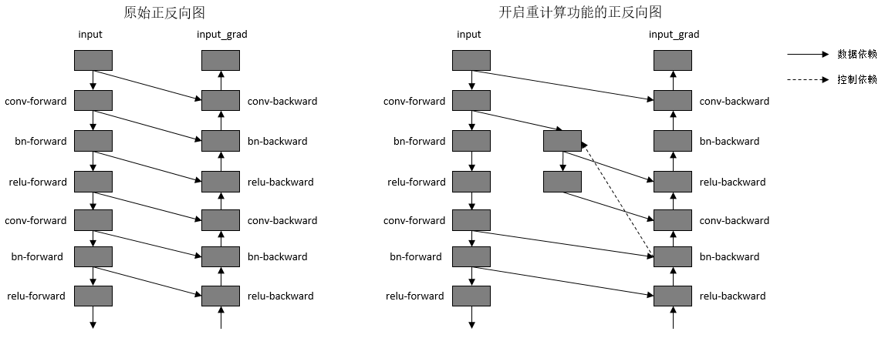

# 重计算

[](https://gitee.com/mindspore/docs/blob/r2.6.0rc1/tutorials/source_zh_cn/parallel/recompute.md)

## 简介

MindSpore采用反向模式的自动微分，根据正向图计算流程来自动推导出反向图，正向图和反向图一起构成了完整的计算图。在计算某些反向算子时，需要用到一些正向算子的计算结果，导致这些正向算子的计算结果需要驻留在内存中，直到依赖它们的反向算子计算完，这些正向算子的计算结果占用的内存才会被复用。这一现象推高了训练的内存峰值，在大规模网络模型中尤为显著。

为了解决这个问题，MindSpore提供了重计算的功能。此教程以模型GPT-3为例，讲解MindSpore如何配置重计算功能去训练模型。

### 基本原理

为了降低内存峰值，MindSpore提供了重计算的能力，重计算技术可以不保存正向激活层的计算结果，让该内存可以被复用，然后在计算反向部分时，重新计算出正向激活层的结果。

重计算功能具体实现为根据用户指定的需要做重计算的正向算子，复制出一份相同的算子，输出到反向算子上，并删除原正向算子与反向算子间的连边关系。另外，我们需要保证复制出来的算子，在计算相应的反向部分时才开始被计算，所以需要插入控制依赖去保证算子执行顺序。如下图所示：



*图：开启重计算功能前后的正反向示意图*

为了方便用户使用，MindSpore目前不仅提供了针对单个算子设置的重计算接口，还提供针对Cell设置的重计算接口。当用户调用Cell的重计算接口时，这个Cell里面的所有正向算子都会被设置为重计算。

以GPT-3模型为例，设置策略为对每层layer对应的Cell设置为重计算，然后每层layer的输出算子设置为非重计算。72层GPT-3网络开启重计算的效果如下图所示：


*图：开启重计算功能前后的GPT-3内存使用比较*

### 相关接口

1. `mindspore.nn.Cell.recompute()`：调用`Cell`的[recompute接口](https://www.mindspore.cn/docs/zh-CN/r2.6.0rc1/api_python/nn/mindspore.nn.Cell.html#mindspore.nn.Cell.recompute)，调用该接口之后，在计算反向部分时，除了该Cell的输出算子，Cell里面其他的所有算子以及子Cell里面的所有算子都会被重新计算。PyNative模式和Graph模式都支持。

2. `mindspore.ops.Primitive.recompute()`：调用`Primitive`的[recompute接口](https://www.mindspore.cn/docs/zh-CN/r2.6.0rc1/api_python/ops/mindspore.ops.Primitive.html#mindspore.ops.Primitive.recompute)，调用该接口之后，在计算反向部分时，该算子会被重新计算。只支持Graph模式。

3. `mindspore.recompute()`：调用`mindspore`的[recompute接口](https://www.mindspore.cn/docs/zh-CN/r2.6.0rc1/api_python/mindspore/mindspore.recompute.html#mindspore.recompute)，调用该接口之后，网络模块会被重新计算。只支持PyNative模式。

## 操作实践

下面以Ascend为例，进行重计算操作说明：

### 样例代码说明

> 下载完整的样例代码：[recompute](https://gitee.com/mindspore/docs/tree/r2.6.0rc1/docs/sample_code/recompute)。

目录结构如下：

```text
└─ sample_code
    ├─ recompute
       └── example.py
    ...
```

其中，`example.py`是定义网络结构和执行流程的脚本。为了对比重计算开启前后的差异，该样例默认未开启重计算，如需开启请参考下文配置。

### 网络定义

网络`Net`由`nn.CellList`中的10个子网络`Block`依次连接而成，`Grad`用于对`Net`进行求导，得到关于网络输入的导数。

```python
import numpy as np
from mindspore.nn import Cell
from mindspore.common import Tensor, Parameter
from mindspore import ops, nn
from mindspore.parallel.auto_parallel import AutoParallel
from mindspore.nn.utils import no_init_parameters
from mindspore.common.initializer import initializer, One
from mindspore import Parameter

class Block(Cell):
    def __init__(self):
        super(Block, self).__init__()
        self.transpose1 = ops.Transpose()
        self.transpose2 = ops.Transpose()
        self.transpose3 = ops.Transpose()
        self.transpose4 = ops.Transpose()
        self.real_div1 = ops.RealDiv()
        self.real_div2 = ops.RealDiv()
        self.batch_matmul1 = ops.BatchMatMul()
        self.batch_matmul2 = ops.BatchMatMul()
        self.add = ops.Add()
        self.softmax = ops.Softmax(-1)
        self.dropout = ops.Dropout(0.9)
        self.expand_dims = ops.ExpandDims()
        self.sub = ops.Sub()
        self.mul = ops.Mul()
        self.y =  Parameter(initializer(One(), [8, 128, 128], mindspore.float32))

    def construct(self, x):
        transpose1 = self.transpose1(x, (0, 2, 1, 3))
        real_div1 = self.real_div1(transpose1, Tensor(2.37891))
        transpose2 = self.transpose2(x, (0, 2, 3, 1))
        real_div2 = self.real_div2(transpose2, Tensor(2.37891))
        batch_matmul1 = self.batch_matmul1(real_div1, real_div2)
        expand_dims = self.expand_dims(self.y, 1)
        sub = self.sub(Tensor([1.0]), expand_dims)
        mul = self.mul(sub, Tensor([-0.0001]))
        add = self.add(mul, batch_matmul1)
        soft_max = self.softmax(add)
        dropout = self.dropout(soft_max)
        transpose3 = self.transpose3(x, (0, 2, 1, 3))
        batch_matmul2 = self.batch_matmul2(dropout[0], transpose3)
        transpose4 = self.transpose4(batch_matmul2, (0, 2, 1, 3))
        return transpose4


class Net(Cell):
    def __init__(self):
        super(Net, self).__init__()
        self.blocks = nn.CellList()
        for _ in range(10):
            b = Block()
            self.blocks.append(b)

    def construct(self, x):
        out = x
        for i in range(10):
            out = self.blocks[i](out)
        return out


class Grad(Cell):
    def __init__(self, net):
        super(Grad, self).__init__()
        self.grad = ops.GradOperation()
        self.net = net

    def construct(self, x):
        grad_net = self.grad(self.net)
        return grad_net(x)
```

### 执行网络

在这一步，我们需要定义网络输入，通过 `no_init_parameters` 接口延后初始化网络参数和优化器参数，然后调用`Grad`以获取导数，
通过顶层 `AutoParallel` 接口设置并行模式为半自动并行模式，代码如下：

```python
import numpy as np
from mindspore.common import Tensor
from mindspore.nn.utils import no_init_parameters
from mindspore.parallel.auto_parallel import AutoParallel

input_x = Tensor(np.ones((8, 128, 16, 32)).astype(np.float32))
with no_init_parameters():
    network = Net()
grad_network = Grad(network)
grad_network = AutoParallel(grad_network, parallel_mode="semi_auto")
output = grad_network(input_x)
print(output)
```

### 运行脚本

接下来通过命令调用对应的脚本，如下所示：

```bash
export GLOG_v=1
python example.py
```

通过`GLOG_v=1`命令，我们可以打印出INFO级别的日志，从而查看网络执行内存占用大小，如下所示：

```text
Device MOC memory size: 62420M
MindSpore Used memory size: 58196M
Used peak memory usage (without fragments): 245M
Actual peak memory usage (with fragments): 260M
```

可以看到执行该网络的动态内存占用大小为245MB。如果我们在执行脚本前，设置环境变量`export MS_DEV_SAVE_GRAPHS=1`，可以看到在执行脚本的目录下，会生成`xx_validate_xxx.ir`文件。打开`xx_validate_xxx.ir`文件，如下所示，我们可以看到节点%38的计算结果，需要供节点%41（正向传播算子）和节点%291（反向传播算子）计算时使用，所以节点%38的计算结果占用的内存，需要等到节点%291计算完成，才会被释放掉（此处%后面的序号与算子执行序相关）。节点%38计算结果的内存占用时间长的原因是，反向传播的顺序与正向传播相反，正向传播中的10个`Block`里面，第一个`Block`对应的反向传播函数反而是最后执行的。

```text
%38(equiv_11_real_div1) = PrimFunc_RealDiv(%37, Tensor(shape=[], dtype=Float32, value=2.37891)) {instance name: real_div2}cnode_attrs: {checkpoint: Bool(1)} cnode_primal_attrs: {unique_id: "10842"}
    : (<Tensor[Float32], (8, 16, 128, 32)>, <Tensor[Float32], (), value=...>) -> (<Tensor[Float32], (8, 16, 128, 32)>)
    # Fullname with scope: (Default/network-Grad/net-Net/blocks-CellList/0-Block/RealDiv-op0)
...

%41(equiv_8_batch_matmul1) = PrimFunc_BatchMatMul(%38, %40, Bool(0), Bool(0)) cnode_attrs: {checkpoint: Bool(1)}cnode_primal_attrs: {unique_id: "10839"}
    : (<Tensor[Float32], (8, 16, 128, 32)>, <Tensor[Float32], (8, 16, 32, 128)>, <Bool, NoShape>, <Bool, NoShape>) -> (<Tensor[Float32], (8, 16, 128, 128)>)
    # Fullname with scope: (Default/network-Grad/net-Net/blocks-CellList/0-Block/BatchMatMul-op0)
...
%291(CNode_549) = PrimFunc_BatchMatMul(%38, %287, Bool(1), Bool(0)) cnode_attrs: {checkpoint: Bool(1)} cnode_primal_attrs:{forward_node_name: "BatchMatMul_10839", forward_unique_id: "10839"}
    : (<Tensor[Float32], (8, 16, 128, 32)>, <Tensor[Float32], (8, 16, 128, 128)>, <Bool, NoShape>, <Bool, NoShape>) -> (<Tensor[Float32], (8, 16, 32, 128)>)
    # Fullname with scope: (Gradients/Default/network-Grad/net-Net/blocks-CellList/0-Block/Grad_BatchMatMul/BatchMatMul-op38)
```

如果我们对第一个`Block`做重计算，那么就可以使得第一个`Block`在正向部分计算结束后，计算结果立即被释放掉，在反向传播时才去重新计算，从而可以显著缩短内存占用的时间，降低内存峰值。使用重计算的代码如下：

```python
class Net(Cell):
    def __init__(self):
        super(Net, self).__init__()
        self.blocks = nn.CellList()
        for _ in range(10):
            b = Block()
            # 对每个Block调用recompute接口来开启重计算功能
            b.recompute()
            self.blocks.append(b)

    def construct(self, x):
        out = x
        for i in range(10):
            out = self.blocks[i](out)
        return out
```

使用重计算后，我们再运行脚本，如下所示：

```bash
GLOG_v=1 python example.py
```

再次查看网络执行内存占用大小，如下所示，执行该网络的动态内存占用减少为65MB。

```text
Device MOC memory size: 62420M
MindSpore Used memory size: 58188M
Used peak memory usage (without fragments): 65M
Actual peak memory usage (with fragments): 76M
```

再次打开`xx_validate_xxx.ir`文件，如下所示，可以看到反向传播节点%429的第一个输入为节点%416，节点%416是根据正向传播节点%38复制得到的，而节点%38的计算结果占用的内存，在节点%41计算完后就可以被释放，从而提高了内存复用率。

```text
 %38(equiv_183_real_div1) = PrimFunc_RealDiv(%37, Tensor(shape=[], dtype=Float32, value=2.37891)) {instance name: real_div2} cnode_attrs: {recompute_sub_graph: U64(0), recompute_id: I64(5), recompute: Bool(1), need_cse_after_recompute: Bool(1)} cnode_primal_attrs: {unique_id: "12172"}
     : (<Tensor[Float32], (8, 16, 128, 32)>, <Tensor[Float32], (), value=...>) -> (<Tensor[Float32], (8, 16, 128, 32)>)
     # Fullname with scope: (recompute_Default/network-Grad/net-Net/blocks-CellList/0-Block/RealDiv-op0)
...
 %41(equiv_180_batch_matmul1) = PrimFunc_BatchMatMul(%38, %40, Bool(0), Bool(0)) cnode_attrs: {recompute_sub_graph: U64(0), recompute_id: I64(8), recompute: Bool(1), need_cse_after_recompute: Bool(1)} cnode_primal_attrs: {unique_id: "12169"}
     : (<Tensor[Float32], (8, 16, 128, 32)>, <Tensor[Float32], (8, 16, 32, 128)>, <Bool, NoShape>, <Bool, NoShape>) -> (<Tensor[Float32], (8, 16, 128, 128)>)
     # Fullname with scope: (recompute_Default/network-Grad/net-Net/blocks-CellList/0-Block/BatchMatMul-op0)
...
 %416(CNode_820) = PrimFunc_RealDiv(%410, Tensor(shape=[], dtype=Float32, value=2.37891)) {instance name: real_div2} cnode_attrs: {recompute_sub_graph: U64(0), recompute_id: I64(5), duplicated: Bool(1), need_cse_after_recompute: Bool(1)}
     : (<Tensor[Float32], (8, 16, 128, 32)>, <Tensor[Float32], (), value=...>) -> (<Tensor[Float32], (8, 16, 128, 32)>)
     # Fullname with scope: (recompute_Default/network-Grad/net-Net/blocks-CellList/0-Block/RealDiv-op2)
...
 %429(CNode_833) = PrimFunc_BatchMatMul(%416, %425, Bool(1), Bool(0)) cnode_attrs: {recompute_sub_graph: U64(0), target_grad: Bool(1), checkpoint: Bool(1)} cnode_primal_attrs: {forward_node_name: "BatchMatMul_12169", forward_unique_id: "12169"}
     : (<Tensor[Float32], (8, 16, 128, 32)>, <Tensor[Float32], (8, 16, 128, 128)>, <Bool, NoShape>, <Bool, NoShape>) -> (<Tensor[Float32], (8, 16, 32, 128)>)
     # Fullname with scope: (Gradients/recompute_Default/network-Grad/net-Net/blocks-CellList/9-Block/Grad_BatchMatMul/BatchMatMul-op38)
```

