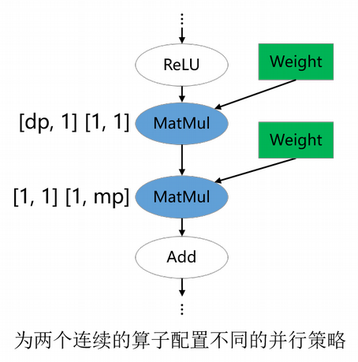

# 切分技巧

[](https://gitee.com/mindspore/docs/blob/r2.6.0rc1/tutorials/source_zh_cn/parallel/split_technique.md)

## 概述

对于一个新模型使用`Sharding Propagation`来配置并行策略，关键问题在于配置哪些算子的切分策略来获得较好的性能。由于策略传播的目标不是最小化端到端的迭代时间，而是最小化张量重排布的代价，因此，为“关键算子”配置合适的切分策略是十分重要的。然而，并不存在明确的规定约束哪些算子是必须配置切分策略的。尽管如此，基于我们训练大模型的经验，确实有一些原则可以用来指导新用户配置并行策略。这里，我们列出4条经验性的原则。

### 配置涉及权重的算子

参数权重的切分策略是十分重要的，尤其对大模型来说，因为参数权重引起的内存消耗占据模型训练总内存消耗的大部分。因此，涉及权重的算子通常需要显式地配置切分策略。在下图的两个例子中，涉及权重的Gather和MatMul算子配置了切分策略，而其他算子没有配置。这分别对应[MindFormers](https://gitee.com/mindspore/mindformers/blob/r1.5.0/mindformers/modules/transformer/transformer.py)中的数据并行VocabEmbedding层和混合并行FeedForward层。


### 配置维度改变/轴改变的算子

深度学习框架的算子大致可以分为两类：语义简单的维度保持的算子；会改变输入张量维度的算子。对于维度保持算子，策略传播算法可以较容易地将切分策略传播出去。但是，对于维度改变算子，显式地配置切分策略才能更好地表达用户的初始想法，避免策略传播算法推导出非用户期望的切分策略。常见的维度改变/轴改变算子有：[ReduceMean](https://www.mindspore.cn/docs/zh-CN/r2.6.0rc1/api_python/ops/mindspore.ops.ReduceMean.html)、[ReduceSum](https://www.mindspore.cn/docs/zh-CN/r2.6.0rc1/api_python/ops/mindspore.ops.ReduceSum.html)、[Transpose](https://www.mindspore.cn/docs/zh-CN/r2.6.0rc1/api_python/ops/mindspore.ops.Transpose.html)、[StridedSlice](https://www.mindspore.cn/docs/zh-CN/r2.6.0rc1/api_python/ops/mindspore.ops.StridedSlice.html)、[MatMul](https://www.mindspore.cn/docs/zh-CN/r2.6.0rc1/api_python/ops/mindspore.ops.MatMul.html)与[BatchMatMul](https://www.mindspore.cn/docs/zh-CN/r2.6.0rc1/api_python/ops/mindspore.ops.BatchMatMul.html)。在下图的例子中，ReduceMean和MatMul是维度改变算子，它们被配置了切分策略。


### 配置并行策略改变的边界算子

对于类ResNet模型，模型的不同部分偏好的并行方式不同：前半部分使用数据并行，后半部分使用模型并行，以此获得最优的迭代性能。对于Llama类大模型，当vocab_size过大时，出于对内存的考虑，可能会选择模型并行切分；当sequence_length过大时，也可能会选择序列并行的策略。以上策略属于用户根据模型和硬件信息精心配置的策略。Sharding Propagation是一种朴素的寻找重排代价最低的算法，并不能自动找到精心配置的策略，因此，对于用户精心调优的算子策略，需要对其进行专门的配置。在下图的例子中，第一个MatMul配置了数据并行的策略，它会将数据并行的策略向前传播到模型的前半部分；第二个MatMul配置了模型并行的策略，它会将模型并行的策略向后传播到模型的后半部分。



### 配置融合算子

对于融合大算子，如[FlashAttentionScore](https://www.mindspore.cn/lite/api/zh-CN/r2.6.0rc1/generate/classmindspore_ops_FlashAttentionScore.html#exhale-class-classmindspore-ops-flashattentionscore)、[rms_norm](https://www.mindspore.cn/docs/zh-CN/r2.6.0rc1/api_python/ops/mindspore.ops.rms_norm.html)，也是需要用户手动配置策略的算子，融合算子的输入与输出逻辑相对复杂，传播出的没有重排的策略并不一定是用户所期望的策略，这些算子也需要显式配置算子级策略。

用户在用策略传播时不仅需要对其传播算法本身有一定的了解，还要对要训练的模型的并行方式有一定的理解。如果存在某个由策略传播算法决定的算子的并行策略不符合用户的期望，那总可以通过多配置一个算子并行策略的方式解决。实际中，对于一个新模型，确实需要尝试几次才能获得性能较优的整体并行配置。

## 配置代码样例

以MindFormers中封装的类[RowParallelLinear](https://gitee.com/mindspore/mindformers/blob/r1.5.0/mindformers/experimental/graph/tensor_parallel/layers.py)为例：

<table>
<tr>
<td valign='top'>

```diff
# 如果使用半自动，需要调用shard方法配置所有算子的策略
class RowParallelLinear(nn.Cell):
    def shard(self, config: TransformerConfig) -> None:
        dp = config.data_parallel
        tp = config.tensor_parallel
        cp = config.context_parallel
        if self.transpose_b:
            weight_strategy = (tp, 1)
        else:
            weight_strategy = (1, tp)
            matmul_in_strategy = ((dp * cp, 1), weight_strategy)
            self.matmul.shard(in_strategy=matmul_in_strategy)
+      if not self.skip_bias_add:
+          dd_in_strategy = ((dp * cp, tp), (tp,))
+          self.add.shard(in_strategy=add_in_strategy)
```

</td>
<td valign='top'>

```diff
# 而使用策略传播，只需要配置其中MatMul算子的策略，无需配置Add算子：
class RowParallelLinear(nn.Cell):
    def shard(self, config: TransformerConfig) -> None:
        dp = config.data_parallel
        tp = config.tensor_parallel
        cp = config.context_parallel
        if self.transpose_b:
            weight_strategy = (tp, 1)
        else:
            weight_strategy = (1, tp)
            matmul_in_strategy = ((dp * cp, 1), weight_strategy)
            self.matmul.shard(in_strategy=matmul_in_strategy)
```

</td>
</tr>
</table>

另一个例子是[CoreAttention](https://gitee.com/mindspore/mindformers/blob/r1.5.0/mindformers/experimental/graph/transformer/transformer.py)，根据上述原则配置：
<table>
<tr>
<td valign='top'>

```diff
# 半自动配置
class CoreAttention(nn.Cell):
    def shard(self, config: TransformerConfig):
        dp = config.data_parallel
        tp = config.tensor_parallel
        cp = config.context_parallel
+       dropout_strategy = (dp, tp, cp, 1)
+       self.dropout.shard(strategy=dropout_strategy)
        self.bmm_qkv.shard(((dp, tp, cp, 1), (dp, tp, 1, 1)))
+       self.mul.shard(((dp, tp, cp, 1), ()))
        self.bmm_qk.shard(((dp, tp, cp, 1), (dp, tp, 1, 1)))
        self.merge_head_transpose.shard(((dp, tp, cp, 1),))
```

</td>
<td valign='top'>

```diff
# 策略传播配置代码如下，仅需配置Matmul与Transpose算子：
class CoreAttention(nn.Cell):
    def shard(self, config: TransformerConfig):
        dp = config.data_parallel
        tp = config.tensor_parallel
        cp = config.context_parallel
        self.bmm_qkv.shard(((dp, tp, cp, 1), (dp, tp, 1, 1)))
        self.bmm_qk.shard(((dp, tp, cp, 1), (dp, tp, 1, 1)))
        self.merge_head_transpose.shard(((dp, tp, cp, 1),))
```

</td>
</tr>
</table>

再看[FlashAttention](https://gitee.com/mindspore/mindformers/blob/r1.5.0/mindformers/modules/flash_attention.py)的例子:
<table>
<tr>
<td valign='top'>

```diff
# 半自动配置如下
class FlashAttention(Cell):
    def shard(self, parallel_config):
        dp = parallel_config.data_parallel
        mp = parallel_config.model_parallel
        cp = parallel_config.context_parallel
        cp_ds = parallel_config.get_ulysses_cp_num()
        fa_strategies = self._generate_flash_attention_strategy(
            dp, mp, cp, cp_ds)
        self.flash_attention.shard(fa_strategies)
+       if self.use_alibi_mask:
+           self.alibi_rescale_mul.shard(((dp, mp, cp, 1), (1,)))
+       return self
```

</td>
<td valign='top'>

```diff
# 策略传播配置代码如下，需要配置FlashAttentionScore算子，无需配置Mul算子：
class FlashAttention(Cell):
    def shard(self, parallel_config):
        dp = parallel_config.data_parallel
        mp = parallel_config.model_parallel
        cp = parallel_config.context_parallel
        cp_ds = parallel_config.get_ulysses_cp_num()
        fa_strategies = self._generate_flash_attention_strategy(
            dp, mp, cp, cp_ds)
        self.flash_attention.shard(fa_strategies)
        return self
```

</td>
</tr>
</table>

若直接使用MindFormers中开源且已经配好策略的类，则外部网络无需对算子再配置shard策略，如[LlamaForCausalLM](https://gitee.com/mindspore/mindformers/blob/r1.5.0/mindformers/models/llama/llama.py)。
<table>
<tr>
<td valign='top'>

```diff
# 使用半自动配置
class LlamaForCausalLM(LlamaPretrainedModel):
    def shard(self, config: TransformerConfig):
+       dp = config.data_parallel
+       slice_in_strategy = ((dp, 1),)
+       self.slice.shard(in_strategy=slice_in_strategy)
+       not_equal_in_strategy = ((dp, 1), ())
+       self.not_equal.shard(in_strategy=not_equal_in_strategy)
+       mul_in_strategy = ((dp, 1), (dp, 1))
+       self.mul.shard(in_strategy=mul_in_strategy)
+       return self
```

</td>
<td valign='top'>

```diff
# 使用策略传播无需配置其他算子策略
class LlamaForCausalLM(LlamaPretrainedModel):
    def shard(self, config: TransformerConfig):
+       pass
```

</td>
</tr>
</table>

**用户无法确认是否需要对算子配置策略时，可以不配置，由算法传播找寻最优策略，但是可能无法获得最佳的并行效果；若用户能够确认该算子需要配置什么策略，则可以进行配置帮助算法获得预期效果。**
