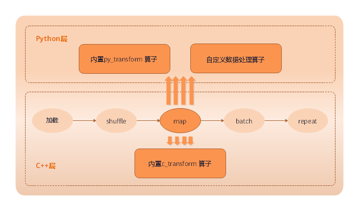
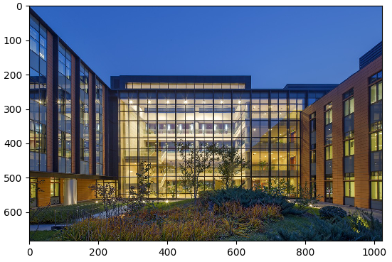

# 数据处理与数据增强

## 概述

数据是深度学习的基础，有好的数据输入，可以对整个深度神经网络训练起到非常积极的作用。所以在获取到原始的数据集后，数据加载训练前，因为数据量、性能等等限制，往往会需要先进行数据处理或者数据增强，从而获得更加优化的数据输入。
同样，MindSpore也为用户提供了数据处理以及数据增强的功能。
> 从本质上来说，数据增强是通过数据处理中的`map`（映射）进行实现，但是因为数据增强提供丰富的变换操作，所以将其单独提出进行描述。

## MindSpore支持的数据处理操作

MindSpore支持多种处理数据操作，包括复制、分批、洗牌、映射等等，详细见下表：

| 数据处理 | 说明                                   |
| -------- | -------------------------------------- |
| repeat   | 对数据集进行复制，来加倍数据量。       |
| batch    | 将数据分批处理，有益于加速训练过程。   |
| shuffle  | 对数据进行混洗。                       |
| map      | 将提供的函数或算子作用于指定的列数据。 |
| zip      | 将多个数据集合并成一个数据集。         |

各个操作可以单独进行使用，实际使用过程中往往会根据实际需要进行组合使用，组合使用时推荐使用的顺序如下所示：


如下示例中，读取MNIST数据集时，对数据进行shuffle、batch、repeat操作。

```python
import mindspore.dataset as ds

ds1 = ds.MnistDataset(MNIST_DATASET_PATH, MNIST_SCHEMA)  # Create MNIST dataset.

ds1 = ds1.shuffle(buffer_size=10000)
ds1 = ds1.batch(32, drop_remainder=True)
ds1 = ds1.repeat(10)
```

上面操作先对数据进行混洗，再将每32条数据组成一个batch，最后将数据集重复10次。

下面将构造一个简单数据集`ds1`，并对其进行数据处理操作，来介绍各类数据处理操作的详细使用。

1. 导入数据处理操作依赖的模块。

    ```python
    import mindspore.dataset as ds
    ```

2. 定义一个生成数据集的函数——`generator_func()`用于生成数据集。

   ```python
    def generator_func():
        for i in range(5):
            yield (np.array([i, i+1, i+2]),)
    ```

3. 通过`GeneratorDataset`创建`ds1`数据集，用于执行数据处理操作。

    ```python
    ds1 = ds.GeneratorDataset(generator_func, ["data"])
    print("ds1:")
    for data in ds1.create_dict_iterator():
        print(data["data"])
    ```

    输出：

    ```
    ds1:
    [0 1 2]
    [1 2 3]
    [2 3 4]
    [3 4 5]
    [4 5 6]
    ```

### repeat

在有限的数据集内，为了优化网络，通常会将一个数据集训练多次。


> 在机器学习中，每训练完一个完整的数据集，我们称为训练完了一个epoch。

加倍数据集，通常用在多个epoch（迭代）训练中，通过`repeat()`来加倍数据量。`repeat()`定义如下：

```python
def repeat(self, count=None):
```

我们可以定义`ds2`数据集，调用`repeat`来加倍数据量。示例代码如下：

```python
ds2 = ds.GeneratorDataset(generator_func, ["data"])
ds2 = ds2.repeat(2)
print("ds2:")
for data in ds2.create_dict_iterator():
    print(data["data"])
```

其中，将倍数设为2，故`ds2`数据量为原始数据集`ds1`的2倍，输出：

```
ds2:
[0 1 2]
[1 2 3]
[2 3 4]
[3 4 5]
[4 5 6]
[0 1 2]
[1 2 3]
[2 3 4]
[3 4 5]
[4 5 6]
```

### batch

将数据集进行分批。在实际训练中，可将数据分批处理，将几个数据作为1组，进行训练，减少训练轮次，达到加速训练过程的目的。MindSpore通过`batch()`函数来实现数据集分批，函数定义如下：


```python
def batch(self, batch_size, drop_remainder=False, num_parallel_workers=None)
```

使用GeneratorDataset产生的数据集`ds1`构建2个数据集。

- 第1个数据集`ds2`，每2条数据为1组。
- 第2个数据集`ds3`，每3条数据为1组，并将不足1组的数据截掉。

`ds2`示例代码如下：

```python
ds2 = ds1.batch(batch_size=2)  # Default drop_remainder is False, the last remainder batch isn't dropped.
print("batch size:2    drop remainder:False")
for data in ds2.create_dict_iterator():
    print(data["data"])
```

输出如下所示：

```
batch size:2    drop remainder:False
[[0 1 2]
 [1 2 3]]
[[2 3 4]
 [3 4 5]]
[[4 5 6]]
```

`ds3`示例代码如下：

```python
ds3 = ds1.batch(batch_size=3, drop_remainder=True)  # When drop_remainder is True, the last remainder batch will be dropped.
print("batch size:3    drop remainder:True")
for data in ds3.create_dict_iterator():
    print(data["data"])
```

输出如下所示：

```
batch size:3    drop remainder:True
[[0 1 2]
 [1 2 3]
 [2 3 4]]
```

### shuffle

对于有序的数据集或者进行过repeat的数据集可以进行混洗。


shuffle操作主要用来将数据混洗，设定的buffer_size越大，混洗程度越大，但时间、计算资源消耗会大。
`shuffle()`定义如下：

```python
def shuffle(self, buffer_size):
```

调用`shuffle()`对数据集`ds1`进行混洗,示例代码如下：

```python
print("Before shuffle:")
for data in ds1.create_dict_iterator():
    print(data["data"])

ds2 = ds1.shuffle(buffer_size=5)
print("After shuffle:")
for data in ds2.create_dict_iterator():
    print(data["data"])
```

可能的输出如下，可以看到进行数据混洗后，数据的顺序发生了随机的变化。

```
Before shuffle:
[0 1 2]
[1 2 3]
[2 3 4]
[3 4 5]
[4 5 6]
After shuffle:
[3 4 5]
[2 3 4]
[4 5 6]
[1 2 3]
[0 1 2]
```

### map

map（映射）即对数据进行处理，譬如将彩色图片的数据集转化为灰色图片的数据集等，应用非常灵活。
MindSpore提供`map()`函数对数据集进行映射操作，用户可以将提供的函数或算子作用于指定的列数据。
用户可以自定义函数，也可以直接使用`c_transforms`或`py_transforms`做数据增强。
> 详细的数据增强操作，将在文后数据增强章节进行介绍。



`map()`函数定义如下：

```python
def map(self, input_columns=None, operations=None, output_columns=None, columns_order=None,
        num_parallel_workers=None):
```

在以下示例中，使用`map()`函数，将定义的匿名函数（lambda函数）作用于数据集`ds1`，使数据集中数据乘以2。

```python
func = lambda x : x*2  # Define lambda function to multiply each element by 2.
ds2 = ds1.map(input_columns="data", operations=func)
for data in ds2.create_dict_iterator():
    print(data["data"])
```

代码输出如下，可以看到数据集`ds2`中各行的数据均乘以了2。

```
[0 2 4]
[2 4 6]
[4 6 8]
[6 8 10]
[8 10 12]
```

### zip

MindSpore提供`zip()`函数，可将多个数据集合并成1个数据集。
> 如果两个数据集的列名相同，则不会合并，请注意列的命名。
> 如果两个数据集的行数不同，合并后的行数将和较小行数保持一致。

```python
def zip(self, datasets):
```

1. 采用前面构造数据集`ds1`的方法，构造1个数据集`ds2`。

    ```python
    def generator_func2():
        for i in range(5):
            yield (np.array([i-3, i-2, i-1]),)

    ds2 = ds.GeneratorDataset(generator_func2, ["data2"])
    ```

2. 通过`zip()`将数据集`ds1`的`data1`列和数据集`ds2`的`data2`列合并成数据集`ds3`。

    ```python
    ds3 = ds.zip((ds1, ds2))
    for data in ds3.create_dict_iterator():
        print(data)
    ```

    输出如下所示：

    ```
    {'data1': array([0, 1, 2], dtype=int64), 'data2': array([-3, -2, -1], dtype=int64)}
    {'data1': array([1, 2, 3], dtype=int64), 'data2': array([-2, -1,  0], dtype=int64)}
    {'data1': array([2, 3, 4], dtype=int64), 'data2': array([-1,  0,  1], dtype=int64)}
    {'data1': array([3, 4, 5], dtype=int64), 'data2': array([0, 1, 2], dtype=int64)}
    {'data1': array([4, 5, 6], dtype=int64), 'data2': array([1, 2, 3], dtype=int64)}
    ```

## 数据增强

在图片训练中，尤其在数据集较小的情况下，用户可以通过一系列的数据增强操作对图片进行预处理，从而丰富了数据集。
MindSpore提供`c_transforms`模块以及`py_transforms`模块函数供用户进行数据增强操作，用户也可以自定义函数或者算子进行数据增强。MindSpore提供的两个模块的简要说明如下表，详细的介绍请参考API中对应模块的说明。

| 模块名称        | 实现                                                   | 说明 |
| ---------------| ------------------------------------------------------ | --- |
| `c_transforms`  | 基于C++的[OpenCV](https://opencv.org/)实现           | 具有较高的性能。  |
| `py_transforms` | 基于Python的[PIL](https://pypi.org/project/Pillow/)实现 | 该模块提供了多种图像增强功能，并提供了PIL Image和numpy数组之间的传输方法。 |

对于喜欢在图像学习任务中使用Python PIL的用户，`py_transforms`模块是处理图像增强的好工具。用户还可以使用Python PIL自定义自己的扩展。
数据增强需要使用`map()`函数，详细`map()`函数的使用，可参考[map](#map)章节。

### 使用`c_transforms`模块进行数据增强

1. 将该模块引入进代码。

    ```python
    import mindspore.dataset.transforms.vision.c_transforms as transforms
    import matplotlib.pyplot as plt
    import matplotlib.image as mpimg
    ```

2. 定义数据增强算子，以`Resize`为例：

    ```python
    dataset = ds.ImageFolderDatasetV2(DATA_DIR, decode=True)  # Deocde images.
    resize_op = transforms.Resize(size=(500,500), interpolation=Inter.LINEAR)
    dataset.map(input_columns="image", operations=resize_op)

    for data in dataset.create_dict_iterator():
        imgplot_resized = plt.imshow(data["image"])
        plt.show()
    ```

运行结果可以看到，原始图片与进行数据处理（`Resize()`）后的图片对比，可以看到图片由原来的1024\*683像素，变化为500\*500像素。


图1：原始图片


图2：重设尺寸后的图片

### 使用`py_transforms`模块进行数据增强

1. 将该模块引入到代码。

    ```python
    import mindspore.dataset.transforms.vision.py_transforms as transforms
    import matplotlib.pyplot as plt
    import matplotlib.image as mpimg
    ```

2. 定义数据增强算子，通过`ComposeOp`接口将多个数据增强组合使用, 以`RandomCrop`为例：

    ```python
    dataset = ds.ImageFolderDatasetV2(DATA_DIR)

    transforms_list = [
        transforms.Decode(),  # Decode images to PIL format.
        transforms.RandomCrop(size=(500,500)),
        transforms.ToTensor()  # Convert PIL images to Numpy ndarray.
    ]
    compose = transforms.ComposeOp(transforms_list)
    dataset = dataset.map(input_columns="image", operations=compose())
    for data in dataset.create_dict_iterator():
         print(data["image"])
         imgplot_resized = plt.imshow(data["image"].transpose(1, 2, 0))
         plt.show()
    ```

运行结果可以看到，原始图片与进行数据处理（`RandomCrop()`）后的图片对比，可以看到图片由原来的1024\*683像素，变化为500\*500像素。


图1：原始图片


图2：按500*500随机裁剪后的图片
