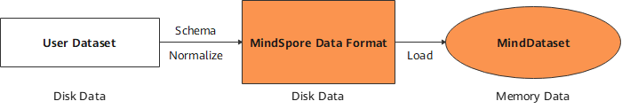
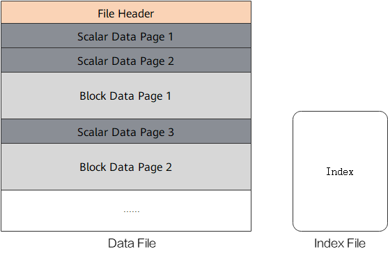

# Converting Dataset to MindRecord

 `Linux` `Ascend` `GPU` `CPU` `Data Preparation` `Intermediate` `Expert`

[](https://gitee.com/mindspore/docs/blob/r1.0/tutorials/training/source_en/advanced_use/convert_dataset.md)

## Overview

Users can convert non-standard datasets and common datasets into the MindSpore data format, MindRecord, so that they can be easily loaded to MindSpore for training. In addition, the performance of MindSpore in some scenarios is optimized, which delivers better user experience when you use datasets in the MindSpore data format.

The MindSpore data format has the following features:
1. Unified storage and access of user data are implemented, simplifying training data loading.
2. Data is aggregated for storage, which can be efficiently read, managed and moved.
3. Data encoding and decoding are efficient and transparent to users.
4. The partition size is flexibly controlled to implement distributed training.

The MindSpore data format aims to normalize the datasets of users to MindRecord, which can be further loaded through the `MindDataset` and used in the training procedure.



## Basic Concepts

A MindRecord file consists of data files and index files. Data files and index files do not support renaming for now.

- Data file

    A data file contains a file header, scalar data pages and block data pages for storing normalized training data. It is recommended that the size of a single MindRecord file does not exceed 20 GB. Users can break up a large dataset and store the dataset into multiple MindRecord files.

- Index file

    An index file contains the index information generated based on scalar data (such as image labels and image file names), used for convenient data fetching and storing statistical data about the dataset.



A data file consists of the following key parts:

- File Header

    The file header stores the file header size, scalar data page size, block data page size, schema, index fields, statistics, file partition information, and mapping between scalar data and block data. It is the metadata of the MindRecord file.

- Scalar data page

    The scalar data page is used to store integer, string and floating point data, such as the label of an image, file name of an image, and length, width of an image. The information suitable for storage with scalars is stored here.

- Block data page

    The block data page is used to store data such as binary strings and NumPy arrays. Additional examples include converted python dictionaries generated from texts and binary image files.

## Converting Dataset to MindRecord

The following tutorial demonstrates how to convert image data and its annotations to MindRecord.

1. Import the `FileWriter` class for file writing.

    ```python
    from mindspore.mindrecord import FileWriter
    ```

2. Define a dataset schema which defines dataset fields and field types.

    ```python
    cv_schema_json = {"file_name": {"type": "string"}, "label": {"type": "int32"}, "data": {"type": "bytes"}}
    ```

    Schema mainly contains `name`, `type` and `shape`:
    - `name`: field names, consist of letters, digits and underscores.
    - `type`: field types, include int32, int64, float32, float64, string and bytes.
    - `shape`: [-1] for one-dimensional array, [m, n, ...] for higher dimensional array in which m and n represent the dimensions.  

    > - The type of a field with the `shape` attribute can only be int32, int64, float32, or float64.
    > - If the field has the `shape` attribute, only data in `numpy.ndarray` type can be transferred to the `write_raw_data` API.

3. Prepare the data sample list to be written based on the user-defined schema format. Binary data of the images is transferred below.

    ```python
    data = [{"file_name": "1.jpg", "label": 0, "data": b"\x10c\xb3w\xa8\xee$o&<q\x8c\x8e(\xa2\x90\x90\x96\xbc\xb1\x1e\xd4QER\x13?\xff\xd9"},
            {"file_name": "2.jpg", "label": 56, "data": b"\xe6\xda\xd1\xae\x07\xb8>\xd4\x00\xf8\x129\x15\xd9\xf2q\xc0\xa2\x91YFUO\x1dsE1\x1ep"},
            {"file_name": "3.jpg", "label": 99, "data": b"\xaf\xafU<\xb8|6\xbd}\xc1\x99[\xeaj+\x8f\x84\xd3\xcc\xa0,i\xbb\xb9-\xcdz\xecp{T\xb1\xdb"}]
    ```

4. Adding index fields can accelerate data loading. This step is optional.

    ```python
    indexes = ["file_name", "label"]
    ```

5. Create a `FileWriter` object, transfer the file name and number of slices, add the schema and index, call the `write_raw_data` API to write data, and call the `commit` API to generate a local data file.

    ```python    
    writer = FileWriter(file_name="test.mindrecord", shard_num=4)
    writer.add_schema(cv_schema_json, "test_schema")
    writer.add_index(indexes)
    writer.write_raw_data(data)
    writer.commit()
    ```

    This example will generate `test.mindrecord0`, `test.mindrecord0.db`, `test.mindrecord1`, `test.mindrecord1.db`, `test.mindrecord2`, `test.mindrecord2.db`, `test.mindrecord3`, `test.mindrecord3.db`, totally eight files, called MindRecord datasets. `test.mindrecord0` and `test.mindrecord0.db` are collectively referred to as a MindRecord file, where `test.mindrecord0` is the data file and `test.mindrecord0.db` is the index file.

    **Interface Description:**
    - `write_raw_data`: write data to memory.
    - `commit`: write data in memory to disk.

6. For adding data to the existing data format file, call the `open_for_append` API to open the existing data file, call the `write_raw_data` API to write new data, and then call the `commit` API to generate a local data file.

    ```python
    writer = FileWriter.open_for_append("test.mindrecord0")
    writer.write_raw_data(data)
    writer.commit()
    ```

## Loading MindRecord Dataset

The following tutorial briefly demonstrates how to load the MindRecord dataset using the `MindDataset`.

1. Import the `dataset` for dataset loading.

    ```python
    import mindspore.dataset as ds
    ```

2. Use the `MindDataset` to load the MindRecord dataset.

    ```python
    data_set = ds.MindDataset(dataset_file="test.mindrecord0")     # read full dataset
    count = 0
    for item in data_set.create_dict_iterator(output_numpy=True):
        print("sample: {}".format(item))
        count += 1
    print("Got {} samples".format(count))
    ```

    The output is as follows:

    ```
    sample: {'data': array([175, 175,  85,  60, 184, 124,  54, 189, 125, 193, 153,  91, 234, 106,  43, 143, 132, 211, 204, 160,  44, 105, 187, 185,  45, 205, 122, 236, 112, 123,  84, 177, 219], dtype=uint8),
        'file_name': array(b'3.jpg', dtype='|S5'),
        'label': array(99, dtype=int32)}
    sample: {'data': array([230, 218, 209, 174,   7, 184,  62, 212,   0, 248,  18,  57,  21, 217, 242, 113, 192, 162, 145,  89,  70,  85,  79,  29, 115,  69, 49,  30, 112], dtype=uint8),
        'file_name': array(b'2.jpg', dtype='|S5'),
        'label': array(56, dtype=int32)}
    sample: {'data': array([ 16,  99, 179, 119, 168, 238,  36, 111,  38,  60, 113, 140, 142, 40, 162, 144, 144, 150, 188, 177,  30, 212,  81,  69,  82,  19, 63, 255, 217], dtype=uint8),
        'file_name': array(b'1.jpg', dtype='|S5'),
        'label': array(0, dtype=int32)}
    sample: {'data': array([ 16,  99, 179, 119, 168, 238,  36, 111,  38,  60, 113, 140, 142, 40, 162, 144, 144, 150, 188, 177,  30, 212,  81,  69,  82,  19, 63, 255, 217], dtype=uint8),
        'file_name': array(b'1.jpg', dtype='|S5'),
        'label': array(0, dtype=int32)}
    sample: {'data': array([175, 175,  85,  60, 184, 124,  54, 189, 125, 193, 153,  91, 234, 106,  43, 143, 132, 211, 204, 160,  44, 105, 187, 185,  45, 205, 122, 236, 112, 123,  84, 177, 219], dtype=uint8),
        'file_name': array(b'3.jpg', dtype='|S5'),
        'label': array(99, dtype=int32)}
    sample: {'data': array([230, 218, 209, 174,   7, 184,  62, 212,   0, 248,  18,  57,  21, 217, 242, 113, 192, 162, 145,  89,  70,  85,  79,  29, 115,  69, 49,  30, 112], dtype=uint8),
        'file_name': array(b'2.jpg', dtype='|S5'),
        'label': array(56, dtype=int32)}
    Got 6 samples
    ```
