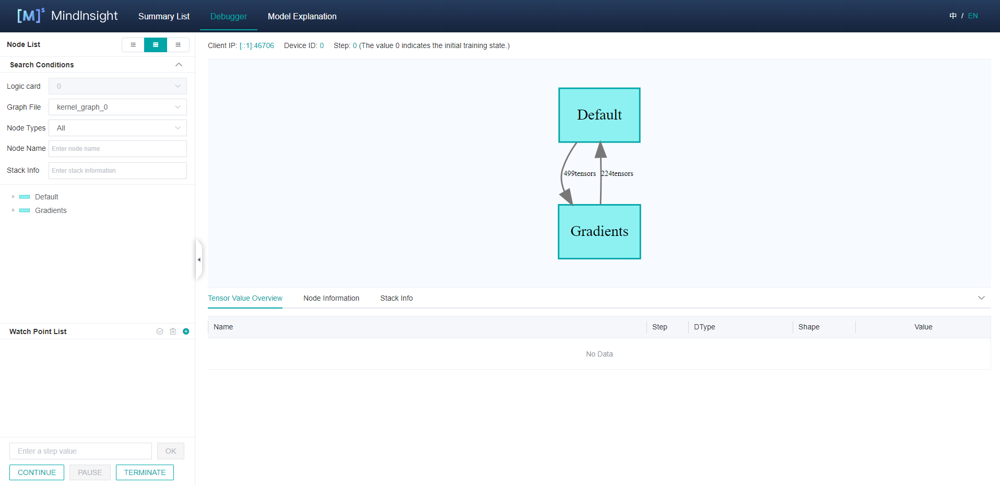
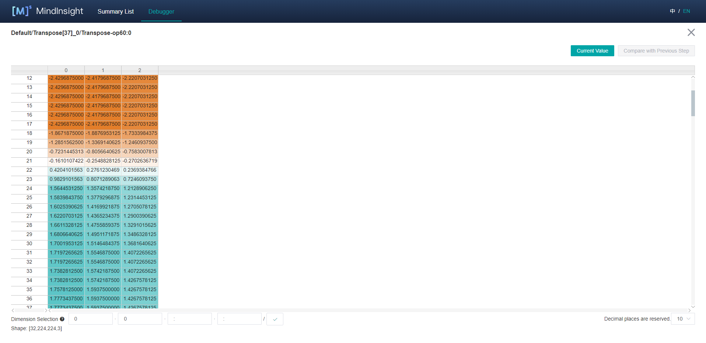
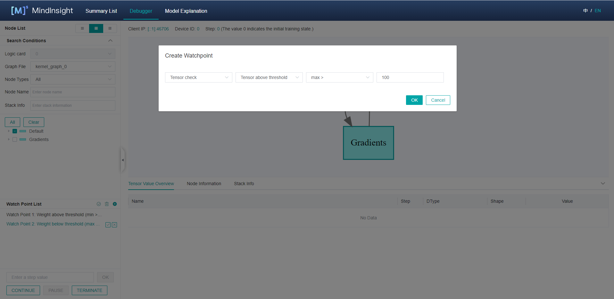
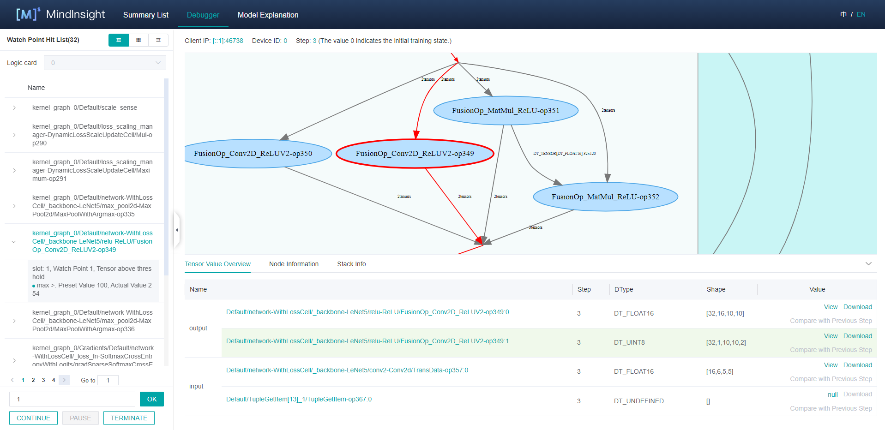
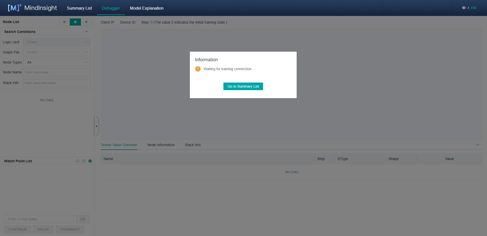

# Using Debugger

`Linux` `Ascend` `GPU` `Graph Mode` `Debug Training` `Intermediate` `Expert`

[](https://gitee.com/mindspore/docs/blob/r1.0/tutorials/training/source_en/advanced_use/debugger.md)

## Overview

MindSpore Debugger is a debugging tool for training in `Graph Mode`. It can be applied to visualize and analyze the intermediate computation results of the computational graph.

In `Graph Mode` training, the computation results of intermediate nodes in the computational graph can not be acquired from python layer, which makes it difficult for users to do the debugging. By applying MindSpore Debugger, users can:

- Visualize the computational graph on the UI and analyze the output of the graph node;
- Set a conditional breakpoint to monitor training exceptions (such as INF), if the condition is met, users can track the cause of the bug when an exception occurs;
- Visualize and analyze the change of parameters, such as weights.   

## Operation Process

- Launch MindInsight in debugger mode, and set Debugger environment variables for the training;
- At the beginning of the training, set conditional breakpoints;
- Analyze the training progress on MindInsight Debugger UI. 

## Debugger Environment Preparation

At first, install MindInsight and launch it in debugger mode. MindSpore will send training information to MindInsight Debugger Server in debugger mode, users can analyze the information on MindInsight UI.

The command to launch MindInsight in debugger mode is as follows: 

```shell
mindinsight start --port {PORT} --enable-debugger True --debugger-port {DEBUGGER_PORT}
```

The Debugger related parameters:

|Name|Argument|Description|Type|Default|Scope|
|---|---|---|---|---|---|
|`--port {PORT}`|Optional|Specifies the port number of the web visualization service.|Integer|8080|1~65535|
|`--enable-debugger {ENABLE_DEBUGGER}`|Required|Should be set to `True`, this will launch the MindInsight debugger server.|Boolean|False|True/False|
|`--debugger-port {DEBUGGER_PORT}`|Optional|Specifies the port number of the debugger server.|Integer|50051|1~65535|

For more launch parameters, please refer to [MindInsight Commands](https://www.mindspore.cn/tutorial/training/en/r1.0/advanced_use/mindinsight_commands.html).

Then, set `export ENABLE_MS_DEBUGGER=1` to specify the training is in the debugger mode, and set the debugger host and port to which the training is connected:
`export MS_DEBUGGER_HOST=127.0.0.1` (the service address must be consistent with MindInsight host address);
`export MS_DEBUGGER_PORT=50051` (the port must be consistent with MindInsight debugger-port).

If the memory space of your equipment is limited, you can use the memory reuse mode before starting the training to reduce the running space: `export MS_DEBUGGER_PARTIAL_MEM=1`。

Besides, do not use dataset sink mode (Set the parameter `dataset_sink_mode` in `model.train` to `False`) to ensure the Debugger can acquire information for all steps.

## Debugger UI Introduction

After the Debugger environment preparation, users can run the training script. 
Before the execution of the computational graph, the MindInsight Debugger UI will show the information of the optimized computational graph.
The following are the Debugger UI components.



Figure 1： The initial UI of debugger

### Computational Graph

Debugger will display the optimized computational graph in the upper middle area of the page.
Users can click the box (stand for one `scope`) to expand the graph, and analyze the nodes contained in that `scope`.

In the GPU environment, there are `Current Node` and `Next Node` buttons in the upper right corner of the computational graph panel,
which are used to return to the current execution node and execute the next node respectively. Users can easily execute one node at a time.

The area on the top shows the training metadata, such as the `Client IP` (address and port of the training script process),
`Device ID` being used and the current training `Step`.

### Node List

As shown in Figure 1，the Computational Graph `Node List` will be displayed on the left of the page.
The `Node List` can be expanded according to the `scope` of the nodes.
When clicking one node in the list, the computational graph on the right will also be expanded and choose the corresponding node automatically.

The search bar on the top can be used to search for nodes in the graph by node name.

### Graph Node Details


Figure 2： The Graph Node Details

When choosing one node on the graph, the details of this node will be displayed at the bottom.
The `Tensor Value Overview` area will show the input nodes and the outputs of this node. The `Type`, `Shape` and `Value` of the `Tensor` can also be viewed.

For GPU environment, after selecting an executable node on the graph, right-click to select `Continue to` on this node, 
which means running the training script to the selected node within one step. 
After left-click `Continue to`, the training script will be executed and paused after running to this node.



Figure 3： `Tensor` Value Visualization

Some outputs of the node contain too many dimensions. 
For these `Tensors`, users can click the `View` link and visualize the `Tensor` in the new panel, which is shown in Figure 3.


Figure 4: Previous Step Value Compare For Parameter Nodes

In addition, the output of the parameter nodes can be compared with their output in the previous step. 
Click the `Compare with Previous Step` button to enter the comparison interface, as shown in Figure 4.

### Conditional Breakpoint



Figure 5： Set Conditional Breakpoint (Watch Point)

In order to monitor the training and find out the bugs, users can set conditional breakpoints (called `Watch Point List` on UI) to analyze the outputs of the 
specified nodes automatically. Figure 5 displays how to set a `Watch Point`:
- At first, click the `+` button on the upper right corner, and then choose a watch condition;
- Select the nodes to be watched in the `Node List`, tick the boxes in the front of the chosen nodes;
- Click the `OK` button to add this `Watch Point`.

The outputs of the watched nodes will be checked by the corresponding conditions. Once the condition is satisfied, the training will pause, and users can analyze 
the triggered `Watch Point List` on the Debugger UI.



Figure 6： The Triggered `Watch Point List`

Figure 6 displays the triggered `Watch Point List`, the displayed area is the same as the `Node List`.
The triggered nodes and corresponding conditions are displayed in the execution order. Click one line in the list, the node will be shown in the computational graph automatically.
Users can further trace the reason of the bug by analyzing the node details.  

### Training Control

At the bottom of the watchpoint setting panel is the training control panel, which shows the training control functions of the debugger, 
with four buttons: `CONTINUE`, `PAUSE`, `TERMINATE` and `OK`:

- `OK` stands for executing the training for several steps, the number of the `step` can be specified in the above bar.
The training will be paused until the `Watch Point List` is triggered, or the number of `step` is executed.
- `CONTINUE` stands for executing the training until the `Watch Point List` is triggered, or the training is finished.
- `PAUSE` stands for pausing the training.
- `TERMINATE` stands for terminating the training.

## Debugger Usage Example

1. Prepare the debugger environment, and open the MindInsight Debugger UI.

    
    
    Figure 7： Debugger Start and Waiting for the Training
    
    The Debugger server is launched and waiting for the training to connect.

2. Run the training script, after a while, the computational graph will be displayed on Debugger UI, as shown in Figure 1.

3. Set conditional breakpoints for the training, as shown in Figure 5.
    
    In Figure 5, the conditions are selected, and some nodes are watched, which means whether there is any output meeting the conditions in the training process of these nodes.
    After setting the conditional breakpoint, users can set steps in the control panel and click `OK` or `CONTINUE` to continue training.

4. The conditional breakpoints are triggered, as shown in Figure 6.
    
    When the conditional breakpoints are triggered, users can analyze the corresponding node details to find out the reason of the bug.

## Notices

- Debugger will slow down the training performance.
- A single Debugger Server can only be connected to one training process.
- The debugger does not support distributed training scenarios.
- The debugger does not support multi-graph training scenarios.
- When too many `Watch Points` are set, the system may run out of memory.
- Debugger cannot get the initialization parameters of the neural network based on Davinci device.
- For GPU environment, only the parameter nodes that meet the conditions can be compared with the results of themselves in the previous step: the node executed with the `Next Node` and `Continue to`, and the parameter nodes as the input of the `Watch Points`. Otherwise, `Compare with Previous Step` cannot be used.
