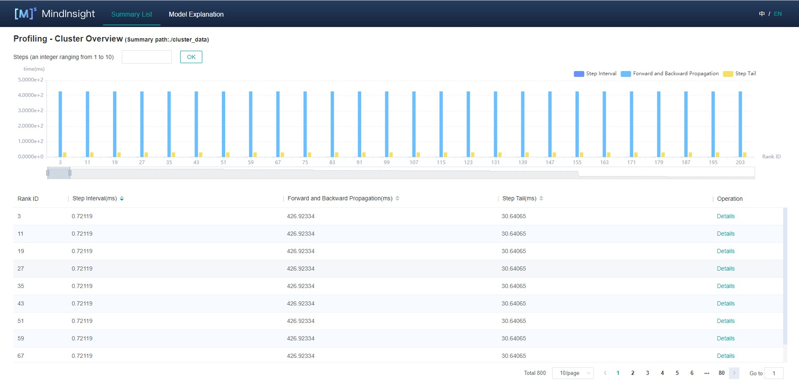

# Cluster Performance Profiling (Ascend)

`Linux` `Ascend` `Model Optimization` `Intermediate` `Expert`

[](https://gitee.com/mindspore/docs/blob/r1.2/tutorials/training/source_en/advanced_use/performance_profiling_ascend_of_cluster.md)

## Overview

This article describes how to use MindSpore Profiler for cluster performance debugging on Ascend AI processors.

## Operation Process

- Set up the distributed training environment, prepare a training script, add profiler APIs in the training script and run the training script.
- Collect Cluster Performance Data.
- Start MindInsight and specify the summary-base-dir using startup parameters, note that summary-base-dir is the parent directory of the directory created by Profiler. For example, the directory created by Profiler is `/home/user/code/data/`, the summary-base-dir should be `/home/user/code`. After MindInsight is started, access the visualization page based on the IP address and port number. The default access IP address is `http://127.0.0.1:8080`.
- Find the cluster training in the list, click the cluster performance profiling link and view the data on the web page.

## Distributed Training

For distributed training, please refer to [Distributed Training](https://www.mindspore.cn/tutorial/training/en/r1.2/advanced_use/distributed_training_ascend.html).

## Collect Cluster Performance Data

In multi-server and multi-device training, after the cluster training, the performance data is distributed in each host node. To analyze the cluster performance, we need to collect the performance data of all host nodes to one host for analysis. Considering the complexity of the cluster running environment and the related permissions and login problems, a more reasonable way is to let users collect cluster performance data. The following is the process of using a script to collect performance data after a distributed cluster training. Users can refer to this script to collect cluster performance data.

Script program description: the script program first creates the cluster job folder, and then uses the SSHPass technology for non interactive remote copy (to avoid manual authentication, manually enter the password), copies the data of each host node in the cluster to the cluster job folder. At the same time, the script program generates the host IP address mapping table and copies the networking information file of the multi-device environment to the cluster job file.

```bash
#!/bin/bash

echo "=============================================================================================================="
echo "Please run the script as: "
echo "bash collect_cluster_profiler_data.sh"
echo "for example: bash collect_cluster_profiler_data.sh cluster_hccl_config_path cluster_account_config_path cluster_train_id host_train_id device_regex output"s
echo "=============================================================================================================="

SSH="ssh -o StrictHostKeyChecking=no"
SCP="scp -o StrictHostKeyChecking=no"

# Get the node list in the cluster.
get_cluster_list()
{
        local cluster_config=$1
        cat ${cluster_config} | python3 -c 'import sys,json;[print(node) for node in json.load(sys.stdin)["cluster"].keys()]'
}

# Get the account number of node.
get_node_user()
{
        local cluster_config=$1
        local node=$2
        cat ${cluster_config} | python3 -c 'import sys,json;print(json.load(sys.stdin)["cluster"]['\"${node}\"']["user"])'
}

# Get the password of node.
get_node_passwd()
{
        local cluster_config=$1
        local node=$2
        cat ${cluster_config} | python3 -c 'import sys,json;print(json.load(sys.stdin)["cluster"]['\"${node}\"']["passwd"])'
}

# Copy the data from remote node to the local node.
rscp_pass()
{
        local node="$1"
        local user="$2"
        local passwd="$3"
        local src="$4"
        local target="$5"
        sshpass -p "${passwd}" ${SCP} -r "${user}"@"${node}":"${src}" "${target}"
}

cluster_hccl_config_path=$1
cluster_account_config_path=$2s
cluster_train_id=$3
host_train_id=$4
device_regex=$5
output=$6
host_ip_mapping_file='host_ips_mapping.txt'
host_ip_mapping_id=1
node_list=$(get_cluster_list ${cluster_account_config_path})
echo "-----begin----"

if [ ! -d "${cluster_train_id}" ]; then
mkdir -p ${cluster_train_id}
fi

# Copy the networking information file of multi-device environment to the cluster directory.
cp $cluster_hccl_config_paht $cluster_train_id

for node in ${node_list}
do
 user=$(get_node_user ${cluster_account_config_path} ${node})
 passwd=$(get_node_passwd ${cluster_account_config_path} ${node})
 echo "------------------${user}@${node}---------------------"
 target_dir=${cluster_train_id}/cluster_profiler/${host_ip_mapping_id}/profiler/
 if [ ! -d "${target_dir}" ]; then
 mkdir -p ${target_dir}
 fi

 # Eight-device data
 for((i=0;i<8;i++));
 do
   src_dir=${host_train_id}/${device_regex}${i}/${output}*/profiler*/*.*
   $(rscp_pass ${node} ${user} ${passwd} "${src_dir}" ${target_dir})
 done

 # Save the mapping information to the host_ips_mapping.txt.
 echo "$node $host_ip_mapping_id">>${cluster_train_id}/$host_ip_mapping_file

 # host_ip_mapping_id ++
 host_ip_mapping_id=$((${host_ip_mapping_id}+1))
done
```

Script Parameter Description:

- `cluster_hccl_config_path` Network information file path in the multi-device environment. The content format is as follows：

    ```json
    {
        "version": "1.0",
        "server_count": "1",
        "server_list": [
            {
            "server_id": "10.xxx.xxx.1",
            "device": [
                {"device_id": "0","device_ip": "192.1.27.6","rank_id": "0"},
                {"device_id": "1","device_ip": "192.2.27.6","rank_id": "1"},
                {"device_id": "2","device_ip": "192.3.27.6","rank_id": "2"},
                {"device_id": "3","device_ip": "192.4.27.6","rank_id": "3"},
                {"device_id": "4","device_ip": "192.1.27.7","rank_id": "4"},
                {"device_id": "5","device_ip": "192.2.27.7","rank_id": "5"},
                {"device_id": "6","device_ip": "192.3.27.7","rank_id": "6"},
                {"device_id": "7","device_ip": "192.4.27.7","rank_id": "7"}],
             "host_nic_ip": "reserve"
            }
    ],
    "status": "completed"
    }
    ```

- `cluster_account_config_path` Host node account password configuration file path, The content format is as follows：

    ```json
    {
      "rank_size": 16,
      "cluster": {
                    "10.xxx.xxx.1": {
                    "user": "root",
                    "passwd": "xxx"
                    },
                    "10.xxx.xxx.2": {
                    "user": "root",
                    "passwd": "xxx"
                    }
                  }
    }
    ```

- `cluster_train_id`  The path to save the performance data of the cluster profiler. For example, `/home/summary/run1` and `/home/data/Run2`, where `run1` and `run2` respectively save the jobs of two cluster training.
- `host_train_id`  During cluster training, each host node stores the path of profiler performance data. For example：`/home/summary/`.
- `device_regex`  The name of the folder where the performance data of the profiler is stored on different devices in each host node. For example：`/home/summary/device0` and `/home/summary/device1`, which are the folders corresponding to device 0 and device 1. At this time, device_regex is device.
- `output`  The path to save the profiler performance file set by the user in the training script, the default is `./data`.

> The collected cluster performance jobs need to conform to the directory structure, otherwise, they cannot be visualized with MindInsight. It must contain the networking information file (the file name is optional) and host_ips_mapping.txt File (file name and suffix are unique).

The directory structure of cluster performance folder collected by script is as follows:

```text
|-- run
    |-- hccl.json
    |-- host_ips_mapping.txt
    |-- cluster_profiler
        |-- 1
        |   |-- profiler
        |       |-- step_trace_raw_0_detail_time.csv
```

Cluster performance folder structure description：

- `hccl.json` It is the networking information file of the current multi-device environment. It records the correspondence between host_ip and device_id and rank_id.
- `host_ips_mapping.txt` For host_ip mapping file. From the security point of view, the real host ip needs to be mapped to avoid exposing the real host value, leading to security risks. A host_ip mapping table is maintained here. One line of content in the file represents a set of mappings. For example, 10.xxx.xxx.1 1 means that the mapping value of 10.xxx.xxx.1 is 1.
- `cluster_profiler` It is the label of cluster training job, which is used to judge whether the training job belongs to cluster training job.
- `1` Save the performance data of the host node profiler, and it is the single-server multi device Profiler Data. The `cluster_profiler` folder contains performance data for all host nodes in the cluster.

## Launch MindInsight

The MindInsight launch command can refer to [MindInsight Commands](https://www.mindspore.cn/tutorial/training/en/r1.2/advanced_use/mindinsight_commands.html).

### Cluster Performance Analysis

Users can access the Performance Profiler by selecting a specific training from the training list, and click the performance profiling link. Cluster performance analysis includes cluster iteration trajectory analysis.

#### Cluster iteration trajectory analysis

Using the cluster iterative trajectory analysis component, we can find out the slow host and slow device in cluster training. Cluster iteration trajectory analysis component shows the iteration information of all devices, including iteration gap, forward and backward, iteration trailing, and supports sorting operation. The iteration gap reflects the speed of the data processing stage, and the iteration gap time of the device can reflect the speed of the corresponding host processing data. The forward and backward time of the device reflects the computing power of the device. Iterative tailing reflects all_reduce time and parallelism.



Figure 1: Cluster iteration trajectory analysis

Figure 1 shows the cluster iteration trajectory analysis page. By default, it shows the average performance of the device. It supports querying the iteration trajectory information of the device under a specific step. By clicking the details link in the single device, you can also jump to the detailed performance display page of the single device to query the detailed performance data of the single device.


Figure 2: Single device details

Figure 2 shows the performance information of a single device in the cluster. Please refer to [single device performance information](https://www.mindspore.cn/tutorial/training/en/r1.2/advanced_use/performance_profiling_ascend.html) for the performance information of a single device.

## Specifications

- To limit the data size generated by the Profiler, MindInsight suggests that for large neural networks, the profiled steps should be less than 10.

  > The number of steps can be controlled by controlling the size of training data set. For example, the `num_samples` parameter in `mindspore.dataset.MindDataset` can control the size of the data set. For details, please refer to:
  > <https://www.mindspore.cn/doc/api_python/en/r1.2/mindspore/dataset/mindspore.dataset.MindDataset.html>

- The parse of Timeline data is time consuming, and usually the data of a few steps is enough to analyze the results. In order to speed up the data parse and UI display, Profiler will show at most 20M data (Contain 10+ step information for large networks).

## Notices

- Currently running in PyNative mode is not supported.
- Currently the training and inference process does not support performance debugging, only individual training or inference is supported.
