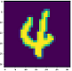

# Testing Model Security Using Fuzz Testing

`Linux` `Ascend` `GPU` `CPU` `Model Evaluation` `Enterprise` `Expert`
<a href="https://gitee.com/mindspore/docs/blob/r1.2/tutorials/training/source_en/advanced_use/test_model_security_fuzzing.md" target="_blank"></a>&nbsp;&nbsp;

## Overview

The decision logic of traditional software is determined by the code logic. Traditional software determines whether the test is adequate based on the code line coverage rate. Ideally, the higher the coverage rate is, the more adequate the code test is. However, for deep neural network, the decision logic of the program is determined by the training data, network structure, and parameters through a black box mechanism. The code line coverage fails to evaluate the test adequacy. A more suitable test evaluation criterion needs to be selected according to the deep network features to guide the neural network to perform a more adequate test and find more corner error cases, thereby ensuring universality and robustness of a model.

The fuzz testing module of MindArmour uses the neuron coverage rate as the test evaluation criterion. Neuron coverage is the range of the number of neurons observed and activated and the range of the neuron output value through a set of inputs. The neuron coverage is used to guide input mutation so that the input can activate more neurons and neuron values can be distributed in a wider range. In this way, we can explore different types of model output results and incorrect behaviors.

The LeNet model and MNIST dataset are used as an example to describe how to use Fuzz testing.

> This example is for CPUs, GPUs, and Ascend 910 AI processors. You can download the complete sample code at <https://gitee.com/mindspore/mindarmour/blob/r1.2/examples/ai_fuzzer/lenet5_mnist_fuzzing.py>.

## Implementation

### Importing Library Files

The following lists the required common modules, MindSpore-related modules, Fuzz testing feature modules, and configuration log labels and log levels.

```python
import numpy as np
from mindspore import Model
from mindspore import context
from mindspore import load_checkpoint, load_param_into_net

from mindarmour.fuzz_testing import Fuzzer
from mindarmour.fuzz_testing import ModelCoverageMetrics
from mindarmour.utils.logger import LogUtil

from examples.common.dataset.data_processing import generate_mnist_dataset
from examples.common.networks.lenet5.lenet5_net import LeNet5

LOGGER = LogUtil.get_instance()
TAG = 'Fuzz_testing'
LOGGER.set_level('INFO')
```

### Parameter Configuration

Configure necessary information, including the environment information and execution mode.

```python
context.set_context(mode=context.GRAPH_MODE, device_target="Ascend")
```

For details about the API configuration, see the `context.set_context`.

### Fuzz Testing Application

1. Create a LeNet model and load the MNIST dataset. The operation is the same as that for [Model Security](https://www.mindspore.cn/tutorial/training/en/r1.2/advanced_use/improve_model_security_nad.html).

   ```python
   ...
   # Lenet model
   model = Model(net)
   # get training data
   mnist_path = "../common/dataset/MNIST/"
   batch_size = 32
   ds = generate_mnist_dataset(os.path.join(mnist_path, "train"), batch_size, sparse=False)
   train_images = []
   for data in ds.create_tuple_iterator():
       images = data[0].asnumpy().astype(np.float32)
       train_images.append(images)
   train_images = np.concatenate(train_images, axis=0)

   # get test data
   batch_size = 32
   ds = generate_mnist_dataset(os.path.join(mnist_path, "test"), batch_size, sparse=False)
   test_images = []
   test_labels = []
   for data in ds.create_tuple_iterator():
       images = data[0].asnumpy().astype(np.float32)
       labels = data[1].asnumpy()
       test_images.append(images)
       test_labels.append(labels)
   test_images = np.concatenate(test_images, axis=0)
   test_labels = np.concatenate(test_labels, axis=0)
   ```

2. Configure Fuzzer parameters.

   Set the data mutation method and parameters. Multiple methods can be configured at the same time. Currently, the following data mutation methods are supported:

   - Image affine transformation methods: Translate, Scale, Shear, and Rotate.
   - Methods based on image pixel value changes: Contrast, Brightness, Blur, and Noise.
   - Methods for generating adversarial examples based on white-box and black-box attacks: FGSM, PGD, and MDIIM.

   The data mutation method must include the method based on the image pixel value changes.

   The first two image transform methods support user-defined configuration parameters and randomly generated parameters by algorithms. For user-defined configuration parameters see the class methods corresponding to <https://gitee.com/mindspore/mindarmour/blob/r1.2/mindarmour/fuzz_testing/image_transform.py>. For randomly generated parameters by algorithms you can set method's params to `'auto_param': [True]`. The mutation parameters are randomly generated within the recommended range.

   For details about how to set parameters based on the attack defense method, see the corresponding attack method class.

   The following is an example for configure Fuzzer parameters.

   ```python
   mutate_config = [{'method': 'Blur',
                     'params': {'radius': [0.1, 0.2, 0.3],
                                'auto_param': [True, False]}},
                    {'method': 'Contrast',
                     'params': {'auto_param': [True]}},
                    {'method': 'Translate',
                     'params': {'auto_param': [True]}},
                    {'method': 'Brightness',
                     'params': {'auto_param': [True]}},
                    {'method': 'Noise',
                     'params': {'auto_param': [True]}},
                    {'method': 'Scale',
                     'params': {'auto_param': [True]}},
                    {'method': 'Shear',
                     'params': {'auto_param': [True]}},
                    {'method': 'FGSM',
                     'params': {'eps': [0.3, 0.2, 0.4], 'alpha': [0.1]}}
                   ]
   ```

   Set evaluation metrics. Currently, the following evaluation metrics are supported:
   - General evaluation metric: accuracy.
   - Neuron coverage rate metrics: kmnc, nbc, and snac.
   - Adversarial attack evaluation metric: attack_success_rate.
   You can set this parameter to `auto`. By default, all evaluation metrics are used.

   ```python
   eval_metrics =['accuracy', 'kmnc', 'attack_success_rate']
   ```

3. Initialize the seed queue. Each seed in the seed queue has two values: original image and image label. Here we select 100 samples as initial seed queue.

   ```python
   # make initial seeds
   initial_seeds = []
   for img, label in zip(test_images, test_labels):
    initial_seeds.append([img, label])
   initial_seeds = initial_seeds[:100]
   ```

4. Test the neuron coverage rate before the fuzz testing.

   ```python
   segmented_num = 1000
   neuron_num = 10
   model_coverage_test = ModelCoverageMetrics(model, neuron_num, segmented_num, train_images)
   model_coverage_test.calculate_coverage(np.array(test_images[:100]).astype(np.float32))
   LOGGER.info(TAG, 'KMNC of this test is : %s', model_coverage_test.get_kmnc())
   ```

   Result:

   ```python
    KMNC of this test is : 0.0851
   ```

5. Perform the fuzz testing.

   ```python
   eval_metrics = 'auto'
   model_fuzz_test = Fuzzer(model, train_images, neuron_num, segmented_num)
   _, _, _, _, metrics = model_fuzz_test.fuzzing(mutate_config, initial_seeds, eval_metrics=eval_metrics)
   ```

6. Experiment results.

   The results of fuzz testing contains five aspect data:

   - fuzz_samples: mutated samples in fuzz testing.
   - true_labels: the ground truth labels of fuzz_samples.
   - fuzz_pred: predictions of tested model about fuzz_samples.
   - fuzz_strategies: the methods used to mutate fuzz_samples.
   - metrics_report: metrics report of fuzz testing.

   The first 4 returns can be used to further calculated complex metrics and analyze the robustness of the model.

   Run the following command to view the result:

   ```python
   if metrics:
       for key in metrics:
           LOGGER.info(TAG, key + ': %s', metrics[key])
   ```

   The fuzz testing result is as follows:

   ```python
   Accuracy: 0.7929
   Attack_success_rate: 0.3939
   Neural_coverage_KMNC: 0.4797
   ```

   Before the fuzzing test, the KMNC neuron coverage rate of the seed is 8.5%. After the fuzzing test, the KMNC neuron coverage rate is 47.97%, and the neuron coverage rate and sample diversity increase. After the fuzzing test, the accuracy rate of the model to generate samples is 79.29%, and the attack success rate is 39.39% for samples using the adversarial attack method. Since the initial seed, the mutation method and the corresponding parameters are all randomly selected, it is normal that the result floats to some extent.

   Original image:

   

   Mutation images generated by fuzzing:

   
