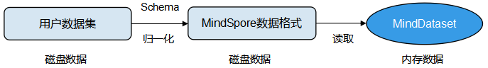
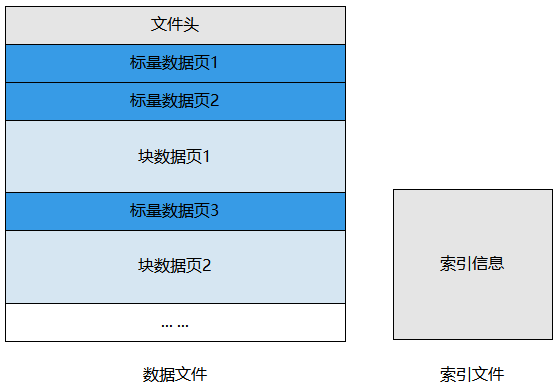

# 转换数据集为MindRecord

`Linux` `Ascend` `GPU` `CPU` `数据准备` `中级` `高级`

[](https://gitee.com/mindspore/docs/blob/r1.1/tutorials/training/source_zh_cn/advanced_use/convert_dataset.md)&nbsp;&nbsp;
[](https://obs.dualstack.cn-north-4.myhuaweicloud.com/mindspore-website/notebook/r1.1/convert_dataset_to_mindrecord/mindspore_convert_dataset_to_mindrecord.ipynb)
&nbsp;&nbsp;
[](https://console.huaweicloud.com/modelarts/?region=cn-north-4#/notebook/loading?share-url-b64=aHR0cHM6Ly9vYnMuZHVhbHN0YWNrLmNuLW5vcnRoLTQubXlodWF3ZWljbG91ZC5jb20vbWluZHNwb3JlLXdlYnNpdGUvbm90ZWJvb2svbW9kZWxhcnRzL21pbmRzcG9yZV9jb252ZXJ0X2RhdGFzZXRfdG9fbWluZHJlY29yZC5pcHluYg==&image_id=65f636a0-56cf-49df-b941-7d2a07ba8c8c)

## 概述

用户可以将非标准的数据集和常用的数据集转换为MindSpore数据格式，即MindRecord，从而方便地加载到MindSpore中进行训练。同时，MindSpore在部分场景做了性能优化，使用MindSpore数据格式可以获得更好的性能。

MindSpore数据格式具备的特征如下：

1. 实现多变的用户数据统一存储、访问，训练数据读取更简便；
2. 数据聚合存储，高效读取，且方便管理、移动；
3. 高效数据编解码操作，对用户透明、无感知；
4. 灵活控制分区大小，实现分布式训练。

MindSpore数据格式的目标是归一化用户的数据集，并进一步通过`MindDataset`实现数据的读取，并用于训练过程。



## 基本概念

一个MindRecord文件由数据文件和索引文件组成，且数据文件及索引文件暂不支持重命名操作：

- 数据文件

    包含文件头、标量数据页、块数据页，用于存储用户归一化后的训练数据，且单个MindRecord文件建议小于20G，用户可将大数据集进行分片存储为多个MindRecord文件。

- 索引文件

    包含基于标量数据（如图像Label、图像文件名等）生成的索引信息，用于方便的检索、统计数据集信息。



数据文件主要由以下几个关键部分组成：

- 文件头

    文件头主要用来存储文件头大小、标量数据页大小、块数据页大小、Schema信息、索引字段、统计信息、文件分区信息、标量数据与块数据对应关系等，是MindRecord文件的元信息。

- 标量数据页

    标量数据页主要用来存储整型、字符串、浮点型数据，如图像的Label、图像的文件名、图像的长宽等信息，即适合用标量来存储的信息会保存在这里。

- 块数据页

    块数据页主要用来存储二进制串、NumPy数组等数据，如二进制图像文件本身、文本转换成的字典等。

## 将数据集转换为MindRecord

下面本教程将简单演示如何将图片数据及其标注转换为MindRecord格式。更多MindSpore数据格式转换说明，可参见编程指南中[MindSpore数据格式转换](https://www.mindspore.cn/doc/programming_guide/zh-CN/r1.1/dataset_conversion.html)章节。

1. 导入文件写入工具类`FileWriter`。

    ```python
    from mindspore.mindrecord import FileWriter
    ```

2. 定义数据集结构文件Schema。

    ```python
    cv_schema_json = {"file_name": {"type": "string"}, "label": {"type": "int32"}, "data": {"type": "bytes"}}
    ```

    Schema文件主要包含字段名`name`、字段数据类型`type`和字段各维度维数`shape`：
    - 字段名：字段的引用名称，可以包含字母、数字和下划线。
    - 字段数据类型：包含int32、int64、float32、float64、string、bytes。
    - 字段维数：一维数组用[-1]表示，更高维度可表示为[m, n, ...]，其中m、n为各维度维数。

    > - 如果字段有属性`shape`，则对应数据类型必须为int32、int64、float32、float64。
    > - 如果字段有属性`shape`，则用户传入`write_raw_data`接口的数据必须为`numpy.ndarray`类型。

3. 按照用户定义的Schema格式，准备需要写入的数据列表，此处传入的是图片数据的二进制流。

    ```python
    data = [{"file_name": "1.jpg", "label": 0, "data": b"\x10c\xb3w\xa8\xee$o&<q\x8c\x8e(\xa2\x90\x90\x96\xbc\xb1\x1e\xd4QER\x13?\xff\xd9"},
            {"file_name": "2.jpg", "label": 56, "data": b"\xe6\xda\xd1\xae\x07\xb8>\xd4\x00\xf8\x129\x15\xd9\xf2q\xc0\xa2\x91YFUO\x1dsE1\x1ep"},
            {"file_name": "3.jpg", "label": 99, "data": b"\xaf\xafU<\xb8|6\xbd}\xc1\x99[\xeaj+\x8f\x84\xd3\xcc\xa0,i\xbb\xb9-\xcdz\xecp{T\xb1\xdb"}]
    ```

4. 添加索引字段可以加速数据读取，该步骤非必选。

    ```python
    indexes = ["file_name", "label"]
    ```

5. 创建`FileWriter`对象，传入文件名及分片数量，然后添加Schema文件及索引，调用`write_raw_data`接口写入数据，最后调用`commit`接口生成本地数据文件。

    ```python
    writer = FileWriter(file_name="test.mindrecord", shard_num=4)
    writer.add_schema(cv_schema_json, "test_schema")
    writer.add_index(indexes)
    writer.write_raw_data(data)
    writer.commit()
    ```

    该示例会生成`test.mindrecord0`、`test.mindrecord0.db`、`test.mindrecord1`、`test.mindrecord1.db`、`test.mindrecord2`、`test.mindrecord2.db`、`test.mindrecord3`、`test.mindrecord3.db`共8个文件，称为MindRecord数据集。`test.mindrecord0`和`test.mindrecord0.db`称为1个MindRecord文件，其中`test.mindrecord0`为数据文件，`test.mindrecord0.db`为索引文件。

    **接口说明：**
    - `write_raw_data`：将数据写入到内存之中。
    - `commit`：将最终内存中的数据写入到磁盘。

6. 如果需要在现有数据格式文件中增加新数据，可以调用`open_for_append`接口打开已存在的数据文件，继续调用`write_raw_data`接口写入新数据，最后调用`commit`接口生成本地数据文件。

    ```python
    writer = FileWriter.open_for_append("test.mindrecord0")
    writer.write_raw_data(data)
    writer.commit()
    ```

## 读取MindRecord数据集

下面将简单演示如何通过`MindDataset`读取MindRecord数据集。

1. 导入读取类`MindDataset`。

    ```python
    import mindspore.dataset as ds
    ```

2. 使用`MindDataset`读取MindRecord数据集。

    ```python
    data_set = ds.MindDataset(dataset_file="test.mindrecord0")     # read full dataset
    count = 0
    for item in data_set.create_dict_iterator(output_numpy=True):
        print("sample: {}".format(item))
        count += 1
    print("Got {} samples".format(count))
    ```

    输出结果如下：

    ```text
    sample: {'data': array([175, 175,  85,  60, 184, 124,  54, 189, 125, 193, 153,  91, 234, 106,  43, 143, 132, 211, 204, 160,  44, 105, 187, 185,  45, 205, 122, 236, 112, 123,  84, 177, 219], dtype=uint8),
        'file_name': array(b'3.jpg', dtype='|S5'),
        'label': array(99, dtype=int32)}
    sample: {'data': array([230, 218, 209, 174,   7, 184,  62, 212,   0, 248,  18,  57,  21, 217, 242, 113, 192, 162, 145,  89,  70,  85,  79,  29, 115,  69, 49,  30, 112], dtype=uint8),
        'file_name': array(b'2.jpg', dtype='|S5'),
        'label': array(56, dtype=int32)}
    sample: {'data': array([ 16,  99, 179, 119, 168, 238,  36, 111,  38,  60, 113, 140, 142, 40, 162, 144, 144, 150, 188, 177,  30, 212,  81,  69,  82,  19, 63, 255, 217], dtype=uint8),
        'file_name': array(b'1.jpg', dtype='|S5'),
        'label': array(0, dtype=int32)}
    sample: {'data': array([ 16,  99, 179, 119, 168, 238,  36, 111,  38,  60, 113, 140, 142, 40, 162, 144, 144, 150, 188, 177,  30, 212,  81,  69,  82,  19, 63, 255, 217], dtype=uint8),
        'file_name': array(b'1.jpg', dtype='|S5'),
        'label': array(0, dtype=int32)}
    sample: {'data': array([175, 175,  85,  60, 184, 124,  54, 189, 125, 193, 153,  91, 234, 106,  43, 143, 132, 211, 204, 160,  44, 105, 187, 185,  45, 205, 122, 236, 112, 123,  84, 177, 219], dtype=uint8),
        'file_name': array(b'3.jpg', dtype='|S5'),
        'label': array(99, dtype=int32)}
    sample: {'data': array([230, 218, 209, 174,   7, 184,  62, 212,   0, 248,  18,  57,  21, 217, 242, 113, 192, 162, 145,  89,  70,  85,  79,  29, 115,  69, 49,  30, 112], dtype=uint8),
        'file_name': array(b'2.jpg', dtype='|S5'),
        'label': array(56, dtype=int32)}
    Got 6 samples
    ```
