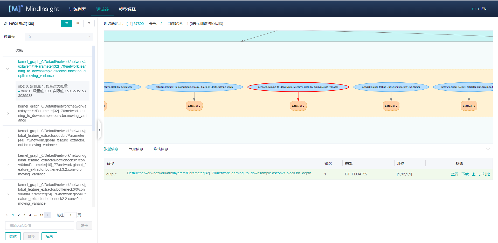

# 使用调试器

`Linux` `Ascend` `GPU` `静态图` `模型调试` `中级` `高级`

[](https://gitee.com/mindspore/docs/blob/r1.0/tutorials/training/source_zh_cn/advanced_use/debugger.md)

## 概述
MindSpore调试器是为图模式训练提供的调试工具，可以用来查看并分析计算图节点的中间结果。

在MindSpore图模式的训练过程中，用户无法从Python层获取到计算图中间节点的结果，使得训练调试变得很困难。使用MindSpore调试器，用户可以：

- 在MindInsight调试器界面结合计算图，查看图节点的输出结果；
- 设置条件断点，监测训练异常情况（比如INF），在异常发生时追踪错误原因；
- 查看权重等参数的变化情况。

## 操作流程

- 以调试模式启动MindInsight，配置相关环境变量;
- 训练开始，在MindInsight调试器界面设置条件断点；
- 在MindInsight调试器界面分析训练执行情况。

## 调试器环境准备
开始训练前，请先安装MindInsight，并以调试模式启动。调试模式下，MindSpore会将训练信息发送给MindInsight调试服务，用户可在MindInsight调试器界面进行查看和分析。

MindInsight调试服务启动命令：

```shell
mindinsight start --port {PORT} --enable-debugger True --debugger-port {DEBUGGER_PORT}
```

参数含义如下:

|参数名|属性|功能描述|参数类型|默认值|取值范围|
|---|---|---|---|---|---|
|`--port {PORT}`|可选|指定Web可视化服务端口。|Integer|8080|1~65535|
|`--enable-debugger {ENABLE_DEBUGGER}`|必选|取值为True, 开启MindInsight侧调试器|Boolean|False|True/False|
|`--debugger-port {DEBUGGER_PORT}`|可选|指定调试服务端口。|Integer|50051|1~65535|

更多启动参数请参考[MindInsight相关命令](https://www.mindspore.cn/tutorial/training/zh-CN/r1.0/advanced_use/mindinsight_commands.html)。

然后，设置环境变量`export ENABLE_MS_DEBUGGER=1`，将训练指定为调试模式，并设置训练要连接的调试服务和端口: 
`export MS_DEBUGGER_HOST=127.0.0.1`(该服务地址需与MindInsight host一致);
`export MS_DEBUGGER_PORT=50051`(该端口需与MindInsight debugger-port一致)。

如果用户设备的内存空间有限，可在运行训练前开启内存复用模式，以降低运行内存占用：`export MS_DEBUGGER_PARTIAL_MEM=1`。

此外，训练时不要使用数据下沉模式（需设置`model.train`中的`dataset_sink_mode`为`False`），以保证调试器可以获取每个step的训练信息。

## 调试器页面介绍

调试器环境准备完成后，开始训练。在训练正式执行前，可以在MindInsight调试器界面查看计算图等训练元信息，调试器页面布局由如下部分组成。


图1： 调试器初始页面

### 计算图
调试器将优化后的最终执行图展示在UI的中上位置，用户可以双击打开图上的方框 (代表一个`scope`) 将计算图进一步展开，查看`scope`中的节点信息。

面板的最上方展示了`训练端地址`（训练脚本所在进程的地址和端口），训练使用的`卡号`, 训练的`当前轮次`等元信息。

在GPU环境下，训练执行图面板的右上角会有`当前节点`和`下一个节点`两个按钮，分别用于回到当前执行节点、和执行下一个节点。
用户可以方便地执行单个节点。

### 节点列表

如图1所示，在UI的左侧会展示计算图`节点列表`，可以将计算图中的节点按`scope`分层展开。点击`节点列表`中的节点，计算图也会联动展开到选中节点的位置。
用户也可以使用`节点列表`上方的搜索框按名称进行节点的搜索。

### 节点信息


图2： 计算图节点信息查看

点击计算图上的节点后，可以在UI下方查看该节点的详细信息，如图2所示。该部分展示了节点的输出和输入，训练的`轮次`数目，`张量`的`类型`、`形状`和`数值`等信息。

在GPU环境下，选中图上的某个可执行节点后，单击鼠标右键，可选择`运行到该节点`，代表将训练脚本运行到被选中节点（不超过一个`轮次`）。选中后单击鼠标左键，训练脚本运行到该节点后会暂停。


图3： 查看`张量`值

一些`张量`的维度过多，无法直接在主页进行展示。用户可以点击对应的查看按钮，在弹出的TAB页中查看`张量`值的详细信息，如图3所示。


图4：查看上一步对比结果

此外，参数类型的节点输出可以和其自身在上一轮次的输出结果进行对比，点击`上一步对比`按钮即可进入到对比界面，如图4所示。

### 条件断点


图5： 条件断点设置

为了方便地对节点的计算结果进行监测分析，用户可以给计算图中的节点设置条件断点。图5展示了条件断点的设置方法，用户首先点击监测点列表右上角的 `+` 按钮新增条件断点并监控条件，比如INF，
然后在节点列表选择要监控的节点（勾选节点前的方框）。训练时，调试器会对这些监控节点的输出进行实时分析，一旦监控条件触发，训练暂停，用户可在UI上查看触发的条件断点信息。



图6： 查看触发的条件断点

图6展示了条件断点触发后的展示页面，该页面和`节点列表`所在位置相同。触发的节点以及监控条件会按照节点的执行序排列，用户点击某一行，会在计算图中跳转到对应节点，可以进一步查看节点信息分析INF等异常结果出现的原因。 

### 训练控制

监测点设置面板的下方是训练控制面板，该面板展示了调试器的训练控制功能，有`继续`、`暂停`、`结束`、`确定`四个按钮。
- `确定`代表训练向前执行若干个`轮次`，需要用户在上方的输入框内指定执行的`轮次`数目，直到条件断点触发、或`轮次`执行完毕后暂停；
- `继续`代表训练一直执行，直到条件断点触发后暂停、或运行至训练结束；
- `暂停`代表训练暂停；
- `结束`代表终止训练。

## 使用调试器进行调试

1. 在调试器环境准备完成后，打开调试器界面，如下图所示：

    
    
    图7： 调试器等待训练连接
    
    此时，调试器处于等待训练启动和连接的状态。

2. 运行训练脚本，稍后可以看到计算图显示在调试器界面，见图1。

3. 设置条件断点，见图5。
    
    图5中，选中检测条件，并勾选了部分节点，代表监控这些节点在计算过程是否存在满足监控条件的输出。
    设置完条件断点后，可以在控制面板选择设置轮次点击`确定`或者`继续`继续训练。

4. 条件断点触发，见图6。
    
    条件断点触发后，用户查看对应的节点信息，找出异常原因后修改脚本，解掉bug。

## 注意事项

- 使用调试器时，会对训练性能产生一定影响。
- 一个调试服务目前只能够连接一个训练进程。
- 调试器暂不支持分布式训练场景。
- 调试器暂不支持多图场景。
- 设置的监测点数目过多时，可能会出现系统内存不足（Out-of-Memory）的异常。
- 在D芯片环境下，调试器暂时无法获取神经网络的初始化参数。
- 在GPU场景下，只有满足条件的参数节点可以与自身的上一步结果作对比：使用`下一个节点`执行过的节点、使用`运行到该节点`时选中的节点、作为`监测点`输入的参数节点。其他情况均无法使用`上一步对比`功能。
