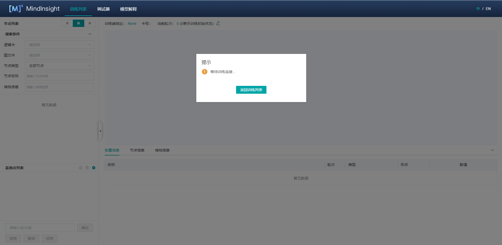

# 使用离线调试器

`Linux` `Ascend` `GPU` `模型调优` `中级` `高级`

<!-- TOC -->

- [使用离线调试器](#使用离线调试器)
    - [概述](#概述)
    - [操作流程](#操作流程)
    - [离线调试器环境准备](#离线调试器环境准备)
    - [离线调试器页面介绍](#离线调试器页面介绍)
    - [使用离线调试器进行调试](#使用离线调试器进行调试)
    - [注意事项](#注意事项)

<!-- /TOC -->

<a href="https://gitee.com/mindspore/docs/blob/master/tutorials/training/source_zh_cn/advanced_use/debugger_offline.md" target="_blank"></a>

## 概述

MindSpore离线调试器是基于训练的Dump数据进行可视化调试，可以用来查看并分析计算图节点的中间结果。

离线调试器支持对接离线Dump数据，进行可视化分析。离线调试器解决不开启内存复用的情况下，在线调试器不支持的问题。

## 操作流程

1. 准备Dump数据。Dump的使用方式详见[使用Dump功能在Graph模式调试](https://www.mindspore.cn/tutorial/training/zh-CN/master/advanced_use/dump_in_graph_mode.html) ；
2. 启动MindInsight，指定summary-base-dir为dump配置中的{path}路径的上一层或上两层；
3. 从训练列表中找到离线调试器入口，点击“离线调试器”，进入调试器页面，开始进行调试分析。

## 离线调试器环境准备

使用MindSpore的Dump功能准备离线数据。Dump的使用方式详见[使用Dump功能在Graph模式调试](https://www.mindspore.cn/tutorial/training/zh-CN/master/advanced_use/dump_in_graph_mode.html) 。

然后，启动MindInsight，指定summary-base-dir为dump配置中的{path}路径的上一层或上两层，即可在UI页面中查询到离线调试器的入口。

MindInsight启动命令：

```text
mindinsight start --port {PORT} --summary-base-dir /path/to/father/directory/of/dump_dir
```

或者：

```text
mindinsight start --port {PORT} --summary-base-dir /path/to/grandfher/directory/of/dump_dir
```

参数含义如下:

|参数名|属性|功能描述|参数类型|默认值|取值范围|
|---|---|---|---|---|---|
|`--port {PORT}`|可选|指定Web可视化服务端口。|Integer|8080|1~65535|
|`--summary-base-dir /path/to`|必选|mp配置中的{path}路径的上一层或上两层。例如，Dump配置文件中的path为“/home/workspace/data/dump_dir”，summary-base-dir可以设置为“/home/workspace/data”或“/home/workspace”。|String|./|-|

更多启动参数请参考[MindInsight相关命令](https://www.mindspore.cn/tutorial/training/zh-CN/master/advanced_use/mindinsight_commands.html)。

然后，打开MindInsight页面，从离线调试器入口进入调试器界面。


图1： 离线调试器入口

## 离线调试器页面介绍

离线调试器界面与在线调试器相同。在线调试器的页面介绍详见[调试器页面介绍](https://www.mindspore.cn/tutorial/training/zh-CN/master/advanced_use/debugger.html#id5) 。

## 使用离线调试器进行调试

1. 在调试器环境准备完成后，打开调试器界面，如下图所示：

    

    图2： 调试器等待训练连接

    此时，调试器处于加载离线数据的状态。

2. 稍等片刻，在MindInsight UI上可以看到弹窗，提示选择是否使用推荐监测点，接下来的使用步骤与在线调试相同。[使用调试器进行调试](https://www.mindspore.cn/tutorial/training/zh-CN/master/advanced_use/debugger.html#id16) 。

3. 与在线调试器相比，离线调试器可以重置训练轮次。如图3所示，点击右边的编辑图标，就会出现一个编辑框，如图4所示，输入需要重置的轮次，点击对钩符号即可。。

   

   图3： 重置训练轮次

   

   图4：重置训练轮次编辑状态

## 注意事项

- 场景支持：
    - 离线调试器暂不支持CPU场景。
    - 离线调试器支持单机多卡场景。若要分析多机多卡的场景。需要自行把多机数据汇总到一起。
    - 离线调试器暂不支持初始权重的检查。

- GPU场景：
    - 与在线调试器不同，离线调试器不支持逐节点执行。

- 重新检查只检查当前有张量值的监测点。
- 调试器展示的图是优化后的最终执行图。调用的算子可能已经与其它算子融合，或者在优化后改变了名称。
- 如果使用Ascend场景下的异步Dump数据，可以使用MindInsight的数据解析工具DumpParser的`convert_all_data_to_host`接口将异步Dump数据转换为`.npy`文件，从而提高数据分析效率。DumpParser的使用方式详见[DumpParser介绍](https://gitee.com/mindspore/mindinsight/tree/master/mindinsight/parser) 。