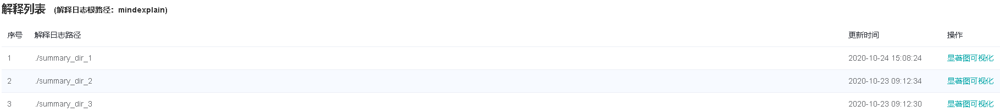
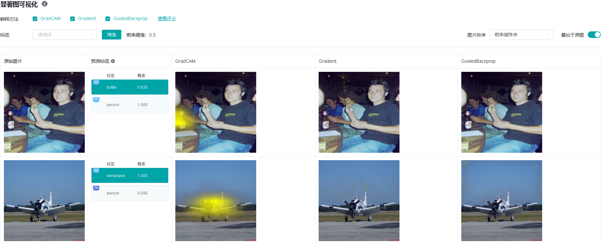
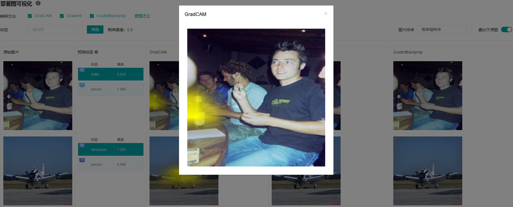
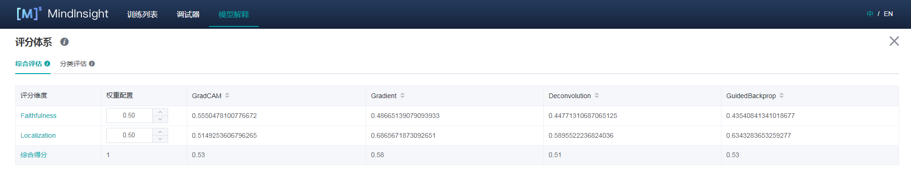

# 解释模型

`Linux` `Ascend` `GPU` `模型调优` `初级` `中级` `高级`

<a href="https://gitee.com/mindspore/docs/blob/r1.1/tutorials/training/source_zh_cn/advanced_use/model_explaination.md" target="_blank"></a>

## 概述

当前深度学习模型多为黑盒模型，性能表现好但可解释性较差。模型解释模块旨在为用户提供对模型决策依据的解释，帮助用户更好地理解模型、信任模型，以及当模型出现错误时有针对性地改进模型效果。

在一些影响至关重要的应用场景中，如自动驾驶、金融决策等，由于法律和政策监管的原因，AI模型如果不具备可解释性，是无法真正落地应用的。所以模型的可解释性的重要性越来越高，受到越来越多的关注。因此，模型解释是提升MindSpore生态应用性、用户友好性至关重要的一部分。

具体来说，在图片分类任务中，较为广泛使用的一类解释方法会将影响模型的分类决策最关键的区域高亮出来，我们称之为“显著图”，如果被高亮的部分恰好就是相应标签的关键特征，那么通常说明模型学习到的特征是正确的，用户可以更加信任模型的效果和决策。如果模型关注的是不相关的部分，即使预测标签是正确的，也不代表模型是可靠的，模型开发者还是需要优化改进模型。造成这种情况有可能是训练数据中存在某些特征的相关性，模型开发者可以考虑有针对性的做数据增强来修正模型学习到的偏见。

除了提供多种解释方法，我们还提供了一套对解释方法效果评分的度量方法，从多种维度评估解释方法的效果，从而帮助用户比较和选择最适合于特定场景的解释方法。

## 操作流程

### 准备脚本

当前MindSpore提供解释方法及给解释方法进行评估的度量Python API，已提供的解释方法可以通过`mindspore.explainer.explanation`包获取，度量方法可以通过`mindspore.explainer.benchmark`包获取。用户准备好待解释的黑盒模型和数据，在脚本中根据需要实例化解释方法及度量方法，调用API用于收集解释结果和解释度量结果。

MindSpore还提供`mindspore.explainer.ImageClassificationRunner`运行模块，支持自动化运行所有解释方法和度量方法。用户将实例化的解释方法及度量方法进行注册，即可自动运行解释方法及度量方法，并生成及保存包含解释结果及解释度量结果的解释日志。

下面以ResNet50及带有20类多标签数据为例，用户初始化`explanation`中解释方法及`benchmark`中度量方法，调用`ImageClassificationRunner`进行解释和度量。其样例代码如下：

```python
import mindspore.nn as nn
from mindspore import load_checkpoint, load_param_into_net

from mindspore.explainer.explanation import GradCAM, GuidedBackprop
from mindspore.explainer.benchmark import Faithfulness, Localization
from mindspore.explainer import ImageClassificationRunner

num_classes = 20
# please refer to model_zoo for the model architecture of resnet50
net = resnet50(num_classes)
param_dict = load_checkpoint("resnet50.ckpt")
load_param_into_net(net, param_dict)


# initialize explainers with the loaded black-box model
gradcam = GradCAM(net, layer='layer4')
guidedbackprop = GuidedBackprop(net)

# initialize benchmarkers to evaluate the chosen explainers
# for Faithfulness, the initialization needs a activation function that transforms the output of the network to a probability is also needed.
activation_fn = nn.Sigmoid()  # for multi-label classification
faithfulness = Faithfulness(num_labels=num_classes, metric='InsertionAUC', activation_fn=activation_fn)
localization = Localization(num_labels=num_classes, metric='PointingGame')

# returns the dataset to be explained, when localization is chosen, the dataset is required to provide bounding box
# the columns of the dataset should be in [image], [image, labels], or [image, labels, bbox] (order matters).
# You may refer to 'mindspore.dataset.project' for columns managements.
dataset_path = "dataset_dir"
dataset = get_dataset(dataset_path)

# specify the class names of the dataset
classes = [
 'aeroplane', 'bicycle', 'bird', 'boat', 'bottle', 'bus', 'car', 'cat',
 'chair', 'cow', 'diningtable', 'dog', 'horse', 'motorbike', 'person',
 'pottedplant', 'sheep', 'sofa', 'train', 'tvmonitor',
]

data = (dataset, classes)
explainers = [gradcam, guidedbackprop]
benchmarkers = [faithfulness, localization]

# initialize runner with specified summary_dir
runner = ImageClassificationRunner(summary_dir='./summary_dir', network=net, activation_fn=activation_fn, data=data)
runner.register_saliency(explainers, benchmarkers)

# execute runner.run to generate explanation and evaluation results to save it to summary_dir
runner.run()
```

### 使用限制

- 当前只支持图片分类下的CNN网络模型，比如：Lenet、Resnet、Alexnet。
- 仅支持PyNative运行模式。
- 所有解释方法及度量方法对象均不能被不同的ImageClassificationRunner对象重用，用户必须为每个ImageClassificationRunner对象实例化独占的解释方法及度量方法对象，否则可能会产生错误。下方是一个正确使用例子。

```python
gradcam = GradCAM(net, layer='layer4')
guidedbackprop = GuidedBackprop(net)

runner = ImageClassificationRunner(summary_dir='./summary_dir_1', network=net, activation_fn=activation_fn, data=data)
runner.register_saliency(expaliners=[gradcam, guidedbackprop])
runner.run()

# generate another summary with GradCAM only
runner2 = ImageClassificationRunner(summary_dir='./summary_dir_2', network=net, activation_fn=activation_fn, data=data)

# reusing explainer instance in other runner, errors may occur
# runner2.register_saliency(explainers=[gradcam])

# instantiating a new GradCAM is the correct way
gradcam2 = GradCAM(net, layer='layer4')
runner2.register_saliency(explainers=[gradcam2])

runner2.run()
```

### 启动MindInsight

启动MindInsight系统，在顶部选择进入“模型解释”模块。可以看到所有的解释日志路径，当日志满足条件时，操作列会有“显著图可视化”的功能入口。



## 页面及功能介绍

### 显著图可视化

显著图可视化用于展示对模型决策结果影响最为显著的图片区域，通常高亮部分可视为图片被标记为目标分类的关键特征。



进入显著图可视化界面，会展示：

- 用户通过Dataset的Python API接口设置的目标数据集。
- 真实标签、预测标签，以及模型对对应标签的预测概率。根据具体情况，系统会在对应标签的左上角增加TP，TN，FP，FN（含义见界面提示信息）的旗标。
- 选中的解释方法给出的显著图。

界面操作：

1. 通过界面上方的解释方法勾选需要的解释方法。
2. 通过切换界面右上方的“叠加于原图”按钮可以选择让显著图叠加于原图上显示。
3. 点击不同标签，显示模型对不同标签的显著图分析结果。对于不同的分类结果，通常模型的关注点也是不同的。
4. 通过界面上方的标签筛选功能，筛选出指定标签图片。
5. 通过界面右上角的图片排序改变图片显示的顺序。
6. 点击解释方法最右边的“查看评分”，可以进入对所有解释方法评估的界面。
7. 点击图片可查看放大图。



### 解释方法评估

#### 综合评估

对当前提供的解释方法，从不同的评估维度进行评分。我们提供了多种评估度量维度，帮助用户对比不同解释方法在不同维度上的表现，从而挑选最适合用户使用的解释方法。用户可以根据对特定场景下看中的指标进行权重配置，得到综合得分。



#### 分类评估

分类评估页提供两种形式的对比，一种是同一解释方法的不同度量维度在各个标签下的分值，一种是对于同一度量维度，不同解释方法在各个标签下的分值。


