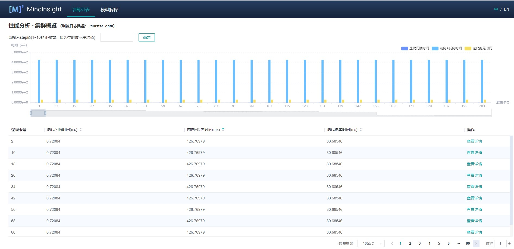
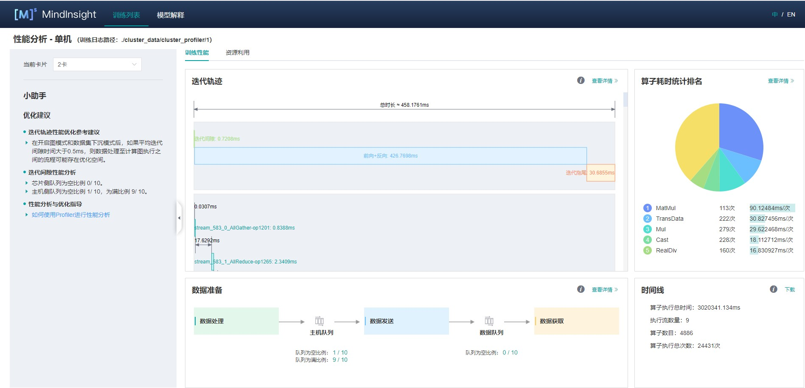

# 集群性能调试（Ascend）

`Linux` `Ascend` `集群调优` `中级` `高级`

<a href="https://gitee.com/mindspore/docs/blob/r1.2/tutorials/training/source_zh_cn/advanced_use/performance_profiling_ascend_of_cluster.md" target="_blank"></a>

## 概述

本教程介绍如何在Ascend AI处理器上使用MindSpore Profiler进行集群训练性能调试。

## 操作流程

- 搭建分布式训练环境，准备分布式训练脚本，并在训练脚本中调用性能调试接口，接着运行训练脚本。
- 收集集群训练性能数据。
- 启动MindInsight，并通过启动参数指定summary-base-dir目录(summary-base-dir是Profiler所创建目录的父目录)，例如训练时Profiler创建的文件夹绝对路径为`/home/user/code/data`，则summary-base-dir设为`/home/user/code`。启动成功后，根据IP和端口访问可视化界面，默认访问地址为 `http://127.0.0.1:8080`。
- 在训练列表找到对应集群训练，点击性能分析，即可在页面中查看集群性能数据。

## 分布式训练

分布式训练请参考[分布式训练教程](https://www.mindspore.cn/tutorial/training/zh-CN/r1.2/advanced_use/distributed_training_ascend.html)。

## 收集集群性能数据

多机多卡训练的时候，一次集群训练后，性能数据分布在各个主机上（host节点）。要进行集群性能分析，需要将所有主机上的性能数据收集到一台主机上进行分析。考虑到集群运行环境的复杂以及相关的权限问题、登录问题，比较合理的方式是让用户去收集集群性能数据。
下面是一次分布式集群训练后，使用脚本收集性能数据的过程，用户可以参照此脚本进行集群性能数据收集。

脚本程序说明：脚本程序首先创建了集群作业文件夹，然后利用SSHPass技术进行非交互式的远程拷贝（避免了手动认证，手动输入密码），将集群中各个host节点的数据拷贝到集群作业文件夹中。脚本程序同时生成了host ip地址的映射表以及将多卡环境的组网信息文件拷贝到集群作业文件中。

```bash
#!/bin/bash

echo "=============================================================================================================="
echo "Please run the script as: "
echo "bash collect_cluster_profiler_data.sh"
echo "for example: bash collect_cluster_profiler_data.sh cluster_hccl_config_path cluster_account_config_path cluster_train_id host_train_id device_regex output"s
echo "=============================================================================================================="

SSH="ssh -o StrictHostKeyChecking=no"
SCP="scp -o StrictHostKeyChecking=no"

# Get the node list in the cluster.
get_cluster_list()
{
        local cluster_config=$1
        cat ${cluster_config} | python3 -c 'import sys,json;[print(node) for node in json.load(sys.stdin)["cluster"].keys()]'
}

# Get the account number of node.
get_node_user()
{
        local cluster_config=$1
        local node=$2
        cat ${cluster_config} | python3 -c 'import sys,json;print(json.load(sys.stdin)["cluster"]['\"${node}\"']["user"])'
}

# Get the password of node.
get_node_passwd()
{
        local cluster_config=$1
        local node=$2
        cat ${cluster_config} | python3 -c 'import sys,json;print(json.load(sys.stdin)["cluster"]['\"${node}\"']["passwd"])'
}

# Copy data from remote node to local node.
rscp_pass()
{
        local node="$1"
        local user="$2"
        local passwd="$3"
        local src="$4"
        local target="$5"
        sshpass -p "${passwd}" ${SCP} -r "${user}"@"${node}":"${src}" "${target}"
}

cluster_hccl_config_path=$1
cluster_account_config_path=$2s
cluster_train_id=$3
host_train_id=$4
device_regex=$5
output=$6
host_ip_mapping_file='host_ips_mapping.txt'
host_ip_mapping_id=1
node_list=$(get_cluster_list ${cluster_account_config_path})
echo "-----begin----"

if [ ! -d "${cluster_train_id}" ]; then
mkdir -p ${cluster_train_id}
fi

# Copy the networking information file of multi card environment to the cluster directory.
cp $cluster_hccl_config_paht $cluster_train_id


for node in ${node_list}
do
 user=$(get_node_user ${cluster_account_config_path} ${node})
 passwd=$(get_node_passwd ${cluster_account_config_path} ${node})
 echo "------------------${user}@${node}---------------------"
 target_dir=${cluster_train_id}/cluster_profiler/${host_ip_mapping_id}/profiler/
 if [ ! -d "${target_dir}" ]; then
 mkdir -p ${target_dir}
 fi

 # Eight card data
 for((i=0;i<8;i++));
 do
   src_dir=${host_train_id}/${device_regex}${i}/${output}*/profiler*/*.*
   $(rscp_pass ${node} ${user} ${passwd} "${src_dir}" ${target_dir})
 done

 # save the mapping information to the host_ips_mapping.txt.
 echo "$node $host_ip_mapping_id">>${cluster_train_id}/$host_ip_mapping_file

 # host_ip_mapping_id ++
 host_ip_mapping_id=$((${host_ip_mapping_id}+1))
done
```

脚本参数说明：

- `cluster_hccl_config_path` 为多卡环境的组网信息文件路径。内容格式如下：

    ```json
    {
        "version": "1.0",
        "server_count": "1",
        "server_list": [
            {
            "server_id": "10.xxx.xxx.1",
            "device": [
                {"device_id": "0","device_ip": "192.1.27.6","rank_id": "0"},
                {"device_id": "1","device_ip": "192.2.27.6","rank_id": "1"},
                {"device_id": "2","device_ip": "192.3.27.6","rank_id": "2"},
                {"device_id": "3","device_ip": "192.4.27.6","rank_id": "3"},
                {"device_id": "4","device_ip": "192.1.27.7","rank_id": "4"},
                {"device_id": "5","device_ip": "192.2.27.7","rank_id": "5"},
                {"device_id": "6","device_ip": "192.3.27.7","rank_id": "6"},
                {"device_id": "7","device_ip": "192.4.27.7","rank_id": "7"}],
             "host_nic_ip": "reserve"
            }
    ],
    "status": "completed"
    }
    ```

- `cluster_account_config_path` 为各主机账号密码配置文件路径，内容格式如下：

    ```json
    {
      "rank_size": 16,
      "cluster": {
                    "10.xxx.xxx.1": {
                    "user": "root",
                    "passwd": "xxx"
                    },
                    "10.xxx.xxx.2": {
                    "user": "root",
                    "passwd": "xxx"
                    }
                  }
    }
    ```

- `cluster_train_id`  为集群profiler性能数据保存的路径，比如`/home/summary/run1`、`/home/data/run2`  其中`run1`和`run2`分别保存两次集群训练的作业。
- `host_train_id`  为集群训练时，各个主机节点保存profiler的性能数据的路径。比如：`/home/summary/`。
- `device_regex`  为各个主机节点中不同卡保存profiler的性能数据的文件夹名称。比如：`/home/summary/device0`和`/home/summary/device1`分别是0号卡和1号卡对应的文件夹，此时device_regex为device。
- `output` 为训练脚本中用户设置的保存profiler性能文件的路径，默认为`./data`。

通过脚本收集到的集群性能文件夹目录结构为：

```text
|-- run
    |-- hccl.json
    |-- host_ips_mapping.txt
    |-- cluster_profiler
        |-- 1
        |   |-- profiler
        |       |-- step_trace_raw_0_detail_time.csv
```

> 收集的集群性能作业需要符合该目录结构，否则无法用MindInsight进行可视化展示。必须包含组网信息文件（文件名可以任取）和host_ips_mapping.txt文件（文件名和后缀唯一）。

集群性能文件夹结构说明：

- `hccl.json` 为当前多卡环境的组网信息文件。记录了host_ip、device_id、rank_id之间的对应关系。
- `host_ips_mapping.txt` 为host_ip映射文件。从安全角度出发，集群中的真实host_ip需要经过映射，避免在查询中，暴露真实的host_ip值，导致安全风险。此处会维护一个host_ip映射表，`host_ips_mapping.txt`中的内容一行代表一组映射，譬如： 10.xxx.xxx.1 1 表示10.xxx.xxx.1的映射值为1。
- `cluster_profiler` 为集群训练作业的标签，用于判断训练作业是否属于集群训练作业。
- `1` 为单机多卡profiler数据，保存集群中某一个host_ip节点的profiler性能数据文件，`1`为该host_ip映射后的名称。一个cluster_profiler文件中包含了集群中所有的host节点的性能数据。

## 启动MindInsight

启动命令请参考[MindInsight相关命令](https://www.mindspore.cn/tutorial/training/zh-CN/r1.2/advanced_use/mindinsight_commands.html)。

### 集群性能分析

用户从训练列表中选择指定的训练，点击性能调试，可以查看该次训练的性能数据。集群性能分析包括集群迭代轨迹分析。

#### 集群迭代轨迹分析

使用集群迭代轨迹分析组件，可以找出集群训练中的慢主机、慢卡。
集群迭代轨迹分析组件展示所有卡的迭代信息，包括迭代间隙、前反向、迭代拖尾，均支持排序操作。其中迭代间隙反映了数据处理阶段的快慢，通过卡的迭代间隙时间可以反映出对应主机处理数据的快慢。卡的前反向时间反映了卡的计算能力。迭代拖尾反映了all_reduce耗时以及并行情况。



图1：集群迭代轨迹

图1展示了集群迭代轨迹分析页面，默认展示卡的性能平均值，支持查询特定step下的卡的迭代轨迹信息。通过点击单卡中的详情连接，也可以跳转到单卡的详细性能展示页面，查询详细的单卡性能数据。



图2：单卡性能信息

图2展示集群中单卡性能信息，单卡性能信息请参考[单卡性能信息](https://www.mindspore.cn/tutorial/training/zh-CN/r1.2/advanced_use/performance_profiling_ascend.html)。

## 规格

- 为了控制性能测试时生成数据的大小，大型网络建议性能调试的step数目限制在10以内。

  > 控制step数目可以通过控制训练数据集的大小来实现，如`mindspore.dataset.MindDataset`类中的`num_samples`参数可以控制数据集大小，详情参考：
  >
  > <https://www.mindspore.cn/doc/api_python/zh-CN/r1.2/mindspore/dataset/mindspore.dataset.MindDataset.html>

## 注意事项

- PyNative模式下暂不支持性能调试。
- 训练加推理过程暂不支持性能调试，目前支持单独训练或推理的性能调试。